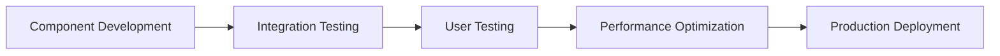
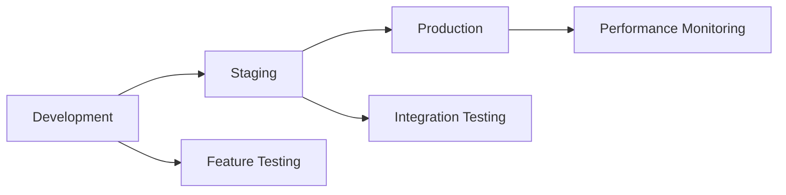

# GreenLedger Implementation Roadmap

## 🎯 Strategic Focus: QR Verification System

Based on business analysis and market research, **Real-Time QR Code Verification** is the one feature that will give GreenLedger massive competitive advantage in the agri-tech industry. This addresses the $40B+ global food fraud problem with instant, consumer-facing verification.

## 🚀 Phase 1: Core QR Verification (Weeks 1-2)

### Priority 1: QR Verification Component
```typescript
// Target: src/components/QRVerificationSystem.tsx
interface VerificationResult {
  tokenId: number;
  isValid: boolean;
  cropType: string;
  originFarm: string;
  currentOwner: string;
  currentState: string;
  harvestDate: string;
  totalSteps: number;
  certifications?: string[];
}
```

**Implementation Tasks:**
- [ ] Create QRVerificationSystem component
- [ ] Implement token ID extraction from QR codes
- [ ] Build verification UI with mobile-first design
- [ ] Add real-time blockchain queries
- [ ] Integrate IPFS metadata fetching
- [ ] Implement error handling and fallbacks

**Success Criteria:**
- ✅ Scan QR code → Instant verification in <3 seconds
- ✅ Works on mobile browsers (MetaMask, WalletConnect)
- ✅ Displays complete provenance history
- ✅ Shows certifications and authenticity proof

### Priority 2: QR Code Generation
```typescript
// Generate verification URLs for physical products
const generateQRUrl = (tokenId: number) => {
  return `${window.location.origin}/verify/${tokenId}`;
};
```

**Implementation Tasks:**
- [ ] Add QR code generation to CropBatchCard
- [ ] Create printable QR labels for physical products
- [ ] Implement QR code routing (/verify/:tokenId)
- [ ] Add QR scanner functionality (camera access)
- [ ] Create embedded verification widget

**Success Criteria:**
- ✅ Generate QR codes for all minted tokens
- ✅ QR codes work without app installation
- ✅ Camera scanning works on mobile devices
- ✅ Embedded verification for third-party websites

## 🔗 Phase 2: Enhanced Provenance Tracking (Weeks 3-4)

### Priority 1: Supply Chain Explorer Enhancement
```typescript
// Target: src/pages/SupplyChainExplorer.tsx
// Enhanced with real-time updates and interactive timeline
```

**Implementation Tasks:**
- [ ] Add interactive supply chain timeline
- [ ] Implement real-time event notifications
- [ ] Create visual provenance flow (D3.js/Recharts)
- [ ] Add geo-location mapping for transfers
- [ ] Implement advanced filtering and search
- [ ] Add export capabilities (PDF reports)

**Success Criteria:**
- ✅ Visual timeline showing complete journey
- ✅ Real-time updates without page refresh
- ✅ Geographic visualization of supply chain
- ✅ Advanced search and filtering options

### Priority 2: Real-Time Event System
```typescript
// Enhanced event monitoring with WebSocket support
export const useRealTimeEvents = () => {
  useWatchContractEvent({
    address: CONTRACT_ADDRESSES.SupplyChainManager,
    abi: SupplyChainManagerABI,
    eventName: 'ProvenanceUpdated',
    onLogs: (logs) => {
      // Real-time UI updates
      updateSupplyChainExplorer(logs);
      showToastNotification('Supply chain updated!');
    },
  });
};
```

**Implementation Tasks:**
- [ ] Implement WebSocket event listening
- [ ] Add real-time notifications system
- [ ] Create event deduplication logic
- [ ] Add offline event queuing
- [ ] Implement push notifications (PWA)

**Success Criteria:**
- ✅ Instant updates across all connected devices
- ✅ No duplicate event processing
- ✅ Works offline with sync on reconnection
- ✅ Push notifications for important events

## 📱 Phase 3: Mobile Optimization & PWA (Weeks 5-6)

### Priority 1: Progressive Web App
```typescript
// Service worker for offline functionality
// Target: public/sw.js and PWA manifest
```

**Implementation Tasks:**
- [ ] Create PWA manifest and service worker
- [ ] Implement offline verification caching
- [ ] Add app installation prompts
- [ ] Create mobile-optimized UI components
- [ ] Add touch gestures and haptic feedback
- [ ] Implement background sync for transactions

**Success Criteria:**
- ✅ Installable as mobile app
- ✅ Works offline for cached verifications
- ✅ Native app-like experience
- ✅ Background transaction processing

### Priority 2: Mobile Wallet Integration
```typescript
// Enhanced mobile wallet support
// Target: src/config/wagmiConfig.ts
```

**Implementation Tasks:**
- [ ] Optimize for MetaMask mobile browser
- [ ] Add WalletConnect v2 deep linking
- [ ] Implement mobile-specific connectors
- [ ] Add wallet detection and recommendations
- [ ] Create mobile debugging tools

**Success Criteria:**
- ✅ Seamless connection on mobile wallets
- ✅ Deep linking to wallet apps
- ✅ Automatic wallet detection
- ✅ Mobile-specific error handling

## 📊 Phase 4: Analytics & Enterprise Features (Weeks 7-8)

### Priority 1: Advanced Analytics Dashboard
```typescript
// Target: src/pages/AnalyticsDashboard.tsx
interface AnalyticsData {
  verificationMetrics: VerificationMetrics;
  supplyChainMetrics: SupplyChainMetrics;
  fraudDetectionMetrics: FraudMetrics;
  userEngagementMetrics: EngagementMetrics;
}
```

**Implementation Tasks:**
- [ ] Create comprehensive analytics dashboard
- [ ] Implement real-time metrics tracking
- [ ] Add fraud detection algorithms
- [ ] Create exportable reports
- [ ] Add predictive analytics (AI/ML)
- [ ] Implement custom dashboard builder

**Success Criteria:**
- ✅ Real-time business intelligence
- ✅ Fraud detection and alerts
- ✅ Predictive supply chain insights
- ✅ Customizable reporting

### Priority 2: Enterprise Integration
```typescript
// API endpoints for enterprise customers
// Target: src/api/ (new directory)
```

**Implementation Tasks:**
- [ ] Create REST API for enterprise integration
- [ ] Add webhook support for real-time updates
- [ ] Implement multi-tenant architecture
- [ ] Add custom branding options
- [ ] Create SDK for third-party integration
- [ ] Add enterprise authentication (SSO)

**Success Criteria:**
- ✅ Enterprise-ready API
- ✅ Multi-tenant support
- ✅ Custom branding capabilities
- ✅ Third-party integration SDK

## 🔧 Technical Implementation Strategy

### Development Approach


### Code Quality Standards
```typescript
// Implement comprehensive testing
describe('QR Verification System', () => {
  it('should verify authentic tokens', async () => {
    const result = await verifyToken(123);
    expect(result.isValid).toBe(true);
    expect(result.cropType).toBeDefined();
  });
  
  it('should handle invalid tokens gracefully', async () => {
    const result = await verifyToken(999999);
    expect(result.isValid).toBe(false);
  });
});
```

### Performance Targets
- **Page Load Time**: <3 seconds
- **Verification Time**: <2 seconds
- **Transaction Confirmation**: <30 seconds
- **IPFS Fetch Time**: <5 seconds
- **Mobile Performance**: 90+ Lighthouse score

## 📈 Success Metrics & KPIs

### Business Metrics
```typescript
interface BusinessKPIs {
  // Adoption Metrics
  monthlyActiveUsers: number;        // Target: 10,000+
  verificationsPerDay: number;       // Target: 1,000+
  tokensMinted: number;              // Target: 5,000+
  
  // Quality Metrics
  verificationSuccessRate: number;   // Target: >99%
  fraudDetectionRate: number;        // Target: >95%
  customerSatisfaction: number;      // Target: >4.5/5
  
  // Growth Metrics
  userRetentionRate: number;         // Target: >80%
  enterpriseAdoption: number;        // Target: 50+ companies
  marketPenetration: number;         // Target: 5% of target market
}
```

### Technical Metrics
```typescript
interface TechnicalKPIs {
  // Performance
  averagePageLoadTime: number;       // Target: <3s
  apiResponseTime: number;           // Target: <500ms
  mobilePerformanceScore: number;    // Target: >90
  
  // Reliability
  systemUptime: number;              // Target: >99.9%
  errorRate: number;                 // Target: <0.1%
  transactionSuccessRate: number;    // Target: >98%
  
  // Security
  securityIncidents: number;         // Target: 0
  vulnerabilitiesFound: number;      // Target: 0 critical
  complianceScore: number;           // Target: 100%
}
```

## 🚀 Deployment Strategy

### Environment Progression


### Deployment Checklist
```markdown
## Pre-Deployment
- [ ] All tests passing (unit, integration, e2e)
- [ ] Performance benchmarks met
- [ ] Security audit completed
- [ ] Documentation updated
- [ ] Environment variables configured

## Deployment
- [ ] Deploy to staging environment
- [ ] Run smoke tests
- [ ] Performance testing
- [ ] Security scanning
- [ ] Deploy to production

## Post-Deployment
- [ ] Monitor error rates
- [ ] Check performance metrics
- [ ] Verify functionality
- [ ] Monitor user feedback
- [ ] Update monitoring dashboards
```

## 🔮 Future Enhancements (Weeks 9-12)

### Advanced Features
1. **IoT Integration**: Sensor data from farms and transport
2. **AI Predictions**: Supply chain optimization algorithms
3. **Multi-chain Support**: Ethereum, Polygon, Arbitrum
4. **Zero-Knowledge Proofs**: Privacy-preserving verification
5. **Augmented Reality**: AR visualization of supply chain

### Market Expansion
1. **International Markets**: Multi-language support
2. **Regulatory Compliance**: GDPR, FDA, organic certifications
3. **Partnership Integrations**: Major retailers and distributors
4. **White-label Solutions**: Custom deployments for enterprises

## 💡 Implementation Tips

### Development Best Practices
1. **Mobile-First**: Always design for mobile first
2. **Performance**: Optimize for slow networks and devices
3. **Accessibility**: Ensure WCAG 2.1 compliance
4. **Security**: Implement defense in depth
5. **Testing**: Comprehensive test coverage

### User Experience Focus
1. **Simplicity**: Make verification effortless
2. **Speed**: Instant feedback and results
3. **Trust**: Clear visual indicators of authenticity
4. **Education**: Help users understand blockchain benefits
5. **Support**: Comprehensive help and documentation

---

This roadmap prioritizes the **QR Verification System** as the core differentiator that will drive massive adoption and competitive advantage in the agri-tech market. Each phase builds upon the previous one, creating a comprehensive platform that solves real-world problems while maintaining technical excellence.
