# GreenLedger Systems Design Document

## 🎯 Executive Summary

GreenLedger is a blockchain-powered agricultural supply chain platform that tokenizes crop batches as ERC1155 NFTs and provides real-time provenance verification. The system's core differentiator is **instant QR code verification** that bridges physical products to immutable blockchain records, addressing the $40B+ global food fraud problem.

## 🏗️ System Architecture

### High-Level Architecture

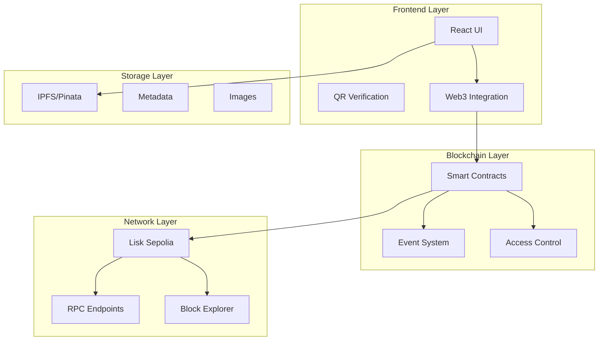

### Component Architecture

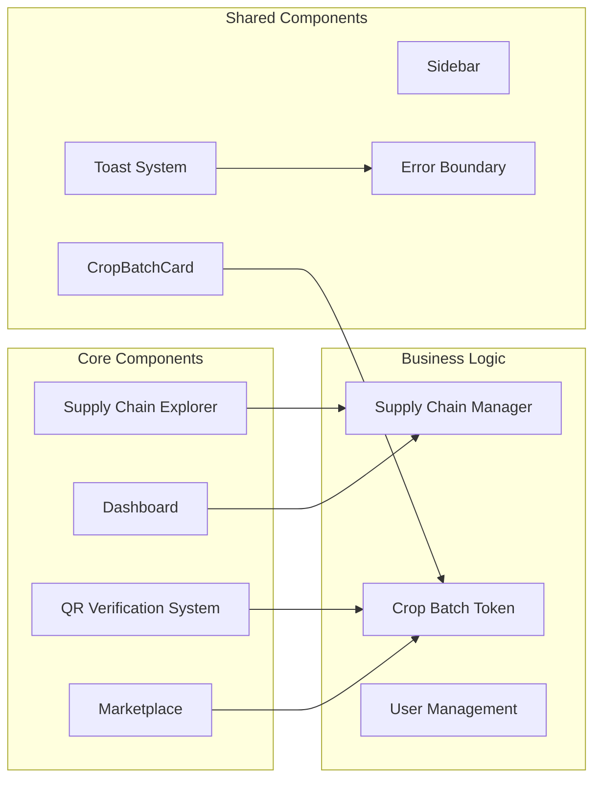

## 🔄 Data Flow Architecture

### 1. **Crop Batch Lifecycle**

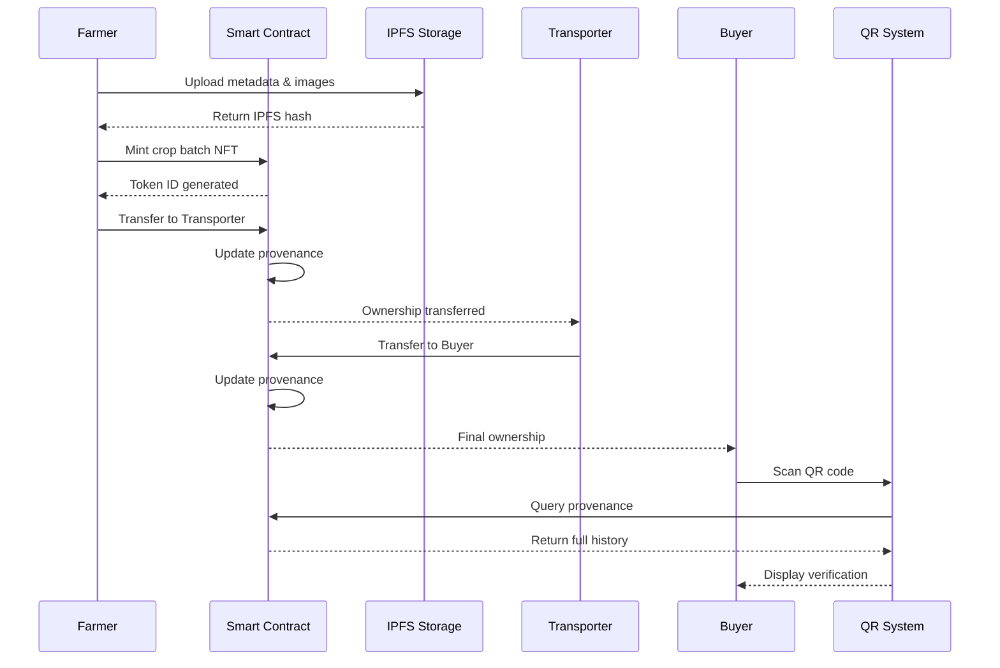

### 2. **Real-Time Verification Flow**

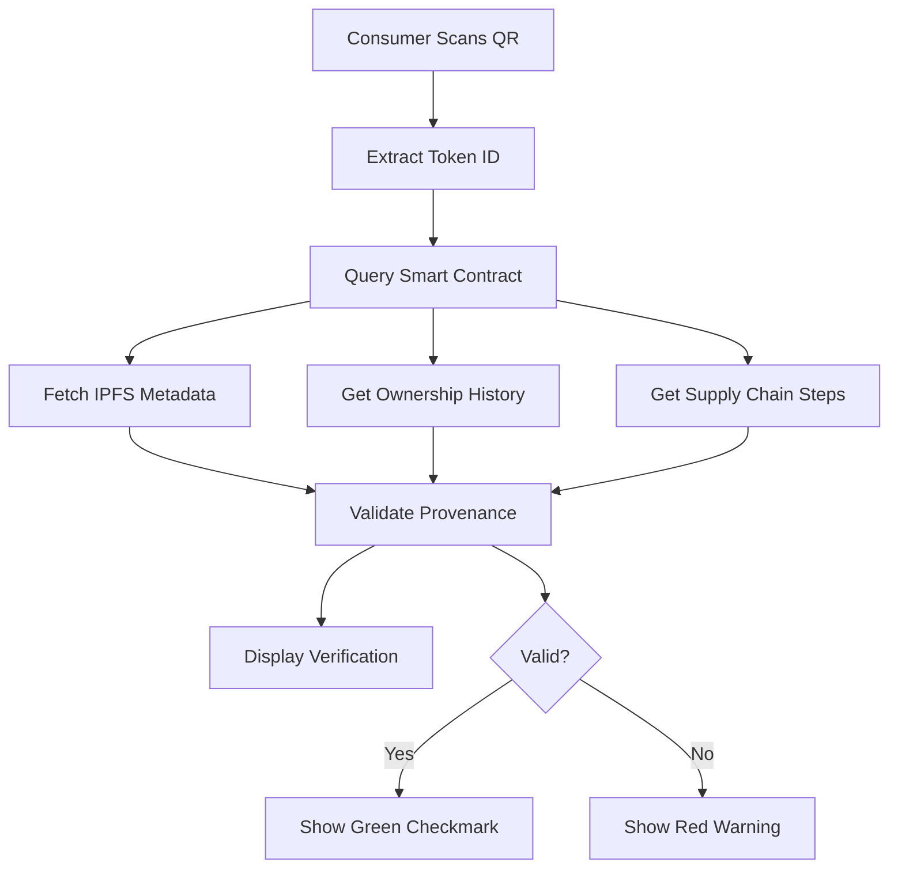

## 📊 Smart Contract Architecture

### Contract Hierarchy

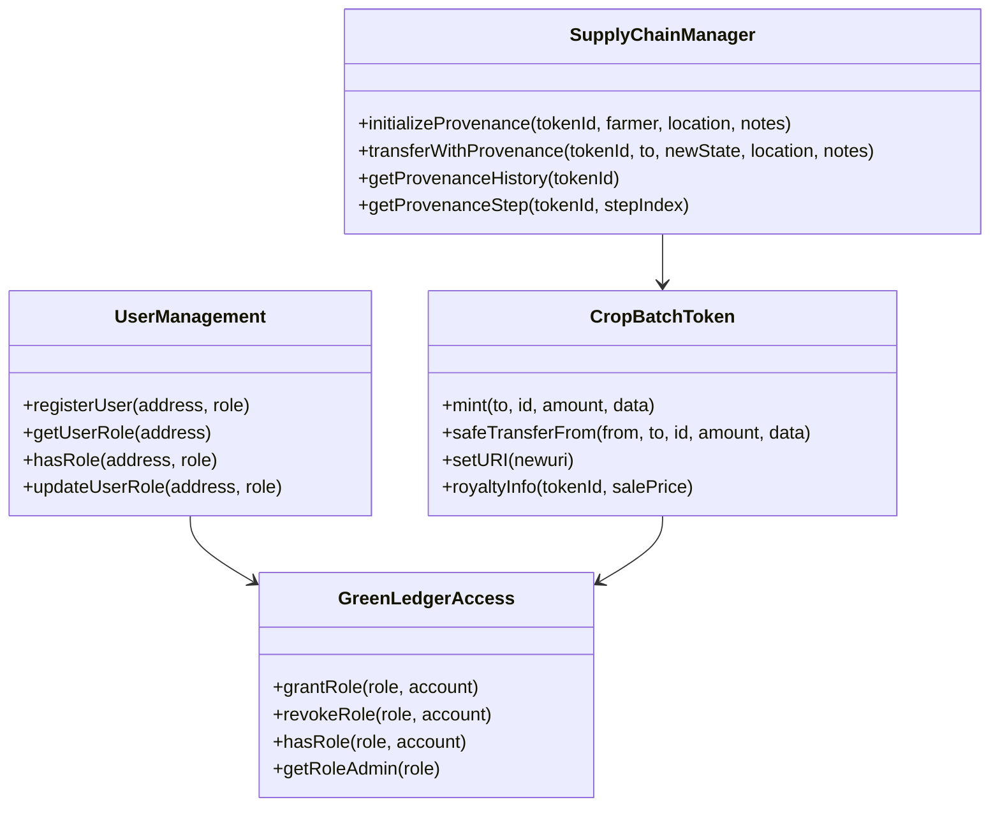

### State Management

```typescript
// Supply Chain States
enum SupplyChainState {
    PRODUCED = 0,    // Farmer mints token
    IN_TRANSIT = 1,  // Transporter has custody
    DELIVERED = 2,   // Buyer receives token
    CONSUMED = 3     // Final consumption
}

// User Roles
enum UserRole {
    FARMER = 0,      // Can mint tokens
    TRANSPORTER = 1, // Can transport tokens
    BUYER = 2,       // Can receive tokens
    ADMIN = 3        // Can manage system
}
```

## 🔧 Frontend Architecture

### State Management Strategy

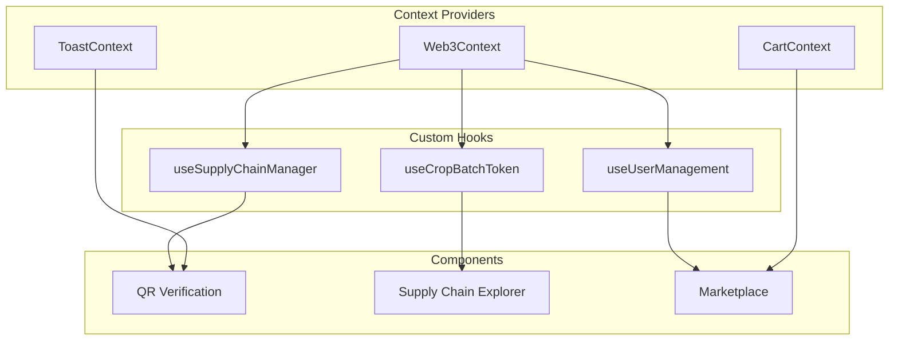

### Component Design Patterns

```typescript
// Hook Pattern for Business Logic
export const useSupplyChainManager = () => {
  const { writeContractAsync } = useWriteContract();
  
  const initializeProvenance = async (args: ProvenanceArgs) => {
    // Business logic here
  };
  
  return { initializeProvenance };
};

// Component Pattern for UI
export const QRVerificationSystem: React.FC<Props> = ({ tokenId }) => {
  const { verification, loading, error } = useVerification(tokenId);
  
  return (
    <div className="verification-container">
      {/* UI rendering logic */}
    </div>
  );
};
```

## 🔐 Security Architecture

### Access Control Matrix

| Role | Mint Tokens | Transfer Tokens | View Provenance | Manage Users |
|------|-------------|-----------------|-----------------|--------------|
| Farmer | ✅ | ✅ (to Transporter) | ✅ | ❌ |
| Transporter | ❌ | ✅ (to Buyer) | ✅ | ❌ |
| Buyer | ❌ | ❌ | ✅ | ❌ |
| Admin | ✅ | ✅ | ✅ | ✅ |

### Security Measures

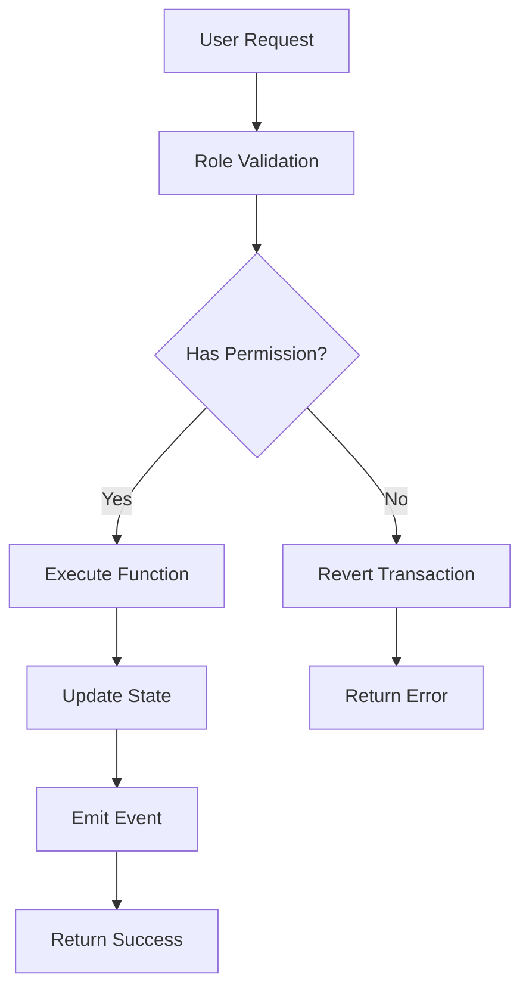

## 📱 QR Verification System Design

### Core Implementation

```typescript
interface VerificationResult {
  tokenId: number;
  isValid: boolean;
  cropType: string;
  originFarm: string;
  currentOwner: string;
  currentState: string;
  harvestDate: string;
  totalSteps: number;
  lastVerified: string;
  certifications?: string[];
}

class QRVerificationSystem {
  async verifyToken(tokenId: number): Promise<VerificationResult> {
    // 1. Query smart contract for token data
    const batch = await getBatchById(tokenId);
    
    // 2. Fetch IPFS metadata
    const metadata = await fetchMetadataFromIPFS(batch.metadataUri);
    
    // 3. Get provenance history
    const provenance = await getProvenanceHistory(tokenId);
    
    // 4. Compile verification result
    return {
      tokenId,
      isValid: true,
      cropType: batch.cropType,
      // ... other fields
    };
  }
}
```

### QR Code Generation Strategy

```typescript
// Generate verification URL
const generateQRUrl = (tokenId: number) => {
  return `${window.location.origin}/verify/${tokenId}`;
};

// QR Code contains: https://app.greenledger.com/verify/123
// When scanned: Instant verification without app installation
```

## 🚀 Performance Optimization

### Caching Strategy

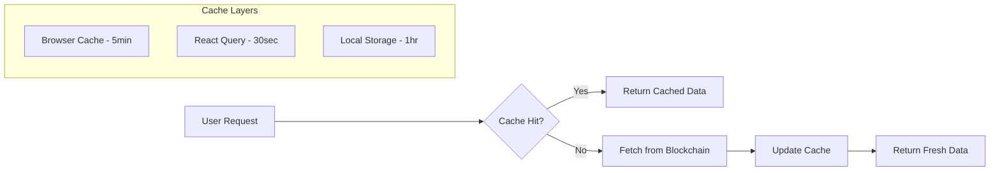

### Optimization Techniques

1. **Smart Contract Calls**
   - Batch multiple reads into single call
   - Use multicall pattern for efficiency
   - Cache frequently accessed data

2. **IPFS Optimization**
   - Multiple gateway fallbacks
   - Image compression and lazy loading
   - Metadata caching in localStorage

3. **UI Performance**
   - Virtual scrolling for large lists
   - Skeleton loading states
   - Code splitting by routes

## 🔄 Event-Driven Architecture

### Event Flow

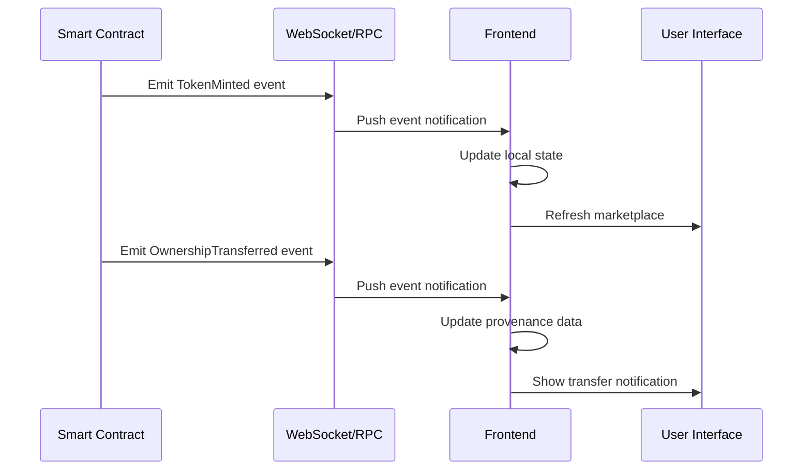

### Event Handling Strategy

```typescript
// Real-time event listening
export const useContractEvents = () => {
  const { data: logs } = useWatchContractEvent({
    address: CONTRACT_ADDRESSES.CropBatchToken,
    abi: CropBatchTokenABI,
    eventName: 'TransferSingle',
    onLogs: (logs) => {
      // Handle real-time updates
      updateMarketplace(logs);
      showToastNotification('Token transferred!');
    },
  });
};
```

## 📊 Data Models

### Core Data Structures

```typescript
// Crop Batch Token
interface CropBatch {
  tokenId: number;
  owner: string;
  minter: string;
  cropType: string;
  quantity: number;
  originFarm: string;
  harvestDate: number;
  metadataUri: string;
  timestamp: number;
  notes: string;
}

// Provenance Record
interface ProvenanceRecord {
  tokenId: bigint;
  originalFarmer: string;
  creationTime: bigint;
  currentState: number;
  currentOwner: string;
  totalSteps: bigint;
}

// Provenance Step
interface ProvenanceStep {
  actor: string;
  state: number;
  timestamp: bigint;
  location: string;
  notes: string;
  transactionHash: string;
}

// IPFS Metadata
interface CropMetadata {
  name: string;
  description: string;
  image: string;
  attributes: Array<{
    trait_type: string;
    value: string;
  }>;
  cropType: string;
  quantity: number;
  originFarm: string;
  harvestDate: number;
  notes: string;
}
```

## 🔧 Integration Patterns

### IPFS Integration

```typescript
class IPFSService {
  private gateways = [
    'https://ipfs.io/ipfs',
    'https://gateway.pinata.cloud/ipfs',
    'https://cloudflare-ipfs.com/ipfs'
  ];
  
  async uploadToIPFS(file: File): Promise<string> {
    // Upload with retry logic and fallbacks
  }
  
  async fetchFromIPFS(hash: string): Promise<any> {
    // Fetch with multiple gateway fallbacks
  }
}
```

### Web3 Integration

```typescript
class Web3Service {
  async connectWallet(): Promise<void> {
    // Multi-wallet connection strategy
  }
  
  async executeTransaction(tx: Transaction): Promise<string> {
    // Transaction execution with error handling
  }
  
  async listenToEvents(): Promise<void> {
    // Real-time event monitoring
  }
}
```

## 🚀 Deployment Architecture

### Infrastructure

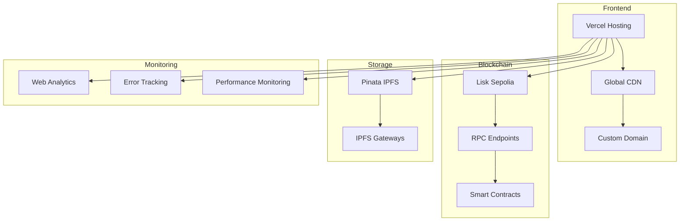

### Deployment Pipeline

```yaml
# CI/CD Pipeline
stages:
  - build:
      - npm install
      - npm run build
      - run tests
  
  - deploy:
      - deploy to staging
      - run integration tests
      - deploy to production
  
  - monitor:
      - check deployment health
      - monitor error rates
      - verify functionality
```

## 📈 Scalability Considerations

### Horizontal Scaling

1. **Frontend Scaling**
   - CDN distribution
   - Code splitting
   - Lazy loading
   - Service workers

2. **Blockchain Scaling**
   - Layer 2 integration
   - Batch operations
   - State channels
   - Optimistic rollups

3. **Storage Scaling**
   - Multiple IPFS providers
   - Content addressing
   - Distributed storage
   - Caching layers

### Performance Metrics

```typescript
// Key Performance Indicators
interface PerformanceMetrics {
  // Frontend Metrics
  pageLoadTime: number;        // Target: <3s
  timeToInteractive: number;   // Target: <5s
  firstContentfulPaint: number; // Target: <2s
  
  // Blockchain Metrics
  transactionConfirmTime: number; // Target: <30s
  gasUsageOptimization: number;   // Target: <100k gas
  
  // IPFS Metrics
  ipfsUploadTime: number;      // Target: <10s
  metadataFetchTime: number;   // Target: <2s
  
  // Business Metrics
  verificationSuccessRate: number; // Target: >99%
  userRetentionRate: number;       // Target: >80%
}
```

## 🔮 Future Enhancements

### Roadmap

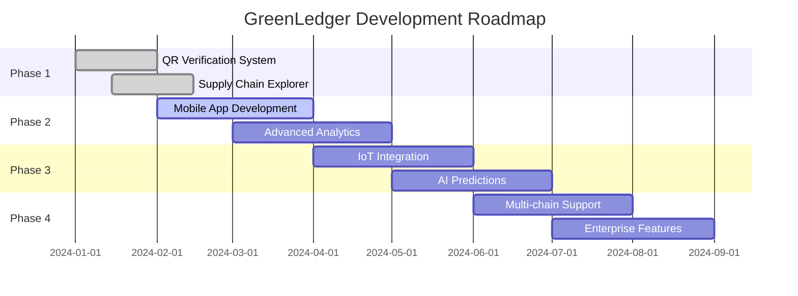

### Technical Enhancements

1. **Advanced Verification**
   - Biometric authentication
   - IoT sensor integration
   - AI-powered fraud detection
   - Zero-knowledge proofs

2. **Enhanced UX**
   - Progressive Web App
   - Offline functionality
   - Voice commands
   - AR visualization

3. **Enterprise Features**
   - Multi-tenant architecture
   - Advanced analytics
   - Custom branding
   - API integrations

## 🎯 Success Metrics

### Business KPIs

```typescript
interface BusinessMetrics {
  // Adoption Metrics
  monthlyActiveUsers: number;
  tokensMinted: number;
  verificationsPerformed: number;
  
  // Quality Metrics
  fraudDetectionRate: number;
  customerSatisfaction: number;
  systemUptime: number;
  
  // Growth Metrics
  userGrowthRate: number;
  revenueGrowth: number;
  marketPenetration: number;
}
```

### Technical KPIs

```typescript
interface TechnicalMetrics {
  // Performance
  averageResponseTime: number;
  errorRate: number;
  throughput: number;
  
  // Reliability
  uptime: number;
  mtbf: number; // Mean Time Between Failures
  mttr: number; // Mean Time To Recovery
  
  // Security
  vulnerabilitiesFound: number;
  securityIncidents: number;
  complianceScore: number;
}
```

## 📋 Implementation Checklist

### Phase 1: Core QR Verification (Immediate)
- [ ] QR code generation for tokens
- [ ] Mobile-optimized verification UI
- [ ] Real-time blockchain queries
- [ ] IPFS metadata integration
- [ ] Error handling and fallbacks

### Phase 2: Enhanced Traceability (Next 30 days)
- [ ] Interactive supply chain timeline
- [ ] Real-time event notifications
- [ ] Advanced filtering and search
- [ ] Export capabilities
- [ ] Analytics dashboard

### Phase 3: Mobile & Performance (Next 60 days)
- [ ] Progressive Web App
- [ ] Offline functionality
- [ ] Performance optimization
- [ ] Caching improvements
- [ ] Load testing

### Phase 4: Enterprise Features (Next 90 days)
- [ ] Multi-tenant support
- [ ] Custom branding
- [ ] API development
- [ ] Advanced analytics
- [ ] Integration capabilities

---

This systems design document provides the comprehensive foundation for building and implementing GreenLedger's QR verification flow in the most efficient, maintainable, and scalable way. The architecture prioritizes the core differentiator while maintaining flexibility for future enhancements.
