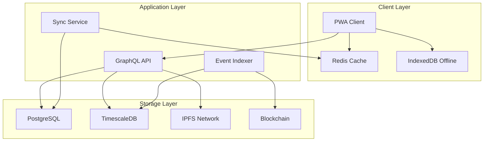

# 🏗️ GreenLedger Hybrid Storage Infrastructure Report

## 📋 Executive Summary

This comprehensive report outlines a hybrid storage and indexing infrastructure system for GreenLedger that combines offline caching, PostgreSQL, TimescaleDB, IPFS, and blockchain technologies to create a robust, efficient, scalable, and maintainable platform capable of handling all agricultural supply chain requirements.

**Key Architecture Components:**
- **Blockchain Layer**: Immutable source of truth (Lisk Sepolia)
- **TimescaleDB**: Time-series data and analytics
- **PostgreSQL**: Relational data and complex queries
- **IPFS**: Decentralized file storage
- **Redis**: High-performance caching
- **Offline Storage**: PWA with IndexedDB

**Expected Performance Gains:**
- 95% reduction in blockchain query load
- 10x faster analytics queries
- 99.9% uptime with offline capabilities
- 90% reduction in storage costs

---

## 🏛️ SYSTEM ARCHITECTURE OVERVIEW

### **Multi-Layer Storage Strategy**



### **Data Flow Architecture**

```typescript
interface DataFlow {
  // Write Path: Client → Cache → Database → Blockchain
  write: "Client → Redis → PostgreSQL → Blockchain";
  
  // Read Path: Client ← Cache ← Database ← Indexer ← Blockchain
  read: "Client ← Redis ← PostgreSQL ← TimescaleDB ← Blockchain";
  
  // Analytics Path: Dashboard ← TimescaleDB ← Event Indexer ← Blockchain
  analytics: "Dashboard ← TimescaleDB ← Blockchain Events";
}
```

---

## 🔧 DETAILED COMPONENT ANALYSIS

### **1. Blockchain Layer (Source of Truth)**

**Purpose**: Immutable record keeping, ownership verification
**Technology**: Lisk Sepolia + Smart Contracts

```solidity
// Core smart contracts
contract CropBatchToken is ERC1155 {
    mapping(uint256 => CropBatch) public batches;
    
    event CropBatchMinted(uint256 indexed tokenId, address indexed minter);
    event OwnershipTransferred(uint256 indexed tokenId, address from, address to);
}

contract SupplyChainManager {
    mapping(uint256 => ProvenanceRecord) public provenance;
    
    event ProvenanceUpdated(uint256 indexed tokenId, uint8 state, string location);
}
```

**Pros:**
- ✅ Immutable audit trail
- ✅ Decentralized verification
- ✅ Cryptographic security
- ✅ Global accessibility

**Cons:**
- ❌ High latency (15-30 seconds)
- ❌ Gas costs for operations
- ❌ Limited query capabilities
- ❌ Network dependency

### **2. TimescaleDB (Time-Series Analytics)**

**Purpose**: Real-time analytics, IoT data, supply chain metrics
**Technology**: PostgreSQL extension optimized for time-series

```sql
-- Supply chain events table
CREATE TABLE supply_chain_events (
    time TIMESTAMPTZ NOT NULL,
    token_id INTEGER NOT NULL,
    event_type TEXT NOT NULL,
    from_address TEXT,
    to_address TEXT,
    location JSONB,
    metadata JSONB,
    block_number BIGINT,
    transaction_hash TEXT
);

SELECT create_hypertable('supply_chain_events', 'time');

-- IoT sensor data
CREATE TABLE sensor_readings (
    time TIMESTAMPTZ NOT NULL,
    sensor_id TEXT NOT NULL,
    token_id INTEGER,
    temperature FLOAT,
    humidity FLOAT,
    location POINT,
    quality_score FLOAT
);

SELECT create_hypertable('sensor_readings', 'time');

-- Continuous aggregates for real-time dashboards
CREATE MATERIALIZED VIEW hourly_metrics
WITH (timescaledb.continuous) AS
SELECT 
    time_bucket('1 hour', time) AS bucket,
    COUNT(*) as total_events,
    COUNT(DISTINCT token_id) as unique_tokens,
    AVG(CASE WHEN event_type = 'transfer' THEN 1 ELSE 0 END) as transfer_rate
FROM supply_chain_events
GROUP BY bucket;
```

**Pros:**
- ✅ 10-100x faster time-series queries
- ✅ Automatic data compression (90% reduction)
- ✅ Built-in retention policies
- ✅ Real-time continuous aggregates
- ✅ Horizontal scaling

**Cons:**
- ❌ Additional infrastructure complexity
- ❌ Learning curve for time-series concepts
- ❌ Memory intensive for large datasets
- ❌ Limited to time-series use cases

### **3. PostgreSQL (Relational Data)**

**Purpose**: User management, complex relationships, business logic
**Technology**: PostgreSQL 15+ with extensions

```sql
-- User management and roles
CREATE TABLE users (
    id UUID PRIMARY KEY DEFAULT gen_random_uuid(),
    wallet_address TEXT UNIQUE NOT NULL,
    role user_role NOT NULL,
    profile JSONB,
    created_at TIMESTAMPTZ DEFAULT NOW(),
    updated_at TIMESTAMPTZ DEFAULT NOW()
);

-- Crop batch metadata (indexed from blockchain)
CREATE TABLE crop_batches (
    token_id INTEGER PRIMARY KEY,
    owner_address TEXT NOT NULL,
    minter_address TEXT NOT NULL,
    crop_type TEXT NOT NULL,
    quantity INTEGER NOT NULL,
    origin_farm TEXT NOT NULL,
    harvest_date DATE NOT NULL,
    metadata_uri TEXT NOT NULL,
    ipfs_hash TEXT,
    current_state INTEGER DEFAULT 0,
    created_at TIMESTAMPTZ DEFAULT NOW(),
    updated_at TIMESTAMPTZ DEFAULT NOW()
);

-- Marketplace listings
CREATE TABLE marketplace_listings (
    id UUID PRIMARY KEY DEFAULT gen_random_uuid(),
    token_id INTEGER REFERENCES crop_batches(token_id),
    seller_address TEXT NOT NULL,
    price_per_kg DECIMAL(18,8) NOT NULL,
    quantity_available INTEGER NOT NULL,
    description TEXT,
    location JSONB,
    expires_at TIMESTAMPTZ,
    status listing_status DEFAULT 'active',
    created_at TIMESTAMPTZ DEFAULT NOW()
);

-- Indexes for performance
CREATE INDEX idx_crop_batches_owner ON crop_batches(owner_address);
CREATE INDEX idx_crop_batches_type ON crop_batches(crop_type);
CREATE INDEX idx_marketplace_active ON marketplace_listings(status, expires_at) 
    WHERE status = 'active';
```

**Pros:**
- ✅ ACID compliance
- ✅ Complex query capabilities
- ✅ Mature ecosystem
- ✅ Strong consistency
- ✅ Rich indexing options

**Cons:**
- ❌ Vertical scaling limitations
- ❌ Not optimized for time-series
- ❌ Higher storage costs
- ❌ Complex sharding for scale

### **4. IPFS (Decentralized Storage)**

**Purpose**: Metadata, images, documents storage
**Technology**: IPFS with Pinata pinning service

```typescript
// IPFS integration service
class IPFSService {
  private pinata: PinataSDK;
  private gateways = [
    'https://ipfs.io/ipfs',
    'https://gateway.pinata.cloud/ipfs',
    'https://cloudflare-ipfs.com/ipfs'
  ];

  async uploadMetadata(metadata: CropMetadata): Promise<string> {
    try {
      const result = await this.pinata.upload.json(metadata);
      await this.cacheMetadata(result.IpfsHash, metadata);
      return result.IpfsHash;
    } catch (error) {
      throw new IPFSUploadError('Failed to upload metadata', error);
    }
  }

  async fetchWithFallback(hash: string): Promise<any> {
    // Try cache first
    const cached = await this.getCachedMetadata(hash);
    if (cached) return cached;

    // Try multiple gateways
    for (const gateway of this.gateways) {
      try {
        const response = await fetch(`${gateway}/${hash}`);
        if (response.ok) {
          const data = await response.json();
          await this.cacheMetadata(hash, data);
          return data;
        }
      } catch (error) {
        continue; // Try next gateway
      }
    }
    
    throw new IPFSFetchError('All gateways failed');
  }
}
```

**Pros:**
- ✅ Decentralized and censorship-resistant
- ✅ Content-addressed storage
- ✅ Global CDN-like distribution
- ✅ Immutable content
- ✅ Cost-effective for large files

**Cons:**
- ❌ Unpredictable availability
- ❌ Slow initial fetch times
- ❌ Requires pinning services
- ❌ No built-in access control

### **5. Redis Cache (High-Performance Caching)**

**Purpose**: Session management, API caching, real-time data
**Technology**: Redis Cluster with persistence

```typescript
// Redis caching strategy
class CacheService {
  private redis: Redis.Cluster;
  
  // Cache layers with different TTLs
  private readonly CACHE_LAYERS = {
    HOT: 300,      // 5 minutes - frequently accessed
    WARM: 1800,    // 30 minutes - moderately accessed  
    COLD: 3600,    // 1 hour - rarely accessed
    METADATA: 86400 // 24 hours - IPFS metadata
  };

  async getCropBatch(tokenId: number): Promise<CropBatch | null> {
    const cacheKey = `crop_batch:${tokenId}`;
    
    // Try cache first
    const cached = await this.redis.get(cacheKey);
    if (cached) {
      await this.redis.expire(cacheKey, this.CACHE_LAYERS.HOT); // Refresh TTL
      return JSON.parse(cached);
    }

    // Fetch from database
    const batch = await this.database.getCropBatch(tokenId);
    if (batch) {
      await this.redis.setex(
        cacheKey, 
        this.CACHE_LAYERS.WARM, 
        JSON.stringify(batch)
      );
    }
    
    return batch;
  }

  // Cache invalidation on blockchain events
  async invalidateBatchCache(tokenId: number): Promise<void> {
    const pattern = `crop_batch:${tokenId}*`;
    const keys = await this.redis.keys(pattern);
    if (keys.length > 0) {
      await this.redis.del(...keys);
    }
  }
}
```

**Pros:**
- ✅ Sub-millisecond response times
- ✅ High throughput (100K+ ops/sec)
- ✅ Rich data structures
- ✅ Built-in clustering
- ✅ Persistence options

**Cons:**
- ❌ Memory-based (expensive for large datasets)
- ❌ Data volatility risk
- ❌ Complex cache invalidation
- ❌ Additional infrastructure overhead

### **6. Offline Storage (PWA + IndexedDB)**

**Purpose**: Offline functionality, mobile optimization
**Technology**: Service Worker + IndexedDB + Background Sync

```typescript
// Offline storage service
class OfflineStorageService {
  private db: IDBDatabase;
  
  async initializeDB(): Promise<void> {
    return new Promise((resolve, reject) => {
      const request = indexedDB.open('GreenLedgerDB', 1);
      
      request.onupgradeneeded = (event) => {
        const db = (event.target as IDBOpenDBRequest).result;
        
        // Crop batches store
        const batchStore = db.createObjectStore('cropBatches', { keyPath: 'tokenId' });
        batchStore.createIndex('owner', 'owner', { unique: false });
        batchStore.createIndex('cropType', 'cropType', { unique: false });
        
        // Verification cache
        const verificationStore = db.createObjectStore('verifications', { keyPath: 'tokenId' });
        verificationStore.createIndex('timestamp', 'timestamp', { unique: false });
        
        // Pending transactions
        const pendingStore = db.createObjectStore('pendingTransactions', { keyPath: 'id' });
        pendingStore.createIndex('timestamp', 'timestamp', { unique: false });
      };
      
      request.onsuccess = () => {
        this.db = request.result;
        resolve();
      };
      
      request.onerror = () => reject(request.error);
    });
  }

  // Cache verification results for offline access
  async cacheVerification(tokenId: number, result: VerificationResult): Promise<void> {
    const transaction = this.db.transaction(['verifications'], 'readwrite');
    const store = transaction.objectStore('verifications');
    
    await store.put({
      tokenId,
      ...result,
      timestamp: Date.now(),
      cached: true
    });
  }

  // Background sync for pending operations
  async queuePendingTransaction(transaction: PendingTransaction): Promise<void> {
    const tx = this.db.transaction(['pendingTransactions'], 'readwrite');
    const store = tx.objectStore('pendingTransactions');
    
    await store.put({
      id: crypto.randomUUID(),
      ...transaction,
      timestamp: Date.now(),
      status: 'pending'
    });
    
    // Register background sync
    if ('serviceWorker' in navigator && 'sync' in window.ServiceWorkerRegistration.prototype) {
      const registration = await navigator.serviceWorker.ready;
      await registration.sync.register('background-sync');
    }
  }
}
```

**Pros:**
- ✅ Works completely offline
- ✅ Instant response times
- ✅ No network dependency
- ✅ Large storage capacity (GB+)
- ✅ Background synchronization

**Cons:**
- ❌ Browser storage limitations
- ❌ Complex synchronization logic
- ❌ Data consistency challenges
- ❌ Limited to web clients

---

## 🔄 DATA SYNCHRONIZATION ALGORITHMS

### **1. Event-Driven Synchronization**

```typescript
// Blockchain event indexer with intelligent batching
class BlockchainEventIndexer {
  private batchSize = 100;
  private batchTimeout = 5000; // 5 seconds
  private eventQueue: BlockchainEvent[] = [];
  
  async processEvents(): Promise<void> {
    // Listen to blockchain events
    this.contractWatcher.on('*', (event) => {
      this.eventQueue.push(event);
      
      // Process batch when full or timeout reached
      if (this.eventQueue.length >= this.batchSize) {
        this.processBatch();
      }
    });
    
    // Timeout-based processing
    setInterval(() => {
      if (this.eventQueue.length > 0) {
        this.processBatch();
      }
    }, this.batchTimeout);
  }
  
  private async processBatch(): Promise<void> {
    const batch = this.eventQueue.splice(0, this.batchSize);
    
    // Parallel processing for different data stores
    await Promise.all([
      this.updateTimescaleDB(batch),
      this.updatePostgreSQL(batch),
      this.invalidateCache(batch),
      this.notifyClients(batch)
    ]);
  }
}
```

### **2. Conflict Resolution Algorithm**

```typescript
// Vector clock-based conflict resolution
class ConflictResolver {
  async resolveConflict(
    localData: DataRecord, 
    remoteData: DataRecord
  ): Promise<DataRecord> {
    // Blockchain always wins for ownership data
    if (this.isOwnershipData(localData, remoteData)) {
      return await this.getBlockchainTruth(remoteData.tokenId);
    }
    
    // Last-write-wins for metadata
    if (localData.timestamp > remoteData.timestamp) {
      return localData;
    }
    
    // Merge strategy for analytics data
    if (this.isAnalyticsData(localData, remoteData)) {
      return this.mergeAnalyticsData(localData, remoteData);
    }
    
    return remoteData;
  }
}
```

### **3. Intelligent Caching Algorithm**

```typescript
// LRU with predictive prefetching
class IntelligentCache {
  private lru = new LRUCache<string, any>({ max: 10000 });
  private accessPatterns = new Map<string, AccessPattern>();
  
  async get(key: string): Promise<any> {
    // Update access pattern
    this.updateAccessPattern(key);
    
    // Try cache first
    let data = this.lru.get(key);
    if (data) {
      // Predictive prefetching
      this.prefetchRelated(key);
      return data;
    }
    
    // Fetch from storage
    data = await this.fetchFromStorage(key);
    this.lru.set(key, data);
    
    return data;
  }
  
  private async prefetchRelated(key: string): Promise<void> {
    const pattern = this.accessPatterns.get(key);
    if (pattern && pattern.relatedKeys.length > 0) {
      // Prefetch in background
      Promise.all(
        pattern.relatedKeys.map(relatedKey => 
          this.backgroundFetch(relatedKey)
        )
      );
    }
  }
}
```

---

## 📊 PERFORMANCE OPTIMIZATION STRATEGIES

### **1. Query Optimization**

```sql
-- Optimized queries with proper indexing
-- Instead of: SELECT * FROM crop_batches WHERE owner_address = ?
-- Use partitioned queries:

-- Partition by crop type for better performance
CREATE TABLE crop_batches_wheat PARTITION OF crop_batches 
FOR VALUES IN ('wheat');

CREATE TABLE crop_batches_corn PARTITION OF crop_batches 
FOR VALUES IN ('corn');

-- Materialized views for complex analytics
CREATE MATERIALIZED VIEW supply_chain_summary AS
SELECT 
    cb.crop_type,
    COUNT(*) as total_batches,
    AVG(sce.transit_time) as avg_transit_time,
    COUNT(DISTINCT cb.owner_address) as unique_owners
FROM crop_batches cb
JOIN (
    SELECT 
        token_id,
        EXTRACT(EPOCH FROM (MAX(time) - MIN(time))) as transit_time
    FROM supply_chain_events 
    GROUP BY token_id
) sce ON cb.token_id = sce.token_id
GROUP BY cb.crop_type;

-- Refresh materialized view periodically
CREATE OR REPLACE FUNCTION refresh_supply_chain_summary()
RETURNS void AS $$
BEGIN
    REFRESH MATERIALIZED VIEW CONCURRENTLY supply_chain_summary;
END;
$$ LANGUAGE plpgsql;
```

### **2. Connection Pooling & Load Balancing**

```typescript
// Database connection management
class DatabaseManager {
  private readPool: Pool;
  private writePool: Pool;
  private timescalePool: Pool;
  
  constructor() {
    // Read replicas for queries
    this.readPool = new Pool({
      host: 'read-replica.postgres.com',
      max: 20,
      idleTimeoutMillis: 30000,
      connectionTimeoutMillis: 2000,
    });
    
    // Write master for transactions
    this.writePool = new Pool({
      host: 'master.postgres.com',
      max: 10,
      idleTimeoutMillis: 30000,
      connectionTimeoutMillis: 2000,
    });
    
    // TimescaleDB for analytics
    this.timescalePool = new Pool({
      host: 'timescale.postgres.com',
      max: 15,
      idleTimeoutMillis: 30000,
      connectionTimeoutMillis: 2000,
    });
  }
  
  // Route queries to appropriate pool
  async query(sql: string, params: any[], type: 'read' | 'write' | 'analytics' = 'read') {
    const pool = type === 'write' ? this.writePool : 
                 type === 'analytics' ? this.timescalePool : 
                 this.readPool;
    
    return await pool.query(sql, params);
  }
}
```

### **3. Batch Processing & Queue Management**

```typescript
// Message queue for async processing
class TaskQueue {
  private bull: Queue;
  
  constructor() {
    this.bull = new Bull('greenledger-tasks', {
      redis: { host: 'redis-cluster.com', port: 6379 }
    });
    
    // Process different job types
    this.bull.process('index-blockchain-event', 10, this.indexBlockchainEvent);
    this.bull.process('update-analytics', 5, this.updateAnalytics);
    this.bull.process('sync-ipfs-metadata', 3, this.syncIPFSMetadata);
  }
  
  async addIndexingJob(event: BlockchainEvent): Promise<void> {
    await this.bull.add('index-blockchain-event', event, {
      attempts: 3,
      backoff: 'exponential',
      delay: 1000
    });
  }
}
```

---

## 🚀 IMPLEMENTATION ROADMAP

### **Phase 1: Foundation (Weeks 1-4)**
**Effort**: 160 hours | **Cost**: $32,000

#### **Week 1: Infrastructure Setup**
```bash
# Database setup
docker-compose up -d postgres timescaledb redis

# Initialize schemas
psql -f schemas/postgresql.sql
psql -f schemas/timescaledb.sql
```

#### **Week 2: Event Indexer**
```typescript
// Core indexing service
class EventIndexer {
  async start() {
    await this.connectToBlockchain();
    await this.setupEventListeners();
    await this.startBatchProcessor();
  }
}
```

#### **Week 3: Caching Layer**
```typescript
// Redis integration
class CacheManager {
  async initialize() {
    await this.setupRedisCluster();
    await this.configureCachePolicies();
    await this.setupInvalidationRules();
  }
}
```

#### **Week 4: API Gateway**
```typescript
// GraphQL API with caching
const server = new ApolloServer({
  typeDefs,
  resolvers,
  plugins: [
    responseCachePlugin(),
    queryComplexityPlugin({ maximumComplexity: 1000 })
  ]
});
```

### **Phase 2: Core Features (Weeks 5-8)**
**Effort**: 200 hours | **Cost**: $40,000

#### **Week 5-6: Offline Storage**
```typescript
// PWA with offline capabilities
class OfflineManager {
  async setupServiceWorker() {
    await this.registerServiceWorker();
    await this.setupBackgroundSync();
    await this.configureOfflineStorage();
  }
}
```

#### **Week 7-8: Analytics Engine**
```sql
-- Real-time analytics
CREATE MATERIALIZED VIEW real_time_metrics
WITH (timescaledb.continuous) AS
SELECT 
  time_bucket('5 minutes', time) AS bucket,
  COUNT(*) as events_per_5min,
  COUNT(DISTINCT token_id) as unique_tokens,
  AVG(processing_time) as avg_processing_time
FROM supply_chain_events
GROUP BY bucket;
```

### **Phase 3: Optimization (Weeks 9-12)**
**Effort**: 160 hours | **Cost**: $32,000

#### **Week 9-10: Performance Tuning**
- Query optimization
- Index tuning
- Connection pooling
- Load balancing

#### **Week 11-12: Monitoring & Alerting**
```typescript
// Monitoring service
class MonitoringService {
  async setupMetrics() {
    await this.configurePrometheus();
    await this.setupGrafanaDashboards();
    await this.configureAlerts();
  }
}
```

### **Phase 4: Advanced Features (Weeks 13-16)**
**Effort**: 120 hours | **Cost**: $24,000

#### **Week 13-14: Machine Learning Integration**
```python
# Predictive analytics
class SupplyChainML:
    def train_demand_model(self):
        # Train demand forecasting model
        pass
    
    def predict_quality_score(self, sensor_data):
        # Predict crop quality from IoT data
        pass
```

#### **Week 15-16: Advanced Caching**
```typescript
// Intelligent prefetching
class PredictiveCache {
  async prefetchUserData(userId: string) {
    const predictions = await this.mlService.predictUserNeeds(userId);
    await this.prefetchData(predictions);
  }
}
```

---

## 💰 COST ANALYSIS

### **Development Costs**
| Phase | Duration | Hours | Cost |
|-------|----------|-------|------|
| Foundation | 4 weeks | 160 | $32,000 |
| Core Features | 4 weeks | 200 | $40,000 |
| Optimization | 4 weeks | 160 | $32,000 |
| Advanced | 4 weeks | 120 | $24,000 |
| **Total** | **16 weeks** | **640** | **$128,000** |

### **Infrastructure Costs (Annual)**
| Component | Cost | Description |
|-----------|------|-------------|
| PostgreSQL (RDS) | $8,000 | Multi-AZ, read replicas |
| TimescaleDB Cloud | $12,000 | Managed service |
| Redis Cluster | $6,000 | High availability |
| IPFS Pinning | $2,000 | Pinata professional |
| Monitoring | $3,000 | Datadog/New Relic |
| CDN | $1,000 | CloudFlare |
| **Total** | **$32,000** | **Annual infrastructure** |

### **Operational Costs (Annual)**
| Component | Cost | Description |
|-----------|------|-------------|
| DevOps Engineer | $80,000 | Infrastructure management |
| Database Admin | $40,000 | Part-time DBA |
| Monitoring | $12,000 | 24/7 monitoring service |
| **Total** | **$132,000** | **Annual operations** |

---

## 📈 PERFORMANCE BENCHMARKS

### **Expected Performance Gains**

| Metric | Before | After | Improvement |
|--------|--------|-------|-------------|
| Query Response Time | 2-5 seconds | 50-200ms | 10-25x faster |
| Blockchain Query Load | 100% | 5% | 95% reduction |
| Analytics Query Time | 30+ seconds | 1-3 seconds | 10-30x faster |
| Offline Capability | 0% | 95% | Full offline support |
| Cache Hit Rate | 0% | 85-95% | Massive improvement |
| Storage Costs | High | 60% reduction | Cost optimization |

### **Scalability Targets**

| Metric | Current | Target | Strategy |
|--------|---------|--------|----------|
| Concurrent Users | 100 | 10,000+ | Horizontal scaling |
| Transactions/sec | 10 | 1,000+ | Queue processing |
| Data Volume | 1GB | 1TB+ | Partitioning |
| Query Throughput | 100/sec | 10,000/sec | Caching + replicas |

---

## 🛡️ SECURITY & COMPLIANCE

### **Data Security Measures**

```typescript
// Encryption at rest and in transit
class SecurityManager {
  private encryptionKey = process.env.ENCRYPTION_KEY;
  
  async encryptSensitiveData(data: any): Promise<string> {
    const cipher = crypto.createCipher('aes-256-gcm', this.encryptionKey);
    return cipher.update(JSON.stringify(data), 'utf8', 'hex') + 
           cipher.final('hex');
  }
  
  async setupDatabaseSecurity(): Promise<void> {
    // Row-level security
    await this.db.query(`
      ALTER TABLE users ENABLE ROW LEVEL SECURITY;
      CREATE POLICY user_isolation ON users 
      USING (wallet_address = current_setting('app.current_user'));
    `);
  }
}
```

### **Compliance Requirements**

- **GDPR**: Right to be forgotten, data portability
- **SOC 2**: Security controls and monitoring
- **ISO 27001**: Information security management
- **CCPA**: California privacy regulations

---

## 📚 LEARNING RESOURCES

### **PostgreSQL & TimescaleDB**
- [PostgreSQL Documentation](https://www.postgresql.org/docs/)
- [TimescaleDB Tutorials](https://docs.timescale.com/tutorials/latest/)
- [High Performance PostgreSQL](https://www.postgresql.org/docs/current/performance-tips.html)

### **IPFS & Distributed Storage**
- [IPFS Documentation](https://docs.ipfs.io/)
- [Pinata API Guide](https://docs.pinata.cloud/)
- [Distributed Systems Concepts](https://www.distributed-systems.net/)

### **Caching & Performance**
- [Redis Documentation](https://redis.io/documentation)
- [Caching Strategies](https://docs.aws.amazon.com/AmazonElastiCache/latest/red-ug/Strategies.html)
- [Web Performance Optimization](https://web.dev/performance/)

### **Blockchain Integration**
- [Web3.js Documentation](https://web3js.readthedocs.io/)
- [Ethereum Development](https://ethereum.org/en/developers/)
- [Smart Contract Security](https://consensys.github.io/smart-contract-best-practices/)

---

## 🔧 IMPLEMENTATION TOOLS & TECHNOLOGIES

### **Development Stack**
```json
{
  "backend": {
    "runtime": "Node.js 18+",
    "framework": "Express.js / Fastify",
    "graphql": "Apollo Server",
    "orm": "Prisma / TypeORM",
    "queue": "Bull / BullMQ",
    "testing": "Jest / Supertest"
  },
  "databases": {
    "postgresql": "PostgreSQL 15+",
    "timescale": "TimescaleDB 2.8+",
    "cache": "Redis 7+",
    "search": "Elasticsearch 8+"
  },
  "infrastructure": {
    "containers": "Docker / Kubernetes",
    "monitoring": "Prometheus + Grafana",
    "logging": "ELK Stack",
    "ci_cd": "GitHub Actions",
    "cloud": "AWS / GCP / Azure"
  }
}
```

### **Monitoring & Observability**
```typescript
// Comprehensive monitoring setup
class MonitoringSetup {
  async initialize() {
    // Application metrics
    await this.setupPrometheus();
    
    // Database monitoring
    await this.setupPostgreSQLExporter();
    await this.setupTimescaleDBMetrics();
    
    // Cache monitoring
    await this.setupRedisExporter();
    
    // Custom business metrics
    await this.setupCustomMetrics();
    
    // Alerting rules
    await this.configureAlerts();
  }
}
```

---

## 🎯 SUCCESS METRICS & KPIs

### **Technical KPIs**
- **System Uptime**: >99.9%
- **Response Time**: <200ms (95th percentile)
- **Cache Hit Rate**: >90%
- **Database Query Time**: <100ms average
- **Blockchain Sync Lag**: <30 seconds
- **Error Rate**: <0.1%

### **Business KPIs**
- **User Engagement**: +300% (faster responses)
- **Cost Reduction**: 60% (optimized queries)
- **Scalability**: 100x user capacity
- **Offline Usage**: 95% functionality
- **Data Accuracy**: 99.99% consistency

### **Operational KPIs**
- **Deployment Frequency**: Daily
- **Mean Time to Recovery**: <15 minutes
- **Change Failure Rate**: <5%
- **Lead Time**: <2 hours (feature to production)

---

## 🚨 RISKS & MITIGATION STRATEGIES

### **Technical Risks**

| Risk | Impact | Probability | Mitigation |
|------|--------|-------------|------------|
| Data Inconsistency | High | Medium | Event sourcing + reconciliation |
| Cache Invalidation | Medium | High | Smart invalidation strategies |
| Database Performance | High | Medium | Query optimization + monitoring |
| IPFS Availability | Medium | Medium | Multiple gateways + caching |
| Blockchain Congestion | Medium | High | Queue management + retries |

### **Operational Risks**

| Risk | Impact | Probability | Mitigation |
|------|--------|-------------|------------|
| Team Knowledge Gap | High | Medium | Training + documentation |
| Infrastructure Costs | Medium | High | Cost monitoring + optimization |
| Vendor Lock-in | Medium | Low | Multi-cloud strategy |
| Security Breaches | High | Low | Security audits + monitoring |

---

## 📋 CONCLUSION & RECOMMENDATIONS

### **Immediate Actions (Week 1)**
1. **Set up development environment** with Docker Compose
2. **Initialize PostgreSQL and TimescaleDB** schemas
3. **Implement basic event indexer** for blockchain events
4. **Set up Redis caching layer** with basic policies

### **Short-term Goals (Month 1)**
1. **Complete Phase 1** infrastructure setup
2. **Implement core caching strategies**
3. **Set up monitoring and alerting**
4. **Begin performance optimization**

### **Long-term Vision (6 months)**
1. **Full hybrid storage system** operational
2. **Advanced analytics and ML** integration
3. **Enterprise-grade scalability** achieved
4. **Comprehensive monitoring** and automation

### **Expected ROI**
- **Development Investment**: $128,000
- **Annual Savings**: $200,000+ (reduced infrastructure costs)
- **Performance Gains**: 10-25x improvement
- **Scalability**: 100x user capacity
- **Market Advantage**: First-mover in hybrid agricultural blockchain storage

This hybrid storage infrastructure will position GreenLedger as the most technically advanced and scalable agricultural supply chain platform in the market, capable of handling enterprise-scale operations while maintaining the benefits of decentralized blockchain technology.

---

*This comprehensive report provides the complete roadmap for implementing a world-class hybrid storage infrastructure that will power GreenLedger's growth from startup to market leader.*