# 🗄️ Hybrid Storage Infrastructure

## 📋 Overview

GreenLedger's hybrid storage infrastructure combines multiple storage technologies to create a robust, scalable, and performant system that handles both agricultural supply chain data and real-time transportation logistics. This document details the complete storage strategy, implementation, and optimization techniques.

## 🎯 Storage Strategy

### **Multi-Layer Architecture**

```mermaid
graph TB
    subgraph "🌐 Client Layer"
        BROWSER[Browser Cache]
        INDEXDB[IndexedDB - Offline]
        LOCALSTORAGE[LocalStorage - Settings]
    end
    
    subgraph "⚡ Performance Layer"
        REDIS[Redis Cluster]
        CDN[CDN Cache]
        EDGE[Edge Cache]
    end
    
    subgraph "💾 Persistence Layer"
        POSTGRES[(PostgreSQL Cluster)]
        TIMESCALE[(TimescaleDB)]
        BLOCKCHAIN[Blockchain - Lisk]
    end
    
    subgraph "📁 File Storage"
        IPFS[IPFS Network]
        S3[S3 Backup]
        LOCAL[Local Storage]
    end
    
    BROWSER --> REDIS
    INDEXDB --> POSTGRES
    REDIS --> POSTGRES
    REDIS --> TIMESCALE
    POSTGRES --> BLOCKCHAIN
    IPFS --> S3
    CDN --> IPFS
```


### **Data Classification**
| Data Type | Primary Storage | Cache | Backup | Access Pattern |
|-----------|----------------|-------|---------|----------------|
| **User Sessions** | Redis | Browser | PostgreSQL | High frequency, short-lived |
| **Crop Batches** | PostgreSQL | Redis | Blockchain | Medium frequency, long-lived |
| **Real-time Tracking** | Redis | Browser | PostgreSQL | Very high frequency, short-lived |
| **Analytics Data** | TimescaleDB | Redis | S3 | Low frequency, append-only |
| **Images/Documents** | IPFS | CDN | S3 | Low frequency, immutable |
| **Blockchain Events** | Blockchain | PostgreSQL | TimescaleDB | Low frequency, immutable |

## 🏗️ Storage Components

### **1. PostgreSQL - Primary Database**

#### **Schema Design**
```sql
-- Core business schemas
CREATE SCHEMA crop_tracking;
CREATE SCHEMA transportation;
CREATE SCHEMA payments;
CREATE SCHEMA analytics;
CREATE SCHEMA system;

-- Enable extensions
CREATE EXTENSION IF NOT EXISTS postgis;        -- Geospatial data
CREATE EXTENSION IF NOT EXISTS pg_partman;     -- Partitioning
CREATE EXTENSION IF NOT EXISTS pg_stat_statements; -- Query analysis
CREATE EXTENSION IF NOT EXISTS uuid-ossp;     -- UUID generation

-- Crop tracking tables
CREATE TABLE crop_tracking.crop_batches (
    id UUID PRIMARY KEY DEFAULT uuid_generate_v4(),
    token_id INTEGER UNIQUE NOT NULL,
    owner_address TEXT NOT NULL,
    minter_address TEXT NOT NULL,
    crop_type TEXT NOT NULL,
    quantity INTEGER NOT NULL,
    origin_farm TEXT NOT NULL,
    harvest_date DATE NOT NULL,
    metadata_uri TEXT NOT NULL,
    ipfs_hash TEXT,
    current_state INTEGER DEFAULT 0,
    quality_score FLOAT,
    certifications JSONB,
    created_at TIMESTAMPTZ DEFAULT NOW(),
    updated_at TIMESTAMPTZ DEFAULT NOW(),
    
    -- Indexes for performance
    CONSTRAINT valid_quantity CHECK (quantity > 0),
    CONSTRAINT valid_quality_score CHECK (quality_score >= 0 AND quality_score <= 100)
);

-- Partitioning by creation date for scalability
SELECT partman.create_parent(
    p_parent_table => 'crop_tracking.crop_batches',
    p_control => 'created_at',
    p_type => 'range',
    p_interval => 'monthly'
);

-- Transportation tables
CREATE TABLE transportation.transporters (
    id UUID PRIMARY KEY DEFAULT uuid_generate_v4(),
    user_address TEXT UNIQUE NOT NULL,
    name TEXT NOT NULL,
    email TEXT,
    phone TEXT,
    vehicle_type TEXT NOT NULL,
    vehicle_capacity INTEGER NOT NULL,
    current_location POINT,
    status TEXT DEFAULT 'offline' CHECK (status IN ('available', 'busy', 'offline')),
    rating FLOAT DEFAULT 5.0 CHECK (rating >= 0 AND rating <= 5),
    total_deliveries INTEGER DEFAULT 0,
    created_at TIMESTAMPTZ DEFAULT NOW(),
    updated_at TIMESTAMPTZ DEFAULT NOW()
);

-- Geospatial index for location queries
CREATE INDEX idx_transporters_location ON transportation.transporters 
USING GIST (current_location);

-- Delivery requests
CREATE TABLE transportation.delivery_requests (
    id UUID PRIMARY KEY DEFAULT uuid_generate_v4(),
    farmer_id UUID REFERENCES crop_tracking.crop_batches(id),
    transporter_id UUID REFERENCES transportation.transporters(id),
    crop_batch_id INTEGER NOT NULL,
    status TEXT DEFAULT 'pending' CHECK (status IN ('pending', 'accepted', 'in_transit', 'delivered', 'cancelled')),
    pickup_location POINT NOT NULL,
    delivery_location POINT NOT NULL,
    pickup_address TEXT NOT NULL,
    delivery_address TEXT NOT NULL,
    estimated_distance INTEGER, -- meters
    estimated_duration INTEGER, -- seconds
    estimated_cost DECIMAL(10,4),
    actual_cost DECIMAL(10,4),
    pickup_time TIMESTAMPTZ,
    delivery_time TIMESTAMPTZ,
    created_at TIMESTAMPTZ DEFAULT NOW(),
    updated_at TIMESTAMPTZ DEFAULT NOW()
);

-- Partitioning delivery requests by month
SELECT partman.create_parent(
    p_parent_table => 'transportation.delivery_requests',
    p_control => 'created_at',
    p_type => 'range',
    p_interval => 'monthly'
);

-- Location tracking history
CREATE TABLE transportation.location_updates (
    id BIGSERIAL,
    transporter_id UUID NOT NULL REFERENCES transportation.transporters(id),
    delivery_id UUID REFERENCES transportation.delivery_requests(id),
    location POINT NOT NULL,
    speed FLOAT, -- km/h
    heading FLOAT, -- degrees
    accuracy FLOAT, -- meters
    timestamp TIMESTAMPTZ NOT NULL DEFAULT NOW(),
    
    PRIMARY KEY (id, timestamp)
) PARTITION BY RANGE (timestamp);

-- Create monthly partitions for location updates
SELECT partman.create_parent(
    p_parent_table => 'transportation.location_updates',
    p_control => 'timestamp',
    p_type => 'range',
    p_interval => 'monthly'
);
```

#### **Performance Optimization**
```sql
-- Optimized indexes
CREATE INDEX CONCURRENTLY idx_crop_batches_owner ON crop_tracking.crop_batches(owner_address);
CREATE INDEX CONCURRENTLY idx_crop_batches_type ON crop_tracking.crop_batches(crop_type);
CREATE INDEX CONCURRENTLY idx_crop_batches_state ON crop_tracking.crop_batches(current_state);
CREATE INDEX CONCURRENTLY idx_crop_batches_created ON crop_tracking.crop_batches(created_at DESC);

-- Composite indexes for common queries
CREATE INDEX CONCURRENTLY idx_crop_batches_owner_type ON crop_tracking.crop_batches(owner_address, crop_type);
CREATE INDEX CONCURRENTLY idx_delivery_requests_status_created ON transportation.delivery_requests(status, created_at DESC);

-- Partial indexes for active data
CREATE INDEX CONCURRENTLY idx_transporters_available ON transportation.transporters(current_location) 
WHERE status = 'available';

-- Materialized views for analytics
CREATE MATERIALIZED VIEW analytics.crop_summary AS
SELECT 
    crop_type,
    COUNT(*) as total_batches,
    SUM(quantity) as total_quantity,
    AVG(quality_score) as avg_quality,
    COUNT(DISTINCT owner_address) as unique_farmers
FROM crop_tracking.crop_batches
GROUP BY crop_type;

-- Refresh materialized views periodically
CREATE OR REPLACE FUNCTION refresh_analytics_views()
RETURNS void AS $$
BEGIN
    REFRESH MATERIALIZED VIEW CONCURRENTLY analytics.crop_summary;
END;
$$ LANGUAGE plpgsql;

-- Schedule refresh every hour
SELECT cron.schedule('refresh-analytics', '0 * * * *', 'SELECT refresh_analytics_views();');
```

### **2. TimescaleDB - Time-Series Analytics**

#### **Hypertables Setup**
```sql
-- Supply chain events
CREATE TABLE supply_chain_events (
    time TIMESTAMPTZ NOT NULL,
    token_id INTEGER NOT NULL,
    event_type TEXT NOT NULL,
    from_address TEXT,
    to_address TEXT,
    location JSONB,
    metadata JSONB,
    block_number BIGINT,
    transaction_hash TEXT,
    gas_used INTEGER,
    gas_price BIGINT
);

-- Convert to hypertable
SELECT create_hypertable('supply_chain_events', 'time');

-- IoT sensor data
CREATE TABLE sensor_readings (
    time TIMESTAMPTZ NOT NULL,
    sensor_id TEXT NOT NULL,
    token_id INTEGER,
    sensor_type TEXT NOT NULL,
    temperature FLOAT,
    humidity FLOAT,
    ph_level FLOAT,
    soil_moisture FLOAT,
    light_intensity FLOAT,
    location POINT,
    battery_level FLOAT,
    metadata JSONB
);

SELECT create_hypertable('sensor_readings', 'time');

-- Transportation metrics
CREATE TABLE transportation_metrics (
    time TIMESTAMPTZ NOT NULL,
    transporter_id UUID NOT NULL,
    delivery_id UUID,
    metric_type TEXT NOT NULL,
    value FLOAT NOT NULL,
    unit TEXT,
    metadata JSONB
);

SELECT create_hypertable('transportation_metrics', 'time');

-- QR verification events
CREATE TABLE qr_verifications (
    time TIMESTAMPTZ NOT NULL,
    token_id INTEGER NOT NULL,
    verifier_ip INET,
    verifier_location POINT,
    verification_result BOOLEAN,
    response_time INTEGER, -- milliseconds
    user_agent TEXT,
    metadata JSONB
);

SELECT create_hypertable('qr_verifications', 'time');
```

#### **Continuous Aggregates**
```sql
-- Hourly supply chain metrics
CREATE MATERIALIZED VIEW supply_chain_hourly
WITH (timescaledb.continuous) AS
SELECT 
    time_bucket('1 hour', time) AS bucket,
    event_type,
    COUNT(*) as event_count,
    COUNT(DISTINCT token_id) as unique_tokens,
    COUNT(DISTINCT from_address) as unique_senders,
    COUNT(DISTINCT to_address) as unique_receivers
FROM supply_chain_events
GROUP BY bucket, event_type;

-- Daily transportation metrics
CREATE MATERIALIZED VIEW transportation_daily
WITH (timescaledb.continuous) AS
SELECT 
    time_bucket('1 day', time) AS bucket,
    COUNT(DISTINCT transporter_id) as active_transporters,
    COUNT(DISTINCT delivery_id) as total_deliveries,
    AVG(value) FILTER (WHERE metric_type = 'delivery_time') as avg_delivery_time,
    AVG(value) FILTER (WHERE metric_type = 'distance') as avg_distance,
    SUM(value) FILTER (WHERE metric_type = 'revenue') as total_revenue
FROM transportation_metrics
GROUP BY bucket;

-- QR verification analytics
CREATE MATERIALIZED VIEW qr_verification_hourly
WITH (timescaledb.continuous) AS
SELECT 
    time_bucket('1 hour', time) AS bucket,
    COUNT(*) as total_verifications,
    COUNT(*) FILTER (WHERE verification_result = true) as successful_verifications,
    AVG(response_time) as avg_response_time,
    COUNT(DISTINCT token_id) as unique_tokens_verified
FROM qr_verifications
GROUP BY bucket;

-- Set up refresh policies
SELECT add_continuous_aggregate_policy('supply_chain_hourly',
    start_offset => INTERVAL '3 hours',
    end_offset => INTERVAL '1 hour',
    schedule_interval => INTERVAL '1 hour');

SELECT add_continuous_aggregate_policy('transportation_daily',
    start_offset => INTERVAL '2 days',
    end_offset => INTERVAL '1 day',
    schedule_interval => INTERVAL '1 hour');
```

#### **Data Retention Policies**
```sql
-- Retain raw sensor data for 90 days
SELECT add_retention_policy('sensor_readings', INTERVAL '90 days');

-- Retain location updates for 30 days
SELECT add_retention_policy('transportation_metrics', INTERVAL '30 days');

-- Retain QR verifications for 1 year
SELECT add_retention_policy('qr_verifications', INTERVAL '1 year');

-- Compress old data
SELECT add_compression_policy('supply_chain_events', INTERVAL '7 days');
SELECT add_compression_policy('sensor_readings', INTERVAL '3 days');
```

### **3. Redis - High-Performance Cache**

#### **Cache Architecture**
```typescript
// src/services/cacheService.ts
export class CacheService {
  private redis: Redis.Cluster;
  
  // Cache layers with different TTLs
  private readonly CACHE_LAYERS = {
    HOT: 300,        // 5 minutes - frequently accessed
    WARM: 1800,      // 30 minutes - moderately accessed
    COLD: 3600,      // 1 hour - rarely accessed
    METADATA: 86400, // 24 hours - IPFS metadata
    SESSION: 7200,   // 2 hours - user sessions
    REALTIME: 60     // 1 minute - real-time data
  };
  
  constructor() {
    this.redis = new Redis.Cluster([
      { host: 'redis-node-1', port: 6379 },
      { host: 'redis-node-2', port: 6379 },
      { host: 'redis-node-3', port: 6379 }
    ], {
      redisOptions: {
        password: process.env.REDIS_PASSWORD,
        retryDelayOnFailover: 100,
        maxRetriesPerRequest: 3
      }
    });
  }
  
  // Crop batch caching
  async getCropBatch(tokenId: number): Promise<CropBatch | null> {
    const cacheKey = `crop_batch:${tokenId}`;
    
    try {
      const cached = await this.redis.get(cacheKey);
      if (cached) {
        // Refresh TTL on access (LRU behavior)
        await this.redis.expire(cacheKey, this.CACHE_LAYERS.HOT);
        return JSON.parse(cached);
      }
      return null;
    } catch (error) {
      console.error('Cache get error:', error);
      return null;
    }
  }
  
  async setCropBatch(tokenId: number, batch: CropBatch): Promise<void> {
    const cacheKey = `crop_batch:${tokenId}`;
    
    try {
      await this.redis.setex(
        cacheKey,
        this.CACHE_LAYERS.WARM,
        JSON.stringify(batch)
      );
      
      // Add to sorted set for batch operations
      await this.redis.zadd(
        'crop_batches_by_date',
        batch.createdAt,
        tokenId.toString()
      );
    } catch (error) {
      console.error('Cache set error:', error);
    }
  }
  
  // Real-time location caching
  async updateTransporterLocation(
    transporterId: string,
    location: Location
  ): Promise<void> {
    try {
      // Store in geospatial index
      await this.redis.geoadd(
        'transporter_locations',
        location.longitude,
        location.latitude,
        transporterId
      );
      
      // Store detailed location data
      await this.redis.setex(
        `location:${transporterId}`,
        this.CACHE_LAYERS.REALTIME,
        JSON.stringify({
          ...location,
          timestamp: Date.now()
        })
      );
      
      // Add to location history (keep last 100 points)
      await this.redis.lpush(
        `location_history:${transporterId}`,
        JSON.stringify(location)
      );
      await this.redis.ltrim(`location_history:${transporterId}`, 0, 99);
      
    } catch (error) {
      console.error('Location update error:', error);
    }
  }
  
  // Find nearby transporters
  async findNearbyTransporters(
    location: Location,
    radius: number = 50000 // 50km in meters
  ): Promise<TransporterLocation[]> {
    try {
      const nearby = await this.redis.georadius(
        'transporter_locations',
        location.longitude,
        location.latitude,
        radius,
        'm',
        'WITHDIST',
        'WITHCOORD',
        'ASC'
      );
      
      return nearby.map(([transporterId, distance, [lng, lat]]) => ({
        transporterId,
        distance: parseFloat(distance),
        location: { longitude: parseFloat(lng), latitude: parseFloat(lat) }
      }));
    } catch (error) {
      console.error('Nearby search error:', error);
      return [];
    }
  }
  
  // Session management
  async createSession(userId: string, sessionData: SessionData): Promise<string> {
    const sessionId = crypto.randomUUID();
    const sessionKey = `session:${sessionId}`;
    
    try {
      await this.redis.setex(
        sessionKey,
        this.CACHE_LAYERS.SESSION,
        JSON.stringify({
          userId,
          ...sessionData,
          createdAt: Date.now()
        })
      );
      
      // Add to user sessions set
      await this.redis.sadd(`user_sessions:${userId}`, sessionId);
      
      return sessionId;
    } catch (error) {
      console.error('Session creation error:', error);
      throw error;
    }
  }
  
  // Cache invalidation patterns
  async invalidateCropBatch(tokenId: number): Promise<void> {
    const patterns = [
      `crop_batch:${tokenId}`,
      `crop_batch:${tokenId}:*`,
      `verification:${tokenId}`,
      `qr:${tokenId}`
    ];
    
    for (const pattern of patterns) {
      if (pattern.includes('*')) {
        const keys = await this.redis.keys(pattern);
        if (keys.length > 0) {
          await this.redis.del(...keys);
        }
      } else {
        await this.redis.del(pattern);
      }
    }
  }
  
  // Batch operations for performance
  async batchGet(keys: string[]): Promise<(string | null)[]> {
    if (keys.length === 0) return [];
    
    try {
      return await this.redis.mget(...keys);
    } catch (error) {
      console.error('Batch get error:', error);
      return new Array(keys.length).fill(null);
    }
  }
  
  async batchSet(keyValuePairs: Array<[string, string, number]>): Promise<void> {
    if (keyValuePairs.length === 0) return;
    
    const pipeline = this.redis.pipeline();
    
    keyValuePairs.forEach(([key, value, ttl]) => {
      pipeline.setex(key, ttl, value);
    });
    
    try {
      await pipeline.exec();
    } catch (error) {
      console.error('Batch set error:', error);
    }
  }
}
```

### **4. IPFS - Decentralized File Storage**

#### **IPFS Service Implementation**
```typescript
// src/services/ipfsService.ts
export class IPFSService {
  private pinata: PinataSDK;
  private gateways: string[];
  private cache: CacheService;
  
  constructor() {
    this.pinata = new PinataSDK({
      pinataApiKey: process.env.VITE_APP_PINATA_API_KEY,
      pinataSecretApiKey: process.env.VITE_APP_PINATA_SECRET_KEY
    });
    
    this.gateways = [
      'https://gateway.pinata.cloud/ipfs',
      'https://ipfs.io/ipfs',
      'https://cloudflare-ipfs.com/ipfs',
      'https://dweb.link/ipfs'
    ];
    
    this.cache = new CacheService();
  }
  
  async uploadFile(file: File, metadata?: any): Promise<IPFSUploadResult> {
    try {
      // Compress image if needed
      const processedFile = await this.processFile(file);
      
      // Upload to Pinata
      const result = await this.pinata.upload.file(processedFile, {
        metadata: {
          name: file.name,
          keyvalues: metadata
        },
        options: {
          cidVersion: 1
        }
      });
      
      // Cache the upload result
      await this.cache.set(
        `ipfs:${result.IpfsHash}`,
        JSON.stringify({
          hash: result.IpfsHash,
          size: result.PinSize,
          timestamp: Date.now(),
          metadata
        }),
        86400 // 24 hours
      );
      
      return {
        hash: result.IpfsHash,
        size: result.PinSize,
        url: `https://gateway.pinata.cloud/ipfs/${result.IpfsHash}`,
        metadata
      };
      
    } catch (error) {
      console.error('IPFS upload error:', error);
      
      // Fallback to mock IPFS for development
      if (process.env.NODE_ENV === 'development') {
        return this.mockIPFSUpload(file, metadata);
      }
      
      throw new IPFSUploadError('Failed to upload to IPFS', error);
    }
  }
  
  async uploadJSON(data: any, name?: string): Promise<IPFSUploadResult> {
    try {
      const result = await this.pinata.upload.json(data, {
        metadata: {
          name: name || 'metadata.json'
        }
      });
      
      // Cache the JSON data
      await this.cache.set(
        `ipfs_json:${result.IpfsHash}`,
        JSON.stringify(data),
        86400 // 24 hours
      );
      
      return {
        hash: result.IpfsHash,
        size: result.PinSize,
        url: `https://gateway.pinata.cloud/ipfs/${result.IpfsHash}`,
        data
      };
      
    } catch (error) {
      console.error('IPFS JSON upload error:', error);
      throw new IPFSUploadError('Failed to upload JSON to IPFS', error);
    }
  }
  
  async fetchWithFallback(hash: string): Promise<any> {
    // Try cache first
    const cached = await this.cache.get(`ipfs_json:${hash}`);
    if (cached) {
      return JSON.parse(cached);
    }
    
    // Try multiple gateways
    for (const gateway of this.gateways) {
      try {
        const response = await fetch(`${gateway}/${hash}`, {
          timeout: 10000 // 10 second timeout
        });
        
        if (response.ok) {
          const data = await response.json();
          
          // Cache successful fetch
          await this.cache.set(
            `ipfs_json:${hash}`,
            JSON.stringify(data),
            3600 // 1 hour
          );
          
          return data;
        }
      } catch (error) {
        console.warn(`Gateway ${gateway} failed:`, error);
        continue;
      }
    }
    
    throw new IPFSFetchError('All IPFS gateways failed');
  }
  
  private async processFile(file: File): Promise<File> {
    // Only process images
    if (!file.type.startsWith('image/')) {
      return file;
    }
    
    // Compress if file is too large
    if (file.size > 5 * 1024 * 1024) { // 5MB
      return await this.compressImage(file);
    }
    
    return file;
  }
  
  private async compressImage(file: File): Promise<File> {
    return new Promise((resolve) => {
      const canvas = document.createElement('canvas');
      const ctx = canvas.getContext('2d')!;
      const img = new Image();
      
      img.onload = () => {
        // Calculate new dimensions (max 1920x1080)
        const maxWidth = 1920;
        const maxHeight = 1080;
        let { width, height } = img;
        
        if (width > maxWidth || height > maxHeight) {
          const ratio = Math.min(maxWidth / width, maxHeight / height);
          width *= ratio;
          height *= ratio;
        }
        
        canvas.width = width;
        canvas.height = height;
        
        // Draw and compress
        ctx.drawImage(img, 0, 0, width, height);
        
        canvas.toBlob((blob) => {
          const compressedFile = new File([blob!], file.name, {
            type: 'image/jpeg',
            lastModified: Date.now()
          });
          resolve(compressedFile);
        }, 'image/jpeg', 0.8);
      };
      
      img.src = URL.createObjectURL(file);
    });
  }
  
  private mockIPFSUpload(file: File, metadata?: any): IPFSUploadResult {
    const mockHash = `Qm${crypto.randomUUID().replace(/-/g, '')}`;
    
    return {
      hash: mockHash,
      size: file.size,
      url: `https://mock-ipfs.local/${mockHash}`,
      metadata
    };
  }
}
```

### **5. Offline Storage - PWA with IndexedDB**

#### **Offline Storage Service**
```typescript
// src/services/offlineStorageService.ts
export class OfflineStorageService {
  private db: IDBDatabase | null = null;
  private readonly DB_NAME = 'GreenLedgerDB';
  private readonly DB_VERSION = 1;
  
  async initialize(): Promise<void> {
    return new Promise((resolve, reject) => {
      const request = indexedDB.open(this.DB_NAME, this.DB_VERSION);
      
      request.onupgradeneeded = (event) => {
        const db = (event.target as IDBOpenDBRequest).result;
        
        // Crop batches store
        if (!db.objectStoreNames.contains('cropBatches')) {
          const batchStore = db.createObjectStore('cropBatches', { keyPath: 'tokenId' });
          batchStore.createIndex('owner', 'owner', { unique: false });
          batchStore.createIndex('cropType', 'cropType', { unique: false });
          batchStore.createIndex('createdAt', 'createdAt', { unique: false });
        }
        
        // QR verifications cache
        if (!db.objectStoreNames.contains('verifications')) {
          const verificationStore = db.createObjectStore('verifications', { keyPath: 'tokenId' });
          verificationStore.createIndex('timestamp', 'timestamp', { unique: false });
          verificationStore.createIndex('isValid', 'isValid', { unique: false });
        }
        
        // Pending transactions
        if (!db.objectStoreNames.contains('pendingTransactions')) {
          const pendingStore = db.createObjectStore('pendingTransactions', { keyPath: 'id' });
          pendingStore.createIndex('timestamp', 'timestamp', { unique: false });
          pendingStore.createIndex('type', 'type', { unique: false });
        }
        
        // User settings
        if (!db.objectStoreNames.contains('settings')) {
          db.createObjectStore('settings', { keyPath: 'key' });
        }
        
        // Offline queue
        if (!db.objectStoreNames.contains('offlineQueue')) {
          const queueStore = db.createObjectStore('offlineQueue', { keyPath: 'id' });
          queueStore.createIndex('timestamp', 'timestamp', { unique: false });
          queueStore.createIndex('priority', 'priority', { unique: false });
        }
      };
      
      request.onsuccess = () => {
        this.db = request.result;
        resolve();
      };
      
      request.onerror = () => reject(request.error);
    });
  }
  
  // Cache crop batch for offline access
  async cacheCropBatch(batch: CropBatch): Promise<void> {
    if (!this.db) throw new Error('Database not initialized');
    
    const transaction = this.db.transaction(['cropBatches'], 'readwrite');
    const store = transaction.objectStore('cropBatches');
    
    await store.put({
      ...batch,
      cachedAt: Date.now(),
      offline: true
    });
  }
  
  // Get cached crop batches
  async getCachedCropBatches(filters?: any): Promise<CropBatch[]> {
    if (!this.db) throw new Error('Database not initialized');
    
    return new Promise((resolve, reject) => {
      const transaction = this.db!.transaction(['cropBatches'], 'readonly');
      const store = transaction.objectStore('cropBatches');
      const request = store.getAll();
      
      request.onsuccess = () => {
        let batches = request.result;
        
        // Apply filters
        if (filters) {
          if (filters.owner) {
            batches = batches.filter(b => b.owner === filters.owner);
          }
          if (filters.cropType) {
            batches = batches.filter(b => b.cropType === filters.cropType);
          }
        }
        
        resolve(batches);
      };
      
      request.onerror = () => reject(request.error);
    });
  }
  
  // Cache QR verification result
  async cacheVerification(tokenId: number, result: VerificationResult): Promise<void> {
    if (!this.db) throw new Error('Database not initialized');
    
    const transaction = this.db.transaction(['verifications'], 'readwrite');
    const store = transaction.objectStore('verifications');
    
    await store.put({
      tokenId,
      ...result,
      cachedAt: Date.now(),
      offline: true
    });
  }
  
  // Get cached verification
  async getCachedVerification(tokenId: number): Promise<VerificationResult | null> {
    if (!this.db) throw new Error('Database not initialized');
    
    return new Promise((resolve, reject) => {
      const transaction = this.db!.transaction(['verifications'], 'readonly');
      const store = transaction.objectStore('verifications');
      const request = store.get(tokenId);
      
      request.onsuccess = () => {
        const result = request.result;
        
        // Check if cache is still valid (5 minutes)
        if (result && Date.now() - result.cachedAt < 300000) {
          resolve(result);
        } else {
          resolve(null);
        }
      };
      
      request.onerror = () => reject(request.error);
    });
  }
  
  // Queue operation for when online
  async queueOfflineOperation(operation: OfflineOperation): Promise<void> {
    if (!this.db) throw new Error('Database not initialized');
    
    const transaction = this.db.transaction(['offlineQueue'], 'readwrite');
    const store = transaction.objectStore('offlineQueue');
    
    await store.put({
      id: crypto.randomUUID(),
      ...operation,
      timestamp: Date.now(),
      status: 'pending'
    });
    
    // Register background sync if available
    if ('serviceWorker' in navigator && 'sync' in window.ServiceWorkerRegistration.prototype) {
      const registration = await navigator.serviceWorker.ready;
      await registration.sync.register('background-sync');
    }
  }
  
  // Process offline queue when online
  async processOfflineQueue(): Promise<void> {
    if (!this.db) throw new Error('Database not initialized');
    
    const transaction = this.db.transaction(['offlineQueue'], 'readwrite');
    const store = transaction.objectStore('offlineQueue');
    const index = store.index('timestamp');
    
    return new Promise((resolve, reject) => {
      const request = index.openCursor();
      const operations: OfflineOperation[] = [];
      
      request.onsuccess = (event) => {
        const cursor = (event.target as IDBRequest).result;
        
        if (cursor) {
          if (cursor.value.status === 'pending') {
            operations.push(cursor.value);
          }
          cursor.continue();
        } else {
          // Process all pending operations
          this.executeOfflineOperations(operations).then(resolve).catch(reject);
        }
      };
      
      request.onerror = () => reject(request.error);
    });
  }
  
  private async executeOfflineOperations(operations: OfflineOperation[]): Promise<void> {
    for (const operation of operations) {
      try {
        switch (operation.type) {
          case 'mint_crop_batch':
            await this.executeMintOperation(operation);
            break;
          case 'transfer_token':
            await this.executeTransferOperation(operation);
            break;
          case 'update_provenance':
            await this.executeProvenanceOperation(operation);
            break;
        }
        
        // Mark as completed
        await this.updateOperationStatus(operation.id, 'completed');
        
      } catch (error) {
        console.error('Offline operation failed:', error);
        await this.updateOperationStatus(operation.id, 'failed');
      }
    }
  }
  
  private async updateOperationStatus(operationId: string, status: string): Promise<void> {
    if (!this.db) return;
    
    const transaction = this.db.transaction(['offlineQueue'], 'readwrite');
    const store = transaction.objectStore('offlineQueue');
    
    const request = store.get(operationId);
    request.onsuccess = () => {
      const operation = request.result;
      if (operation) {
        operation.status = status;
        operation.completedAt = Date.now();
        store.put(operation);
      }
    };
  }
}
```

## 🔄 Data Synchronization

### **Event-Driven Synchronization**
```typescript
// src/services/syncService.ts
export class DataSyncService {
  private blockchain: BlockchainService;
  private database: DatabaseService;
  private cache: CacheService;
  private offline: OfflineStorageService;
  private eventQueue: EventQueue;
  
  constructor() {
    this.eventQueue = new EventQueue({
      batchSize: 100,
      batchTimeout: 5000,
      retryAttempts: 3,
      retryDelay: 1000
    });
  }
  
  async startSynchronization(): Promise<void> {
    // Listen to blockchain events
    await this.setupBlockchainListeners();
    
    // Process event queue
    await this.startEventProcessing();
    
    // Sync offline data when online
    await this.syncOfflineData();
  }
  
  private async setupBlockchainListeners(): Promise<void> {
    // Listen to crop batch minting
    this.blockchain.on('CropBatchMinted', async (event) => {
      await this.eventQueue.add({
        type: 'CROP_BATCH_MINTED',
        data: event,
        priority: 'high'
      });
    });
    
    // Listen to ownership transfers
    this.blockchain.on('TransferSingle', async (event) => {
      await this.eventQueue.add({
        type: 'OWNERSHIP_TRANSFERRED',
        data: event,
        priority: 'high'
      });
    });
    
    // Listen to provenance updates
    this.blockchain.on('ProvenanceUpdated', async (event) => {
      await this.eventQueue.add({
        type: 'PROVENANCE_UPDATED',
        data: event,
        priority: 'medium'
      });
    });
  }
  
  private async startEventProcessing(): Promise<void> {
    this.eventQueue.process(async (events) => {
      // Group events by type for batch processing
      const eventGroups = this.groupEventsByType(events);
      
      // Process each group in parallel
      await Promise.all([
        this.processCropBatchEvents(eventGroups.CROP_BATCH_MINTED || []),
        this.processTransferEvents(eventGroups.OWNERSHIP_TRANSFERRED || []),
        this.processProvenanceEvents(eventGroups.PROVENANCE_UPDATED || [])
      ]);
    });
  }
  
  private async processCropBatchEvents(events: BlockchainEvent[]): Promise<void> {
    if (events.length === 0) return;
    
    // Batch database updates
    const batchUpdates = events.map(event => ({
      tokenId: event.args.tokenId,
      minter: event.args.minter,
      metadataUri: event.args.metadataUri,
      cropType: event.args.cropType,
      quantity: event.args.quantity,
      blockNumber: event.blockNumber,
      transactionHash: event.transactionHash,
      timestamp: event.timestamp
    }));
    
    // Update database
    await this.database.batchInsertCropBatches(batchUpdates);
    
    // Update cache
    await Promise.all(
      batchUpdates.map(batch => 
        this.cache.setCropBatch(batch.tokenId, batch)
      )
    );
    
    // Update TimescaleDB for analytics
    await this.updateAnalytics(events);
    
    // Invalidate related caches
    await this.invalidateRelatedCaches(events);
  }
  
  private async processTransferEvents(events: BlockchainEvent[]): Promise<void> {
    if (events.length === 0) return;
    
    // Update ownership in database
    const ownershipUpdates = events.map(event => ({
      tokenId: event.args.id,
      from: event.args.from,
      to: event.args.to,
      blockNumber: event.blockNumber,
      transactionHash: event.transactionHash,
      timestamp: event.timestamp
    }));
    
    await this.database.batchUpdateOwnership(ownershipUpdates);
    
    // Update cache
    await Promise.all(
      ownershipUpdates.map(update => 
        this.cache.invalidateCropBatch(update.tokenId)
      )
    );
    
    // Notify real-time subscribers
    await this.notifyTransferSubscribers(ownershipUpdates);
  }
  
  private async syncOfflineData(): Promise<void> {
    // Check if online
    if (!navigator.onLine) return;
    
    try {
      // Process offline queue
      await this.offline.processOfflineQueue();
      
      // Sync cached data with server
      await this.syncCachedData();
      
    } catch (error) {
      console.error('Offline sync failed:', error);
    }
  }
  
  private async syncCachedData(): Promise<void> {
    // Get all cached crop batches
    const cachedBatches = await this.offline.getCachedCropBatches();
    
    // Check for updates on server
    for (const batch of cachedBatches) {
      try {
        const serverBatch = await this.database.getCropBatch(batch.tokenId);
        
        if (serverBatch && serverBatch.updatedAt > batch.cachedAt) {
          // Update local cache
          await this.offline.cacheCropBatch(serverBatch);
        }
      } catch (error) {
        console.warn(`Failed to sync batch ${batch.tokenId}:`, error);
      }
    }
  }
}
```

## 📊 Performance Monitoring

### **Storage Performance Metrics**
```typescript
// src/services/storageMetrics.ts
export class StorageMetricsService {
  private prometheus: PrometheusService;
  
  constructor() {
    this.prometheus = new PrometheusService();
    this.setupMetrics();
  }
  
  private setupMetrics(): void {
    // Database metrics
    this.prometheus.createHistogram('db_query_duration', {
      name: 'db_query_duration_seconds',
      help: 'Database query duration',
      labelNames: ['operation', 'table']
    });
    
    // Cache metrics
    this.prometheus.createCounter('cache_operations_total', {
      name: 'cache_operations_total',
      help: 'Total cache operations',
      labelNames: ['operation', 'result']
    });
    
    // IPFS metrics
    this.prometheus.createHistogram('ipfs_operation_duration', {
      name: 'ipfs_operation_duration_seconds',
      help: 'IPFS operation duration',
      labelNames: ['operation']
    });
    
    // Storage size metrics
    this.prometheus.createGauge('storage_size_bytes', {
      name: 'storage_size_bytes',
      help: 'Storage size in bytes',
      labelNames: ['storage_type']
    });
  }
  
  // Track database performance
  async trackDatabaseQuery<T>(
    operation: string,
    table: string,
    queryFn: () => Promise<T>
  ): Promise<T> {
    const timer = this.prometheus.getHistogram('db_query_duration')
      .startTimer({ operation, table });
    
    try {
      const result = await queryFn();
      timer({ status: 'success' });
      return result;
    } catch (error) {
      timer({ status: 'error' });
      throw error;
    }
  }
  
  // Track cache performance
  trackCacheOperation(operation: 'get' | 'set' | 'del', result: 'hit' | 'miss' | 'success' | 'error'): void {
    this.prometheus.getCounter('cache_operations_total')
      .inc({ operation, result });
  }
  
  // Monitor storage sizes
  async updateStorageSizes(): Promise<void> {
    try {
      // PostgreSQL size
      const pgSize = await this.getPostgreSQLSize();
      this.prometheus.getGauge('storage_size_bytes')
        .set({ storage_type: 'postgresql' }, pgSize);
      
      // TimescaleDB size
      const tsSize = await this.getTimescaleDBSize();
      this.prometheus.getGauge('storage_size_bytes')
        .set({ storage_type: 'timescaledb' }, tsSize);
      
      // Redis memory usage
      const redisSize = await this.getRedisMemoryUsage();
      this.prometheus.getGauge('storage_size_bytes')
        .set({ storage_type: 'redis' }, redisSize);
      
      // IPFS pinned size
      const ipfsSize = await this.getIPFSPinnedSize();
      this.prometheus.getGauge('storage_size_bytes')
        .set({ storage_type: 'ipfs' }, ipfsSize);
        
    } catch (error) {
      console.error('Failed to update storage sizes:', error);
    }
  }
}
```

## 🔗 Related Documentation

### **Architecture**
- [System Architecture](./SYSTEM_ARCHITECTURE.md) - Overall system design
- [Microservices Design](./MICROSERVICES.md) - Service architecture
- [Database Design](./DATABASE_DESIGN.md) - Detailed schema design

### **Implementation**
- [Development Setup](../implementation/DEVELOPMENT_SETUP.md) - Local environment
- [Deployment Guide](../implementation/DEPLOYMENT.md) - Production deployment
- [Performance Optimization](../operations/PERFORMANCE.md) - Speed guidelines

### **Features**
- [QR Verification System](../features/QR_VERIFICATION.md) - Core verification
- [Transportation Network](../features/TRANSPORTATION.md) - Logistics system
- [Supply Chain Tracking](../features/SUPPLY_CHAIN.md) - Provenance tracking

### **Operations**
- [Monitoring & Alerting](../operations/MONITORING.md) - System monitoring
- [Security Guidelines](../operations/SECURITY.md) - Security practices
- [Troubleshooting](../operations/TROUBLESHOOTING.md) - Common issues

---

**Related Links:**
- [← Documentation Hub](../README.md)
- [← System Architecture](./SYSTEM_ARCHITECTURE.md)
- [Microservices Design →](./MICROSERVICES.md)
- [Quick Start Guide →](../implementation/QUICK_START.md)

**Last Updated**: January 15, 2024  
**Version**: 2.0  
**Status**: ✅ Complete