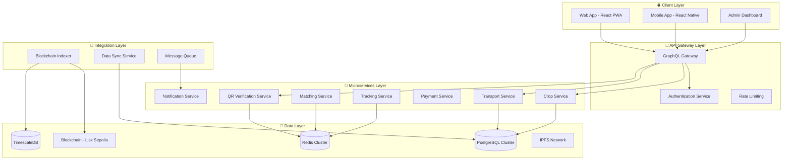
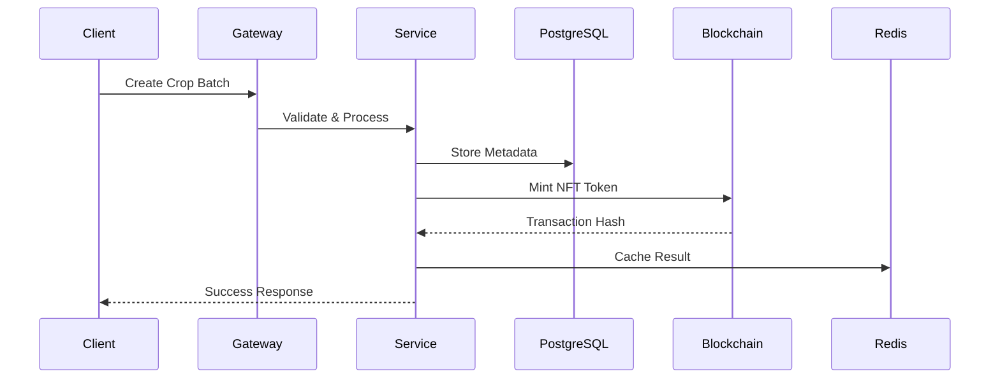
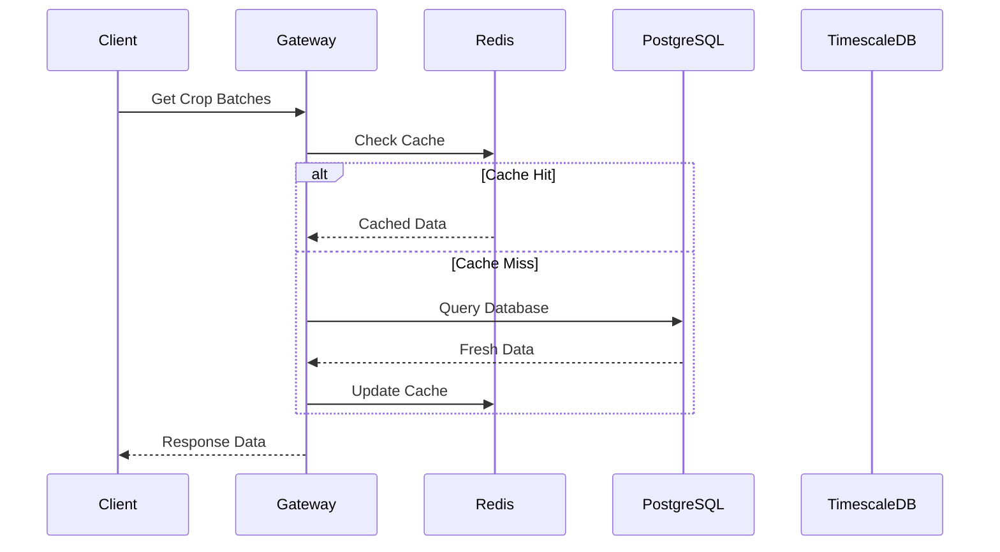

# 🏗️ GreenLedger System Architecture

## 📋 Overview

GreenLedger implements a hybrid architecture that combines the immutability of blockchain with the performance of traditional databases and the real-time capabilities required for transportation logistics. This document provides a comprehensive overview of our system design.

## 🎯 Architecture Principles

### **Core Design Philosophy**
- **Blockchain as Audit Trail**: Immutable record keeping without performance penalties
- **Database as Performance Layer**: Fast queries and complex relationships
- **Cache as Speed Layer**: Sub-millisecond response times
- **Microservices as Scale Layer**: Independent scaling and deployment

### **Key Requirements**
- **Agricultural Supply Chain**: Provenance tracking, quality assurance
- **Transportation Network**: Real-time matching, GPS tracking (Uber-like)
- **QR Verification**: <200ms verification times
- **Offline Support**: Field workers in remote areas
- **Enterprise Scale**: 100K+ users, millions of transactions

## 🏛️ High-Level Architecture



## 🔄 Data Flow Architecture

### **Write Path: Client → Database → Blockchain**


### **Read Path: Client ← Cache ← Database**


## 🎯 Service Architecture

### **Core Services**

#### **1. Crop Service**
- **Purpose**: Crop batch lifecycle management
- **Responsibilities**: Minting, metadata, provenance
- **Database**: PostgreSQL + Blockchain
- **Cache**: Redis (metadata, ownership)

```typescript
interface CropService {
  mintCropBatch(data: CropData): Promise<string>;
  getCropBatch(tokenId: number): Promise<CropBatch>;
  updateProvenance(tokenId: number, update: ProvenanceUpdate): Promise<void>;
  searchCropBatches(filters: SearchFilters): Promise<CropBatch[]>;
}
```

#### **2. Transportation Service**
- **Purpose**: Uber-like logistics network
- **Responsibilities**: Matching, routing, tracking
- **Database**: PostgreSQL (PostGIS) + Redis
- **Real-time**: WebSocket connections

```typescript
interface TransportationService {
  findNearbyTransporters(location: Location): Promise<Transporter[]>;
  createDeliveryRequest(request: DeliveryRequest): Promise<string>;
  trackDelivery(deliveryId: string): Promise<TrackingData>;
  updateTransporterLocation(id: string, location: Location): Promise<void>;
}
```

#### **3. QR Verification Service**
- **Purpose**: Instant crop batch verification
- **Responsibilities**: QR generation, scanning, verification
- **Performance**: <200ms response time
- **Cache**: Aggressive caching strategy

```typescript
interface QRVerificationService {
  generateQR(tokenId: number): Promise<string>;
  verifyToken(tokenId: number): Promise<VerificationResult>;
  getVerificationHistory(tokenId: number): Promise<VerificationEvent[]>;
}
```

## 💾 Data Architecture

### **Storage Strategy**

| Data Type | Primary Storage | Cache | Backup | Purpose |
|-----------|----------------|-------|---------|---------|
| **User Data** | PostgreSQL | Redis | S3 | Profiles, authentication |
| **Crop Batches** | PostgreSQL | Redis | Blockchain | Fast queries, ownership |
| **Transactions** | Blockchain | PostgreSQL | TimescaleDB | Immutable audit trail |
| **Analytics** | TimescaleDB | Redis | S3 | Time-series analysis |
| **Files** | IPFS | CDN | S3 | Images, documents |
| **Sessions** | Redis | - | PostgreSQL | User sessions |
| **Real-time** | Redis | - | PostgreSQL | Live tracking data |

### **Database Schemas**

#### **PostgreSQL Schema**
```sql
-- Core business entities
CREATE SCHEMA crop_tracking;
CREATE SCHEMA transportation;  
CREATE SCHEMA payments;
CREATE SCHEMA analytics;

-- Enable PostGIS for location data
CREATE EXTENSION postgis;

-- Partitioning for scale
CREATE TABLE transportation.location_updates (
  id BIGSERIAL,
  transporter_id UUID,
  location POINT,
  timestamp TIMESTAMPTZ
) PARTITION BY RANGE (timestamp);
```

#### **TimescaleDB Schema**
```sql
-- Time-series data
CREATE TABLE supply_chain_events (
  time TIMESTAMPTZ NOT NULL,
  token_id INTEGER,
  event_type TEXT,
  actor_address TEXT,
  metadata JSONB
);

SELECT create_hypertable('supply_chain_events', 'time');

-- Continuous aggregates
CREATE MATERIALIZED VIEW hourly_metrics
WITH (timescaledb.continuous) AS
SELECT 
  time_bucket('1 hour', time) AS bucket,
  COUNT(*) as total_events,
  COUNT(DISTINCT token_id) as unique_tokens
FROM supply_chain_events
GROUP BY bucket;
```

## 🔧 Technology Stack

### **Frontend Stack**
```json
{
  "framework": "React 18.3.1",
  "language": "TypeScript 5.6.3",
  "styling": "Tailwind CSS",
  "state": "Zustand + React Query",
  "web3": "Wagmi + RainbowKit",
  "mobile": "React Native (future)",
  "pwa": "Vite PWA Plugin"
}
```

### **Backend Stack**
```json
{
  "runtime": "Node.js 18+",
  "framework": "Fastify",
  "graphql": "Apollo Server",
  "database": "PostgreSQL 15 + TimescaleDB",
  "cache": "Redis 7+",
  "queue": "BullMQ",
  "blockchain": "Viem + Wagmi"
}
```

### **Infrastructure Stack**
```json
{
  "containers": "Docker + Kubernetes",
  "cloud": "AWS / Railway",
  "monitoring": "Prometheus + Grafana",
  "logging": "Winston + ELK Stack",
  "ci_cd": "GitHub Actions",
  "security": "Helmet + Rate Limiting"
}
```

## 🚀 Performance Characteristics

### **Response Time Targets**
| Operation | Target | Current | Strategy |
|-----------|--------|---------|----------|
| QR Verification | <200ms | N/A | Redis cache + DB |
| Crop Search | <500ms | 2-5s | Indexed queries |
| Real-time Tracking | <100ms | N/A | WebSocket + Redis |
| Blockchain Sync | <30s | Variable | Event indexing |

### **Scalability Targets**
| Metric | Current | Target | Strategy |
|--------|---------|--------|----------|
| Concurrent Users | 100 | 10,000+ | Horizontal scaling |
| Transactions/sec | 10 | 1,000+ | Queue processing |
| Data Volume | 1GB | 1TB+ | Partitioning |
| Cache Hit Rate | 0% | 90%+ | Intelligent caching |

## 🔐 Security Architecture

### **Security Layers**
1. **Network Security**: WAF, DDoS protection, SSL/TLS
2. **Application Security**: Input validation, CORS, CSP
3. **Authentication**: JWT tokens, role-based access
4. **Data Security**: Encryption at rest and in transit
5. **Blockchain Security**: Multi-signature, access control

### **Access Control Matrix**
| Role | Mint Tokens | Transfer | View Analytics | Admin Functions |
|------|-------------|----------|----------------|-----------------|
| **Farmer** | ✅ | ✅ (to Transporter) | ❌ | ❌ |
| **Transporter** | ❌ | ✅ (to Buyer) | ❌ | ❌ |
| **Buyer** | ❌ | ❌ | ✅ (own data) | ❌ |
| **Admin** | ✅ | ✅ | ✅ | ✅ |

## 📊 Monitoring & Observability

### **Key Metrics**
```typescript
interface SystemMetrics {
  // Performance
  responseTime: number;        // Target: <200ms
  throughput: number;          // Target: 1000+ req/sec
  errorRate: number;           // Target: <0.1%
  
  // Business
  activeUsers: number;         // Target: 10,000+
  tokensVerified: number;      // Target: 1,000+/day
  deliveriesTracked: number;   // Target: 500+/day
  
  // Infrastructure
  cpuUsage: number;           // Target: <70%
  memoryUsage: number;        // Target: <80%
  diskUsage: number;          // Target: <85%
}
```

### **Alerting Rules**
- **Critical**: Response time >1s, Error rate >1%, Service down
- **Warning**: Response time >500ms, Error rate >0.5%, High resource usage
- **Info**: New deployments, Scaling events, Maintenance windows

## 🔗 Related Documentation

### **Architecture Deep Dives**
- [Hybrid Storage Infrastructure](./HYBRID_STORAGE.md) - Detailed storage strategy
- [Microservices Design](./MICROSERVICES.md) - Service decomposition
- [Database Design](./DATABASE_DESIGN.md) - Schema and optimization

### **Implementation Guides**
- [Development Setup](../implementation/DEVELOPMENT_SETUP.md) - Local environment
- [Deployment Guide](../implementation/DEPLOYMENT.md) - Production deployment
- [Migration Guide](../implementation/MIGRATION.md) - Evolution strategy

### **Feature Documentation**
- [QR Verification System](../features/QR_VERIFICATION.md) - Core differentiator
- [Transportation Network](../features/TRANSPORTATION.md) - Logistics system
- [Supply Chain Tracking](../features/SUPPLY_CHAIN.md) - Provenance tracking

### **Operations**
- [Performance Optimization](../operations/PERFORMANCE.md) - Speed guidelines
- [Monitoring & Alerting](../operations/MONITORING.md) - Observability setup
- [Security Guidelines](../operations/SECURITY.md) - Security practices

## 🚨 Architecture Decisions

### **Key Trade-offs**
1. **Complexity vs Performance**: Chose hybrid approach for optimal performance
2. **Consistency vs Availability**: Eventual consistency for non-critical data
3. **Cost vs Scalability**: Designed for horizontal scaling
4. **Security vs Usability**: Balanced security with user experience

### **Future Considerations**
- **Multi-chain Support**: Ethereum, Polygon integration
- **Edge Computing**: CDN and edge caching
- **Machine Learning**: Predictive analytics and fraud detection
- **IoT Integration**: Sensor data and automated quality scoring

---

**Related Links:**
- [← Documentation Hub](../README.md)
- [Hybrid Storage →](./HYBRID_STORAGE.md)
- [Microservices Design →](./MICROSERVICES.md)
- [Quick Start Guide →](../implementation/QUICK_START.md)

**Last Updated**: January 15, 2024  
**Version**: 2.0  
**Status**: ✅ Complete