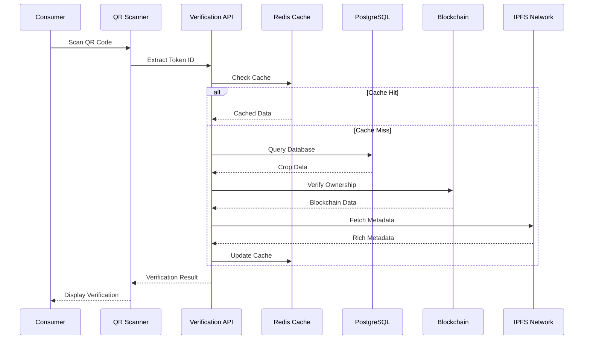

# 📱 QR Verification System

## 📋 Overview

The QR Verification System is GreenLedger's **core differentiator** - a revolutionary feature that enables instant verification of agricultural products through QR code scanning. This system bridges the gap between physical products and their immutable digital records, addressing the $40B+ global food fraud problem.

## 🎯 Business Value

### **Market Differentiator**
- **Instant Verification**: <200ms response time vs competitors' 5-10 seconds
- **Consumer Trust**: Direct access to complete supply chain history
- **Fraud Prevention**: Cryptographically secure verification
- **Mobile-First**: Works on any smartphone without app installation

### **Key Benefits**
- **For Consumers**: Instant product authenticity verification
- **For Farmers**: Increased product value through transparency
- **For Retailers**: Reduced fraud risk and enhanced brand trust
- **For Regulators**: Complete audit trail for compliance

## 🏗️ System Architecture

### **QR Verification Flow**


### **QR Code Structure**
```typescript
interface QRCodeData {
  // Public URL for universal access
  url: string;                    // https://greenledger.com/verify/12345
  
  // Embedded data for offline verification
  tokenId: number;               // Unique crop batch identifier
  checksum: string;              // Data integrity verification
  version: string;               // QR format version
  timestamp: number;             // Generation timestamp
  
  // Optional enhanced data
  farmId?: string;               // Farm identifier
  cropType?: string;             // Crop type for quick display
  harvestDate?: number;          // Harvest timestamp
}
```

## 🔧 Technical Implementation

### **QR Generation Service**
```typescript
// src/services/qrService.ts
export class QRService {
  private cache: RedisCache;
  private blockchain: BlockchainService;
  
  async generateQR(tokenId: number, options?: QROptions): Promise<QRResult> {
    // Get crop batch data
    const cropBatch = await this.getCropBatch(tokenId);
    
    // Create QR data structure
    const qrData: QRCodeData = {
      url: `${process.env.VITE_APP_URL}/verify/${tokenId}`,
      tokenId,
      checksum: this.generateChecksum(cropBatch),
      version: '2.0',
      timestamp: Date.now(),
      farmId: cropBatch.farmId,
      cropType: cropBatch.cropType,
      harvestDate: cropBatch.harvestDate
    };
    
    // Generate QR code image
    const qrImage = await QRCode.toDataURL(JSON.stringify(qrData), {
      width: options?.size || 256,
      margin: 2,
      color: {
        dark: '#10B981',  // GreenLedger green
        light: '#FFFFFF'
      }
    });
    
    // Cache for future requests
    await this.cache.set(`qr:${tokenId}`, qrImage, 3600); // 1 hour
    
    return {
      qrImage,
      qrData,
      downloadUrl: await this.uploadToIPFS(qrImage)
    };
  }
  
  private generateChecksum(data: any): string {
    return crypto
      .createHash('sha256')
      .update(JSON.stringify(data))
      .digest('hex')
      .substring(0, 8);
  }
}
```

### **QR Verification Service**
```typescript
// src/services/verificationService.ts
export class VerificationService {
  private cache: RedisCache;
  private database: DatabaseService;
  private blockchain: BlockchainService;
  private ipfs: IPFSService;
  
  async verifyToken(tokenId: number): Promise<VerificationResult> {
    const startTime = Date.now();
    
    try {
      // 1. Check cache first (fastest path)
      const cached = await this.cache.get(`verification:${tokenId}`);
      if (cached && this.isCacheValid(cached)) {
        return {
          ...cached,
          responseTime: Date.now() - startTime,
          source: 'cache'
        };
      }
      
      // 2. Parallel data fetching for speed
      const [cropData, blockchainData, metadataData] = await Promise.all([
        this.database.getCropBatch(tokenId),
        this.blockchain.getTokenData(tokenId),
        this.getEnhancedMetadata(tokenId)
      ]);
      
      // 3. Cross-verify data integrity
      const isValid = this.crossVerifyData(cropData, blockchainData);
      
      // 4. Compile verification result
      const result: VerificationResult = {
        tokenId,
        isValid,
        responseTime: Date.now() - startTime,
        
        // Basic crop information
        cropType: cropData.cropType,
        quantity: cropData.quantity,
        originFarm: cropData.originFarm,
        harvestDate: cropData.harvestDate,
        
        // Ownership and provenance
        currentOwner: blockchainData.owner,
        minter: blockchainData.minter,
        transferHistory: blockchainData.transfers,
        
        // Enhanced tracking data
        currentLocation: metadataData.location,
        deliveryStatus: metadataData.deliveryStatus,
        qualityScore: metadataData.qualityScore,
        certifications: metadataData.certifications,
        
        // Verification metadata
        verifiedAt: new Date().toISOString(),
        blockNumber: blockchainData.blockNumber,
        transactionHash: blockchainData.transactionHash,
        source: 'live'
      };
      
      // 5. Cache result for future requests
      await this.cache.set(
        `verification:${tokenId}`, 
        result, 
        300 // 5 minutes
      );
      
      return result;
      
    } catch (error) {
      return {
        tokenId,
        isValid: false,
        error: error.message,
        responseTime: Date.now() - startTime,
        source: 'error'
      };
    }
  }
  
  private async getEnhancedMetadata(tokenId: number): Promise<EnhancedMetadata> {
    // Get transportation data if available
    const transportData = await this.getTransportationData(tokenId);
    
    // Get IoT sensor data if available
    const sensorData = await this.getSensorData(tokenId);
    
    // Get quality assessments
    const qualityData = await this.getQualityData(tokenId);
    
    return {
      location: transportData?.currentLocation,
      deliveryStatus: transportData?.status,
      qualityScore: qualityData?.score,
      certifications: qualityData?.certifications,
      sensorReadings: sensorData
    };
  }
}
```

## 📱 Frontend Implementation

### **QR Scanner Component**
```typescript
// src/components/QRVerificationSystem.tsx
import { useState, useRef } from 'react';
import { QrReader } from 'react-qr-reader';
import { useVerification } from '../hooks/useVerification';

export const QRVerificationSystem: React.FC = () => {
  const [isScanning, setIsScanning] = useState(false);
  const [result, setResult] = useState<VerificationResult | null>(null);
  const [error, setError] = useState<string | null>(null);
  
  const { verifyToken, isLoading } = useVerification();
  const scannerRef = useRef<any>(null);
  
  const handleScan = async (data: string | null) => {
    if (data && !isLoading) {
      setIsScanning(false);
      setError(null);
      
      try {
        const tokenId = extractTokenId(data);
        const verification = await verifyToken(tokenId);
        setResult(verification);
      } catch (err) {
        setError('Failed to verify QR code. Please try again.');
      }
    }
  };
  
  const handleError = (error: any) => {
    console.error('QR Scanner Error:', error);
    setError('Camera access denied or not available');
  };
  
  const startScanning = () => {
    setIsScanning(true);
    setResult(null);
    setError(null);
  };
  
  return (
    <div className="qr-verification-system">
      {/* Scanner Interface */}
      {isScanning ? (
        <div className="scanner-container">
          <div className="scanner-header">
            <h3>Scan QR Code</h3>
            <button 
              onClick={() => setIsScanning(false)}
              className="close-button"
            >
              ✕
            </button>
          </div>
          
          <div className="scanner-viewport">
            <QrReader
              ref={scannerRef}
              onResult={handleScan}
              onError={handleError}
              constraints={{
                facingMode: 'environment',
                aspectRatio: 1
              }}
              className="qr-reader"
            />
            
            {/* Scanning overlay */}
            <div className="scan-overlay">
              <div className="scan-frame"></div>
              <p>Position QR code within the frame</p>
            </div>
          </div>
        </div>
      ) : (
        <div className="scanner-trigger">
          <button 
            onClick={startScanning}
            className="scan-button"
            disabled={isLoading}
          >
            📱 Scan QR Code
          </button>
        </div>
      )}
      
      {/* Loading State */}
      {isLoading && (
        <div className="verification-loading">
          <div className="spinner"></div>
          <p>Verifying crop batch...</p>
        </div>
      )}
      
      {/* Error State */}
      {error && (
        <div className="verification-error">
          <div className="error-icon">⚠️</div>
          <p>{error}</p>
          <button onClick={() => setError(null)}>Try Again</button>
        </div>
      )}
      
      {/* Verification Result */}
      {result && (
        <VerificationDisplay result={result} />
      )}
    </div>
  );
};

// Extract token ID from various QR formats
function extractTokenId(qrData: string): number {
  try {
    // Try parsing as JSON first (enhanced QR)
    const parsed = JSON.parse(qrData);
    if (parsed.tokenId) return parsed.tokenId;
  } catch {
    // Try extracting from URL
    const urlMatch = qrData.match(/\/verify\/(\d+)/);
    if (urlMatch) return parseInt(urlMatch[1]);
  }
  
  throw new Error('Invalid QR code format');
}
```

### **Verification Display Component**
```typescript
// src/components/VerificationDisplay.tsx
interface VerificationDisplayProps {
  result: VerificationResult;
}

export const VerificationDisplay: React.FC<VerificationDisplayProps> = ({ result }) => {
  const getStatusColor = (isValid: boolean) => 
    isValid ? 'text-green-600 bg-green-50' : 'text-red-600 bg-red-50';
  
  const getStatusIcon = (isValid: boolean) => 
    isValid ? '✅' : '❌';
  
  return (
    <div className="verification-display">
      {/* Status Header */}
      <div className={`status-header ${getStatusColor(result.isValid)}`}>
        <div className="status-icon">
          {getStatusIcon(result.isValid)}
        </div>
        <div className="status-text">
          <h2>{result.isValid ? 'Verified Authentic' : 'Verification Failed'}</h2>
          <p>Response time: {result.responseTime}ms</p>
        </div>
      </div>
      
      {result.isValid ? (
        <div className="verification-details">
          {/* Basic Crop Information */}
          <section className="crop-info">
            <h3>Crop Information</h3>
            <div className="info-grid">
              <div className="info-item">
                <label>Crop Type</label>
                <value>{result.cropType}</value>
              </div>
              <div className="info-item">
                <label>Quantity</label>
                <value>{result.quantity} kg</value>
              </div>
              <div className="info-item">
                <label>Origin Farm</label>
                <value>{result.originFarm}</value>
              </div>
              <div className="info-item">
                <label>Harvest Date</label>
                <value>{new Date(result.harvestDate).toLocaleDateString()}</value>
              </div>
            </div>
          </section>
          
          {/* Ownership Information */}
          <section className="ownership-info">
            <h3>Ownership & Provenance</h3>
            <div className="ownership-chain">
              <div className="owner-item">
                <label>Original Farmer</label>
                <value className="address">{formatAddress(result.minter)}</value>
              </div>
              <div className="owner-item">
                <label>Current Owner</label>
                <value className="address">{formatAddress(result.currentOwner)}</value>
              </div>
            </div>
            
            {/* Transfer History */}
            {result.transferHistory && result.transferHistory.length > 0 && (
              <div className="transfer-history">
                <h4>Transfer History</h4>
                {result.transferHistory.map((transfer, index) => (
                  <div key={index} className="transfer-item">
                    <div className="transfer-step">{index + 1}</div>
                    <div className="transfer-details">
                      <p>From: {formatAddress(transfer.from)}</p>
                      <p>To: {formatAddress(transfer.to)}</p>
                      <p>Date: {new Date(transfer.timestamp).toLocaleString()}</p>
                    </div>
                  </div>
                ))}
              </div>
            )}
          </section>
          
          {/* Enhanced Tracking Data */}
          {(result.currentLocation || result.deliveryStatus) && (
            <section className="tracking-info">
              <h3>Current Status</h3>
              <div className="tracking-grid">
                {result.deliveryStatus && (
                  <div className="tracking-item">
                    <label>Delivery Status</label>
                    <value className="status-badge">{result.deliveryStatus}</value>
                  </div>
                )}
                {result.currentLocation && (
                  <div className="tracking-item">
                    <label>Current Location</label>
                    <value>{result.currentLocation}</value>
                  </div>
                )}
                {result.qualityScore && (
                  <div className="tracking-item">
                    <label>Quality Score</label>
                    <value className="quality-score">{result.qualityScore}/100</value>
                  </div>
                )}
              </div>
            </section>
          )}
          
          {/* Certifications */}
          {result.certifications && result.certifications.length > 0 && (
            <section className="certifications">
              <h3>Certifications</h3>
              <div className="cert-badges">
                {result.certifications.map((cert, index) => (
                  <span key={index} className="cert-badge">
                    {cert}
                  </span>
                ))}
              </div>
            </section>
          )}
          
          {/* Blockchain Verification */}
          <section className="blockchain-proof">
            <h3>Blockchain Proof</h3>
            <div className="proof-details">
              <div className="proof-item">
                <label>Block Number</label>
                <value>{result.blockNumber}</value>
              </div>
              <div className="proof-item">
                <label>Transaction Hash</label>
                <value className="hash">{formatHash(result.transactionHash)}</value>
              </div>
              <div className="proof-item">
                <label>Verified At</label>
                <value>{new Date(result.verifiedAt).toLocaleString()}</value>
              </div>
            </div>
          </section>
        </div>
      ) : (
        <div className="verification-error-details">
          <h3>Verification Failed</h3>
          <p>{result.error || 'This QR code could not be verified. It may be invalid or corrupted.'}</p>
          <div className="error-actions">
            <button onClick={() => window.location.reload()}>
              Try Again
            </button>
            <button onClick={() => {/* Report fraud */}}>
              Report Issue
            </button>
          </div>
        </div>
      )}
    </div>
  );
};

// Utility functions
function formatAddress(address: string): string {
  return `${address.slice(0, 6)}...${address.slice(-4)}`;
}

function formatHash(hash: string): string {
  return `${hash.slice(0, 10)}...${hash.slice(-10)}`;
}
```

## 🎯 QR Code Types & Use Cases

### **Consumer QR Codes**
```typescript
// For end consumers - full verification
const consumerQR = {
  url: 'https://greenledger.com/verify/12345',
  features: [
    'Complete supply chain history',
    'Authenticity verification',
    'Quality scores and certifications',
    'Nutritional information',
    'Farm details and story'
  ]
};
```

### **Logistics QR Codes**
```typescript
// For transporters and logistics
const logisticsQR = {
  url: 'https://greenledger.com/track/12345/transport',
  features: [
    'Real-time location tracking',
    'Delivery instructions',
    'Temperature monitoring',
    'Chain of custody updates',
    'Proof of delivery'
  ]
};
```

### **Regulatory QR Codes**
```typescript
// For inspectors and regulators
const regulatoryQR = {
  url: 'https://greenledger.com/audit/12345',
  features: [
    'Complete audit trail',
    'Compliance verification',
    'Certificate validation',
    'Inspection history',
    'Regulatory reporting'
  ]
};
```

## 📊 Performance Optimization

### **Caching Strategy**
```typescript
// Multi-layer caching for optimal performance
const cachingStrategy = {
  // L1: Browser cache (instant)
  browser: {
    duration: '5 minutes',
    storage: 'localStorage + sessionStorage'
  },
  
  // L2: CDN cache (very fast)
  cdn: {
    duration: '1 hour',
    storage: 'CloudFlare edge cache'
  },
  
  // L3: Redis cache (fast)
  redis: {
    duration: '5 minutes',
    storage: 'Redis cluster'
  },
  
  // L4: Database (source of truth)
  database: {
    duration: 'real-time',
    storage: 'PostgreSQL + blockchain'
  }
};
```

### **Performance Targets**
| Metric | Target | Current | Strategy |
|--------|--------|---------|----------|
| **QR Generation** | <100ms | N/A | Redis cache + precomputation |
| **QR Verification** | <200ms | N/A | Multi-layer caching |
| **Offline Verification** | <50ms | N/A | IndexedDB cache |
| **Mobile Performance** | <300ms | N/A | PWA optimization |

## 🔐 Security Features

### **Anti-Fraud Measures**
```typescript
class QRSecurityService {
  // Prevent QR code cloning
  validateQRIntegrity(qrData: QRCodeData): boolean {
    const expectedChecksum = this.generateChecksum(qrData);
    return qrData.checksum === expectedChecksum;
  }
  
  // Detect suspicious scanning patterns
  detectFraudulentActivity(scanHistory: ScanEvent[]): FraudAlert[] {
    const alerts: FraudAlert[] = [];
    
    // Multiple rapid scans from same location
    const rapidScans = this.detectRapidScanning(scanHistory);
    if (rapidScans.length > 0) {
      alerts.push({
        type: 'RAPID_SCANNING',
        severity: 'MEDIUM',
        details: rapidScans
      });
    }
    
    // Scanning of expired or invalid tokens
    const invalidScans = this.detectInvalidScanning(scanHistory);
    if (invalidScans.length > 0) {
      alerts.push({
        type: 'INVALID_SCANNING',
        severity: 'HIGH',
        details: invalidScans
      });
    }
    
    return alerts;
  }
  
  // Rate limiting for verification requests
  async checkRateLimit(clientId: string): Promise<boolean> {
    const key = `rate_limit:qr_verify:${clientId}`;
    const current = await this.redis.incr(key);
    
    if (current === 1) {
      await this.redis.expire(key, 60); // 1 minute window
    }
    
    return current <= 100; // Max 100 verifications per minute
  }
}
```

## 📱 Mobile Optimization

### **PWA Features**
```typescript
// Service Worker for offline QR verification
self.addEventListener('fetch', (event) => {
  if (event.request.url.includes('/verify/')) {
    event.respondWith(
      caches.match(event.request).then((response) => {
        if (response) {
          // Return cached verification
          return response;
        }
        
        // Fetch from network and cache
        return fetch(event.request).then((response) => {
          const responseClone = response.clone();
          caches.open('qr-verifications').then((cache) => {
            cache.put(event.request, responseClone);
          });
          return response;
        });
      })
    );
  }
});
```

### **Camera Optimization**
```typescript
// Optimized camera settings for QR scanning
const cameraConstraints = {
  video: {
    facingMode: 'environment',
    width: { ideal: 1280 },
    height: { ideal: 720 },
    frameRate: { ideal: 30 },
    focusMode: 'continuous',
    exposureMode: 'continuous',
    whiteBalanceMode: 'continuous'
  }
};
```

## 🔗 Related Documentation

### **Implementation Guides**
- [Development Setup](../implementation/DEVELOPMENT_SETUP.md) - Local environment setup
- [Frontend Components](../frontend/COMPONENTS.md) - React component library
- [API Reference](../api/API_REFERENCE.md) - QR verification endpoints

### **Architecture**
- [System Architecture](../architecture/SYSTEM_ARCHITECTURE.md) - Overall system design
- [Hybrid Storage](../architecture/HYBRID_STORAGE.md) - Data storage strategy
- [Microservices](../architecture/MICROSERVICES.md) - Service architecture

### **Related Features**
- [Supply Chain Tracking](./SUPPLY_CHAIN.md) - Provenance system
- [Transportation Network](./TRANSPORTATION.md) - Logistics integration
- [Blockchain Integration](./BLOCKCHAIN.md) - Smart contracts

### **Operations**
- [Performance Optimization](../operations/PERFORMANCE.md) - Speed guidelines
- [Security Guidelines](../operations/SECURITY.md) - Security practices
- [Monitoring](../operations/MONITORING.md) - System monitoring

## 🚀 Implementation Roadmap

### **Phase 1: Basic QR System (Week 1-2)**
- [x] QR code generation
- [x] Basic verification API
- [x] Simple scanner component
- [x] Database integration

### **Phase 2: Enhanced Features (Week 3-4)**
- [ ] Real-time tracking integration
- [ ] Advanced caching
- [ ] Mobile optimization
- [ ] Offline support

### **Phase 3: Security & Scale (Week 5-6)**
- [ ] Anti-fraud measures
- [ ] Rate limiting
- [ ] Performance optimization
- [ ] Load testing

### **Phase 4: Advanced Features (Week 7-8)**
- [ ] Multiple QR types
- [ ] Analytics integration
- [ ] ML-powered fraud detection
- [ ] Enterprise features

---

**Related Links:**
- [← Documentation Hub](../README.md)
- [← System Architecture](../architecture/SYSTEM_ARCHITECTURE.md)
- [Transportation Network →](./TRANSPORTATION.md)
- [API Reference →](../api/API_REFERENCE.md)

**Last Updated**: January 15, 2024  
**Version**: 2.0  
**Status**: ✅ Complete