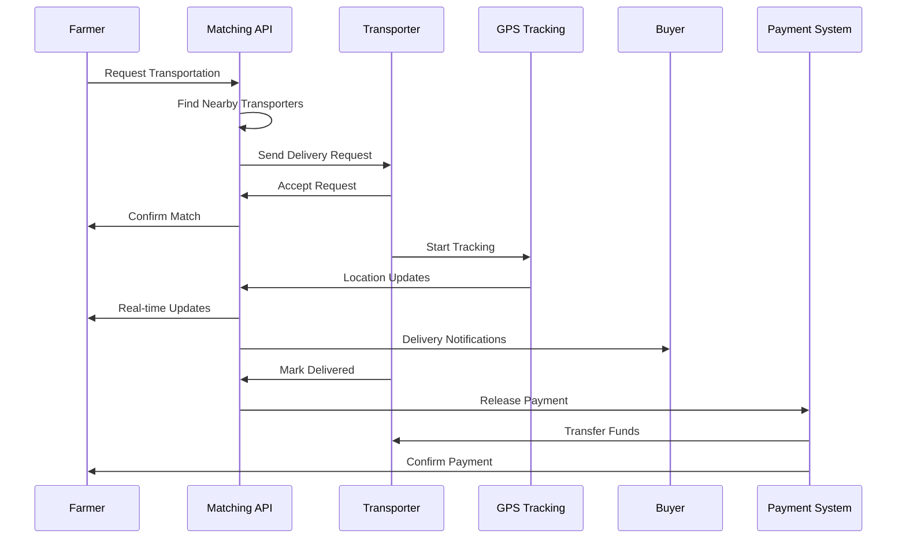
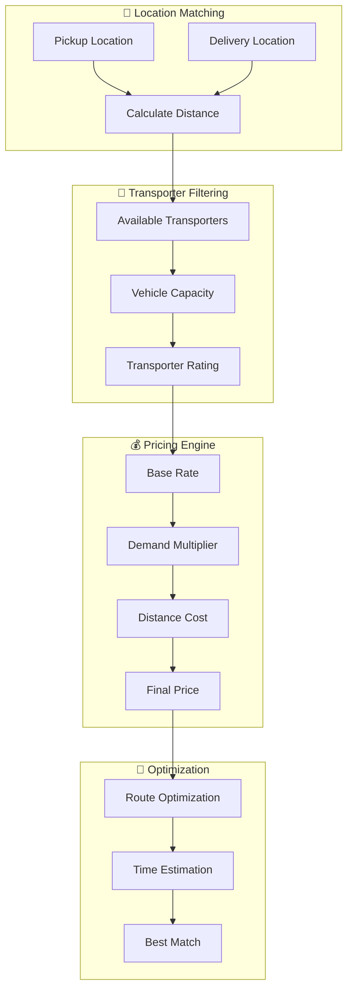

# 🚛 Transportation Network System

## 📋 Overview

GreenLedger's Transportation Network implements an **Uber-like logistics system** specifically designed for agricultural supply chains. This system enables real-time matching between farmers and transporters, GPS tracking, dynamic pricing, and seamless integration with crop batch provenance.

## 🎯 Business Value

### **Market Opportunity**
- **Agricultural Logistics**: $200B+ global market
- **Last-Mile Delivery**: Critical bottleneck in supply chains
- **Real-time Tracking**: Consumer demand for transparency
- **Cost Optimization**: Reduce transportation costs by 20-30%

### **Key Benefits**
- **For Farmers**: Access to reliable, cost-effective transportation
- **For Transporters**: Optimized routes and guaranteed payments
- **For Buyers**: Real-time delivery tracking and quality assurance
- **For Consumers**: Complete supply chain visibility

## 🏗️ System Architecture

### **Transportation Flow**


### **Matching Algorithm**


## 🔧 Technical Implementation

### **Matching Service**
```typescript
// src/services/matchingService.ts
export class TransportationMatchingService {
  private database: DatabaseService;
  private redis: RedisService;
  private maps: MapsService;
  
  async findNearbyTransporters(request: TransportRequest): Promise<TransporterMatch[]> {
    const { pickup, delivery, cropType, quantity, urgency } = request;
    
    // 1. Find transporters within radius using PostGIS
    const nearbyTransporters = await this.database.query(`
      SELECT 
        t.*,
        ST_Distance(t.current_location, ST_Point($1, $2)) as distance_meters,
        t.rating,
        t.vehicle_capacity,
        t.vehicle_type
      FROM transporters t
      WHERE 
        t.status = 'available'
        AND t.vehicle_capacity >= $3
        AND ST_DWithin(t.current_location, ST_Point($1, $2), $4)
        AND t.vehicle_type = ANY($5)
      ORDER BY 
        distance_meters ASC,
        t.rating DESC
      LIMIT 20
    `, [
      pickup.longitude,
      pickup.latitude, 
      quantity,
      50000, // 50km radius
      this.getCompatibleVehicleTypes(cropType)
    ]);
    
    // 2. Calculate routes and pricing for each transporter
    const matches = await Promise.all(
      nearbyTransporters.map(async (transporter) => {
        const route = await this.maps.calculateRoute(
          transporter.current_location,
          pickup,
          delivery
        );
        
        const pricing = await this.calculatePricing({
          distance: route.distance,
          duration: route.duration,
          cropType,
          quantity,
          urgency,
          transporterRating: transporter.rating
        });
        
        return {
          transporterId: transporter.id,
          transporter,
          route,
          pricing,
          estimatedPickupTime: this.calculatePickupTime(
            transporter.current_location,
            pickup,
            route.duration
          ),
          estimatedDeliveryTime: this.calculateDeliveryTime(
            route.duration,
            urgency
          )
        };
      })
    );
    
    // 3. Rank matches by score
    return matches
      .map(match => ({
        ...match,
        score: this.calculateMatchScore(match, request)
      }))
      .sort((a, b) => b.score - a.score)
      .slice(0, 5); // Return top 5 matches
  }
  
  private calculateMatchScore(match: TransporterMatch, request: TransportRequest): number {
    const weights = {
      distance: 0.3,
      price: 0.25,
      rating: 0.2,
      pickupTime: 0.15,
      deliveryTime: 0.1
    };
    
    // Normalize scores (0-1 scale)
    const distanceScore = Math.max(0, 1 - (match.route.distance / 100000)); // 100km max
    const priceScore = Math.max(0, 1 - (match.pricing.total / 1000)); // $1000 max
    const ratingScore = match.transporter.rating / 5; // 5-star rating
    const pickupScore = Math.max(0, 1 - (match.estimatedPickupTime / 7200)); // 2 hours max
    const deliveryScore = Math.max(0, 1 - (match.estimatedDeliveryTime / 86400)); // 24 hours max
    
    return (
      distanceScore * weights.distance +
      priceScore * weights.price +
      ratingScore * weights.rating +
      pickupScore * weights.pickupTime +
      deliveryScore * weights.deliveryTime
    ) * 100;
  }
  
  async createDeliveryRequest(
    farmerId: string, 
    match: TransporterMatch,
    cropBatchId: number
  ): Promise<DeliveryRequest> {
    const deliveryRequest = {
      id: crypto.randomUUID(),
      farmerId,
      transporterId: match.transporterId,
      cropBatchId,
      status: 'pending',
      pickup: match.route.pickup,
      delivery: match.route.delivery,
      estimatedCost: match.pricing.total,
      estimatedPickupTime: match.estimatedPickupTime,
      estimatedDeliveryTime: match.estimatedDeliveryTime,
      createdAt: new Date()
    };
    
    // Store in database
    await this.database.createDeliveryRequest(deliveryRequest);
    
    // Notify transporter
    await this.notificationService.notifyTransporter(
      match.transporterId,
      'NEW_DELIVERY_REQUEST',
      deliveryRequest
    );
    
    // Set expiration (5 minutes to respond)
    await this.redis.setex(
      `delivery_request:${deliveryRequest.id}`,
      300,
      JSON.stringify(deliveryRequest)
    );
    
    return deliveryRequest;
  }
}
```

### **Real-time Tracking Service**
```typescript
// src/services/trackingService.ts
export class TrackingService {
  private redis: RedisService;
  private websocket: WebSocketService;
  private database: DatabaseService;
  
  async updateTransporterLocation(
    transporterId: string,
    location: Location,
    deliveryId?: string
  ): Promise<void> {
    const timestamp = Date.now();
    
    // 1. Update real-time location in Redis
    await this.redis.geoadd(
      'transporter_locations',
      location.longitude,
      location.latitude,
      transporterId
    );
    
    // 2. Store location history
    await this.redis.zadd(
      `location_history:${transporterId}`,
      timestamp,
      JSON.stringify({ ...location, timestamp })
    );
    
    // 3. If actively delivering, update delivery tracking
    if (deliveryId) {
      await this.updateDeliveryTracking(deliveryId, location, timestamp);
    }
    
    // 4. Broadcast to subscribers
    await this.websocket.broadcast(`transporter:${transporterId}`, {
      type: 'LOCATION_UPDATE',
      transporterId,
      location,
      timestamp,
      deliveryId
    });
    
    // 5. Batch write to PostgreSQL (every 30 seconds)
    await this.batchLocationUpdate(transporterId, location, timestamp);
  }
  
  private async updateDeliveryTracking(
    deliveryId: string,
    location: Location,
    timestamp: number
  ): Promise<void> {
    // Get delivery details
    const delivery = await this.database.getDelivery(deliveryId);
    if (!delivery) return;
    
    // Calculate progress
    const progress = this.calculateDeliveryProgress(
      delivery.pickup,
      delivery.delivery,
      location
    );
    
    // Update delivery status based on location
    let status = delivery.status;
    if (this.isNearLocation(location, delivery.pickup, 100)) { // 100m radius
      status = 'arrived_pickup';
    } else if (this.isNearLocation(location, delivery.delivery, 100)) {
      status = 'arrived_delivery';
    } else if (progress > 0.1) {
      status = 'in_transit';
    }
    
    // Store tracking update
    const trackingUpdate = {
      deliveryId,
      location,
      progress,
      status,
      timestamp,
      estimatedArrival: this.calculateETA(location, delivery.delivery)
    };
    
    await this.database.addTrackingUpdate(trackingUpdate);
    
    // Notify stakeholders
    await this.notifyStakeholders(delivery, trackingUpdate);
  }
  
  private calculateDeliveryProgress(
    pickup: Location,
    delivery: Location,
    current: Location
  ): number {
    const totalDistance = this.calculateDistance(pickup, delivery);
    const remainingDistance = this.calculateDistance(current, delivery);
    return Math.max(0, Math.min(1, 1 - (remainingDistance / totalDistance)));
  }
  
  private async notifyStakeholders(
    delivery: DeliveryRequest,
    update: TrackingUpdate
  ): Promise<void> {
    // Notify farmer
    await this.websocket.send(`farmer:${delivery.farmerId}`, {
      type: 'DELIVERY_UPDATE',
      deliveryId: delivery.id,
      update
    });
    
    // Notify buyer
    if (delivery.buyerId) {
      await this.websocket.send(`buyer:${delivery.buyerId}`, {
        type: 'DELIVERY_UPDATE',
        deliveryId: delivery.id,
        update
      });
    }
    
    // Update QR verification cache
    await this.redis.setex(
      `tracking:${delivery.cropBatchId}`,
      300, // 5 minutes
      JSON.stringify({
        location: update.location,
        status: update.status,
        progress: update.progress,
        estimatedArrival: update.estimatedArrival
      })
    );
  }
}
```

### **Dynamic Pricing Engine**
```typescript
// src/services/pricingService.ts
export class PricingService {
  private redis: RedisService;
  private database: DatabaseService;
  
  async calculatePricing(params: PricingParams): Promise<PricingResult> {
    const {
      distance,
      duration,
      cropType,
      quantity,
      urgency,
      transporterRating,
      timeOfDay,
      dayOfWeek
    } = params;
    
    // 1. Base rate calculation
    const baseRates = await this.getBaseRates(cropType);
    const basePrice = (distance / 1000) * baseRates.perKm + quantity * baseRates.perKg;
    
    // 2. Demand multiplier
    const demandMultiplier = await this.calculateDemandMultiplier(
      params.pickup.region,
      timeOfDay,
      dayOfWeek
    );
    
    // 3. Urgency multiplier
    const urgencyMultiplier = this.getUrgencyMultiplier(urgency);
    
    // 4. Quality multiplier (based on transporter rating)
    const qualityMultiplier = this.getQualityMultiplier(transporterRating);
    
    // 5. Special handling multiplier
    const specialHandlingMultiplier = this.getSpecialHandlingMultiplier(cropType);
    
    // 6. Calculate final price
    const subtotal = basePrice * demandMultiplier * urgencyMultiplier * 
                    qualityMultiplier * specialHandlingMultiplier;
    
    const platformFee = subtotal * 0.05; // 5% platform fee
    const total = subtotal + platformFee;
    
    return {
      basePrice,
      multipliers: {
        demand: demandMultiplier,
        urgency: urgencyMultiplier,
        quality: qualityMultiplier,
        specialHandling: specialHandlingMultiplier
      },
      subtotal,
      platformFee,
      total,
      breakdown: {
        distanceCost: (distance / 1000) * baseRates.perKm,
        weightCost: quantity * baseRates.perKg,
        demandSurcharge: subtotal * (demandMultiplier - 1),
        urgencySurcharge: subtotal * (urgencyMultiplier - 1),
        qualityPremium: subtotal * (qualityMultiplier - 1)
      }
    };
  }
  
  private async calculateDemandMultiplier(
    region: string,
    timeOfDay: number,
    dayOfWeek: number
  ): Promise<number> {
    // Get current demand in region
    const activeRequests = await this.redis.get(`demand:${region}`);
    const availableTransporters = await this.redis.get(`supply:${region}`);
    
    const demandSupplyRatio = parseInt(activeRequests || '0') / 
                             Math.max(1, parseInt(availableTransporters || '1'));
    
    // Base demand multiplier
    let multiplier = Math.min(3.0, 1 + (demandSupplyRatio * 0.5));
    
    // Peak hours adjustment (7-9 AM, 5-7 PM)
    if ((timeOfDay >= 7 && timeOfDay <= 9) || (timeOfDay >= 17 && timeOfDay <= 19)) {
      multiplier *= 1.2;
    }
    
    // Weekend adjustment
    if (dayOfWeek === 0 || dayOfWeek === 6) {
      multiplier *= 1.1;
    }
    
    return multiplier;
  }
  
  private getUrgencyMultiplier(urgency: 'standard' | 'express' | 'emergency'): number {
    switch (urgency) {
      case 'standard': return 1.0;
      case 'express': return 1.5;
      case 'emergency': return 2.0;
      default: return 1.0;
    }
  }
  
  private getQualityMultiplier(rating: number): number {
    // Higher rated transporters can charge premium
    if (rating >= 4.8) return 1.2;
    if (rating >= 4.5) return 1.1;
    if (rating >= 4.0) return 1.0;
    if (rating >= 3.5) return 0.95;
    return 0.9;
  }
  
  private getSpecialHandlingMultiplier(cropType: string): number {
    const specialHandling = {
      'organic': 1.15,
      'refrigerated': 1.3,
      'fragile': 1.25,
      'hazardous': 1.5,
      'standard': 1.0
    };
    
    return specialHandling[cropType] || 1.0;
  }
}
```

## 📱 Frontend Implementation

### **Transportation Request Component**
```typescript
// src/components/TransportationRequest.tsx
export const TransportationRequest: React.FC<{ cropBatchId: number }> = ({ 
  cropBatchId 
}) => {
  const [step, setStep] = useState<'details' | 'matching' | 'selection' | 'confirmation'>('details');
  const [request, setRequest] = useState<TransportRequest | null>(null);
  const [matches, setMatches] = useState<TransporterMatch[]>([]);
  const [selectedMatch, setSelectedMatch] = useState<TransporterMatch | null>(null);
  
  const { findTransporters, createDelivery } = useTransportation();
  
  const handleRequestTransport = async (requestData: TransportRequest) => {
    setRequest(requestData);
    setStep('matching');
    
    try {
      const transporterMatches = await findTransporters(requestData);
      setMatches(transporterMatches);
      setStep('selection');
    } catch (error) {
      // Handle error
    }
  };
  
  const handleSelectTransporter = (match: TransporterMatch) => {
    setSelectedMatch(match);
    setStep('confirmation');
  };
  
  const handleConfirmDelivery = async () => {
    if (!selectedMatch || !request) return;
    
    try {
      const delivery = await createDelivery({
        cropBatchId,
        transporterId: selectedMatch.transporterId,
        request
      });
      
      // Navigate to tracking page
      navigate(`/track/${delivery.id}`);
    } catch (error) {
      // Handle error
    }
  };
  
  return (
    <div className="transportation-request">
      {step === 'details' && (
        <TransportRequestForm 
          cropBatchId={cropBatchId}
          onSubmit={handleRequestTransport}
        />
      )}
      
      {step === 'matching' && (
        <div className="matching-screen">
          <div className="loading-animation">
            <div className="truck-icon">🚛</div>
            <p>Finding nearby transporters...</p>
          </div>
        </div>
      )}
      
      {step === 'selection' && (
        <TransporterSelection
          matches={matches}
          onSelect={handleSelectTransporter}
        />
      )}
      
      {step === 'confirmation' && selectedMatch && (
        <DeliveryConfirmation
          match={selectedMatch}
          request={request}
          onConfirm={handleConfirmDelivery}
        />
      )}
    </div>
  );
};
```

### **Real-time Tracking Component**
```typescript
// src/components/DeliveryTracking.tsx
export const DeliveryTracking: React.FC<{ deliveryId: string }> = ({ 
  deliveryId 
}) => {
  const [tracking, setTracking] = useState<TrackingData | null>(null);
  const [isLive, setIsLive] = useState(false);
  
  const { subscribeToTracking, unsubscribeFromTracking } = useWebSocket();
  
  useEffect(() => {
    // Subscribe to real-time updates
    const unsubscribe = subscribeToTracking(deliveryId, (update) => {
      setTracking(update);
      setIsLive(true);
    });
    
    return () => {
      unsubscribe();
      setIsLive(false);
    };
  }, [deliveryId]);
  
  if (!tracking) {
    return <div className="loading">Loading tracking information...</div>;
  }
  
  return (
    <div className="delivery-tracking">
      {/* Status Header */}
      <div className="tracking-header">
        <div className="status-indicator">
          <div className={`status-dot ${tracking.status}`}></div>
          <span className="status-text">{formatStatus(tracking.status)}</span>
          {isLive && <span className="live-indicator">🔴 LIVE</span>}
        </div>
        
        <div className="progress-bar">
          <div 
            className="progress-fill"
            style={{ width: `${tracking.progress * 100}%` }}
          ></div>
        </div>
      </div>
      
      {/* Map View */}
      <div className="tracking-map">
        <DeliveryMap
          pickup={tracking.pickup}
          delivery={tracking.delivery}
          currentLocation={tracking.currentLocation}
          route={tracking.route}
        />
      </div>
      
      {/* Delivery Details */}
      <div className="tracking-details">
        <div className="detail-section">
          <h3>Delivery Information</h3>
          <div className="detail-grid">
            <div className="detail-item">
              <label>Estimated Arrival</label>
              <value>{formatTime(tracking.estimatedArrival)}</value>
            </div>
            <div className="detail-item">
              <label>Distance Remaining</label>
              <value>{formatDistance(tracking.remainingDistance)}</value>
            </div>
            <div className="detail-item">
              <label>Current Speed</label>
              <value>{tracking.currentSpeed} km/h</value>
            </div>
          </div>
        </div>
        
        {/* Transporter Information */}
        <div className="detail-section">
          <h3>Transporter</h3>
          <div className="transporter-info">
            <div className="transporter-avatar">
              
            </div>
            <div className="transporter-details">
              <h4>{tracking.transporter.name}</h4>
              <div className="rating">
                {'⭐'.repeat(Math.floor(tracking.transporter.rating))}
                <span>{tracking.transporter.rating}</span>
              </div>
              <p>{tracking.transporter.vehicle}</p>
            </div>
            <div className="contact-actions">
              <button onClick={() => callTransporter(tracking.transporter.phone)}>
                📞 Call
              </button>
              <button onClick={() => messageTransporter(tracking.transporter.id)}>
                💬 Message
              </button>
            </div>
          </div>
        </div>
        
        {/* Timeline */}
        <div className="detail-section">
          <h3>Delivery Timeline</h3>
          <div className="timeline">
            {tracking.timeline.map((event, index) => (
              <div key={index} className={`timeline-item ${event.status}`}>
                <div className="timeline-dot"></div>
                <div className="timeline-content">
                  <h4>{event.title}</h4>
                  <p>{event.description}</p>
                  <span className="timeline-time">
                    {formatTime(event.timestamp)}
                  </span>
                </div>
              </div>
            ))}
          </div>
        </div>
      </div>
    </div>
  );
};
```

## 🗺️ Route Optimization

### **Multi-Stop Routing**
```typescript
// src/services/routeOptimizationService.ts
export class RouteOptimizationService {
  private maps: MapsService;
  
  async optimizeMultiStopRoute(
    transporterId: string,
    deliveries: DeliveryRequest[]
  ): Promise<OptimizedRoute> {
    // Get transporter's current location
    const currentLocation = await this.getCurrentLocation(transporterId);
    
    // Create waypoints array
    const waypoints = deliveries.flatMap(delivery => [
      { ...delivery.pickup, type: 'pickup', deliveryId: delivery.id },
      { ...delivery.delivery, type: 'delivery', deliveryId: delivery.id }
    ]);
    
    // Use genetic algorithm for optimization
    const optimizedOrder = await this.geneticAlgorithmOptimization(
      currentLocation,
      waypoints
    );
    
    // Calculate route with optimized order
    const route = await this.maps.calculateMultiStopRoute(
      currentLocation,
      optimizedOrder
    );
    
    return {
      totalDistance: route.distance,
      totalDuration: route.duration,
      waypoints: optimizedOrder,
      route: route.path,
      estimatedFuelCost: this.calculateFuelCost(route.distance),
      estimatedRevenue: this.calculateRevenue(deliveries),
      efficiency: this.calculateEfficiency(route, deliveries)
    };
  }
  
  private async geneticAlgorithmOptimization(
    start: Location,
    waypoints: Waypoint[]
  ): Promise<Waypoint[]> {
    const populationSize = 50;
    const generations = 100;
    const mutationRate = 0.1;
    
    // Initialize population
    let population = Array.from({ length: populationSize }, () => 
      this.shuffleArray([...waypoints])
    );
    
    for (let generation = 0; generation < generations; generation++) {
      // Evaluate fitness
      const fitness = await Promise.all(
        population.map(individual => this.calculateFitness(start, individual))
      );
      
      // Selection and crossover
      const newPopulation = [];
      for (let i = 0; i < populationSize; i++) {
        const parent1 = this.tournamentSelection(population, fitness);
        const parent2 = this.tournamentSelection(population, fitness);
        const offspring = this.crossover(parent1, parent2);
        
        // Mutation
        if (Math.random() < mutationRate) {
          this.mutate(offspring);
        }
        
        newPopulation.push(offspring);
      }
      
      population = newPopulation;
    }
    
    // Return best solution
    const finalFitness = await Promise.all(
      population.map(individual => this.calculateFitness(start, individual))
    );
    
    const bestIndex = finalFitness.indexOf(Math.min(...finalFitness));
    return population[bestIndex];
  }
  
  private async calculateFitness(
    start: Location,
    waypoints: Waypoint[]
  ): Promise<number> {
    // Calculate total distance and time
    let totalDistance = 0;
    let totalTime = 0;
    let currentLocation = start;
    
    for (const waypoint of waypoints) {
      const segment = await this.maps.calculateRoute(currentLocation, waypoint);
      totalDistance += segment.distance;
      totalTime += segment.duration;
      currentLocation = waypoint;
    }
    
    // Fitness function (lower is better)
    return totalDistance * 0.7 + totalTime * 0.3;
  }
}
```

## 📊 Performance Metrics

### **Key Performance Indicators**
```typescript
interface TransportationKPIs {
  // Operational Metrics
  averageMatchingTime: number;      // Target: <30 seconds
  averagePickupTime: number;        // Target: <60 minutes
  deliverySuccessRate: number;      // Target: >98%
  onTimeDeliveryRate: number;       // Target: >95%
  
  // Business Metrics
  activeTransporters: number;       // Target: 1,000+
  dailyDeliveries: number;          // Target: 500+
  averageDeliveryValue: number;     // Target: $50+
  customerSatisfaction: number;     // Target: >4.5/5
  
  // Technical Metrics
  apiResponseTime: number;          // Target: <200ms
  trackingAccuracy: number;         // Target: >99%
  systemUptime: number;             // Target: >99.9%
  realTimeLatency: number;          // Target: <1 second
}
```

### **Monitoring Dashboard**
```typescript
// Real-time transportation metrics
const transportationMetrics = {
  liveDeliveries: await this.getLiveDeliveryCount(),
  averageSpeed: await this.getAverageTransporterSpeed(),
  demandHeatmap: await this.getDemandByRegion(),
  priceFluctuations: await this.getPriceHistory(),
  transporterUtilization: await this.getTransporterUtilization()
};
```

## 🔗 Related Documentation

### **Architecture**
- [System Architecture](../architecture/SYSTEM_ARCHITECTURE.md) - Overall system design
- [Microservices Design](../architecture/MICROSERVICES.md) - Service architecture
- [Database Design](../architecture/DATABASE_DESIGN.md) - Data schemas

### **Related Features**
- [QR Verification System](./QR_VERIFICATION.md) - Product verification
- [Supply Chain Tracking](./SUPPLY_CHAIN.md) - Provenance system
- [Payment System](./PAYMENT_SYSTEM.md) - Financial transactions

### **Implementation**
- [API Reference](../api/API_REFERENCE.md) - Transportation endpoints
- [Frontend Components](../frontend/COMPONENTS.md) - UI components
- [Backend Services](../backend/SERVICES.md) - Service implementation

### **Operations**
- [Performance Optimization](../operations/PERFORMANCE.md) - Speed guidelines
- [Monitoring](../operations/MONITORING.md) - System monitoring
- [Security Guidelines](../operations/SECURITY.md) - Security practices

## 🚀 Implementation Roadmap

### **Phase 1: Basic Matching (Week 1-2)**
- [x] Transporter registration
- [x] Basic matching algorithm
- [x] Simple pricing engine
- [ ] Delivery request system

### **Phase 2: Real-time Tracking (Week 3-4)**
- [ ] GPS tracking integration
- [ ] WebSocket real-time updates
- [ ] Mobile tracking app
- [ ] Delivery notifications

### **Phase 3: Advanced Features (Week 5-6)**
- [ ] Route optimization
- [ ] Dynamic pricing
- [ ] Multi-stop deliveries
- [ ] Performance analytics

### **Phase 4: Enterprise Features (Week 7-8)**
- [ ] Fleet management
- [ ] Advanced analytics
- [ ] API integrations
- [ ] White-label solutions

---

**Related Links:**
- [← Documentation Hub](../README.md)
- [← QR Verification](./QR_VERIFICATION.md)
- [Supply Chain Tracking →](./SUPPLY_CHAIN.md)
- [System Architecture →](../architecture/SYSTEM_ARCHITECTURE.md)

**Last Updated**: January 15, 2024  
**Version**: 2.0  
**Status**: 🚧 In Progress