# 🧩 Frontend Components Library

## 📋 Overview

GreenLedger's React component library provides a comprehensive set of reusable components optimized for agricultural supply chain management, QR verification, and transportation logistics.

## 🎯 Component Architecture

### **Design Principles**
- **Atomic Design**: Components built from atoms to organisms
- **Accessibility First**: WCAG 2.1 AA compliance
- **Mobile Responsive**: Mobile-first design approach
- **Type Safety**: Full TypeScript support
- **Performance**: Optimized for React 18 concurrent features

### **Component Categories**

```mermaid
graph TB
    ATOMS[🔸 Atoms<br/>Button, Input, Icon]
    MOLECULES[🔹 Molecules<br/>SearchBar, Card, Modal]
    ORGANISMS[🔷 Organisms<br/>CropBatchCard, QRScanner]
    TEMPLATES[🔶 Templates<br/>Dashboard, Marketplace]
    PAGES[🔵 Pages<br/>Complete Views]
    
    ATOMS --> MOLECULES
    MOLECULES --> ORGANISMS
    ORGANISMS --> TEMPLATES
    TEMPLATES --> PAGES
```


## 🎨 Design System

### **Color Palette**
```typescript
export const colors = {
  // Primary - GreenLedger Green
  primary: {
    50: '#f0fdf4',
    100: '#dcfce7',
    500: '#10b981',    // Main brand color
    600: '#059669',
    900: '#064e3b'
  },
  
  // Status Colors
  success: '#10b981',
  warning: '#f59e0b',
  error: '#ef4444',
  info: '#3b82f6',
  
  // Neutrals
  gray: {
    50: '#f9fafb',
    100: '#f3f4f6',
    500: '#6b7280',
    900: '#111827'
  }
};
```

### **Typography Scale**
```typescript
export const typography = {
  fontFamily: {
    sans: ['Inter', 'system-ui', 'sans-serif'],
    mono: ['JetBrains Mono', 'monospace']
  },
  
  fontSize: {
    xs: '0.75rem',     // 12px
    sm: '0.875rem',    // 14px
    base: '1rem',      // 16px
    lg: '1.125rem',    // 18px
    xl: '1.25rem',     // 20px
    '2xl': '1.5rem',   // 24px
    '3xl': '1.875rem', // 30px
    '4xl': '2.25rem'   // 36px
  }
};
```

## 🔸 Atomic Components

### **Button Component**
```typescript
// src/components/atoms/Button.tsx
interface ButtonProps {
  variant?: 'primary' | 'secondary' | 'outline' | 'ghost';
  size?: 'sm' | 'md' | 'lg';
  loading?: boolean;
  disabled?: boolean;
  icon?: React.ReactNode;
  children: React.ReactNode;
  onClick?: () => void;
}

export const Button: React.FC<ButtonProps> = ({
  variant = 'primary',
  size = 'md',
  loading = false,
  disabled = false,
  icon,
  children,
  onClick,
  ...props
}) => {
  const baseClasses = 'inline-flex items-center justify-center font-medium rounded-lg transition-colors focus:outline-none focus:ring-2 focus:ring-offset-2';
  
  const variantClasses = {
    primary: 'bg-primary-500 text-white hover:bg-primary-600 focus:ring-primary-500',
    secondary: 'bg-gray-100 text-gray-900 hover:bg-gray-200 focus:ring-gray-500',
    outline: 'border border-gray-300 text-gray-700 hover:bg-gray-50 focus:ring-primary-500',
    ghost: 'text-gray-700 hover:bg-gray-100 focus:ring-gray-500'
  };
  
  const sizeClasses = {
    sm: 'px-3 py-1.5 text-sm',
    md: 'px-4 py-2 text-base',
    lg: 'px-6 py-3 text-lg'
  };
  
  return (
    <button
      className={cn(
        baseClasses,
        variantClasses[variant],
        sizeClasses[size],
        (disabled || loading) && 'opacity-50 cursor-not-allowed'
      )}
      disabled={disabled || loading}
      onClick={onClick}
      {...props}
    >
      {loading && <LoadingSpinner className="mr-2 h-4 w-4" />}
      {icon && !loading && <span className="mr-2">{icon}</span>}
      {children}
    </button>
  );
};
```

### **Input Component**
```typescript
// src/components/atoms/Input.tsx
interface InputProps extends React.InputHTMLAttributes<HTMLInputElement> {
  label?: string;
  error?: string;
  helperText?: string;
  icon?: React.ReactNode;
  variant?: 'default' | 'filled';
}

export const Input: React.FC<InputProps> = ({
  label,
  error,
  helperText,
  icon,
  variant = 'default',
  className,
  ...props
}) => {
  const inputId = useId();
  
  return (
    <div className="space-y-1">
      {label && (
        <label htmlFor={inputId} className="block text-sm font-medium text-gray-700">
          {label}
        </label>
      )}
      
      <div className="relative">
        {icon && (
          <div className="absolute inset-y-0 left-0 pl-3 flex items-center pointer-events-none">
            {icon}
          </div>
        )}
        
        <input
          id={inputId}
          className={cn(
            'block w-full rounded-md border-gray-300 shadow-sm focus:border-primary-500 focus:ring-primary-500',
            icon && 'pl-10',
            error && 'border-red-300 focus:border-red-500 focus:ring-red-500',
            variant === 'filled' && 'bg-gray-50',
            className
          )}
          {...props}
        />
      </div>
      
      {error && (
        <p className="text-sm text-red-600">{error}</p>
      )}
      
      {helperText && !error && (
        <p className="text-sm text-gray-500">{helperText}</p>
      )}
    </div>
  );
};
```

## 🔹 Molecular Components

### **SearchBar Component**
```typescript
// src/components/molecules/SearchBar.tsx
interface SearchBarProps {
  placeholder?: string;
  value: string;
  onChange: (value: string) => void;
  onSearch?: (value: string) => void;
  suggestions?: string[];
  loading?: boolean;
}

export const SearchBar: React.FC<SearchBarProps> = ({
  placeholder = "Search crop batches...",
  value,
  onChange,
  onSearch,
  suggestions = [],
  loading = false
}) => {
  const [showSuggestions, setShowSuggestions] = useState(false);
  
  const handleSubmit = (e: React.FormEvent) => {
    e.preventDefault();
    onSearch?.(value);
    setShowSuggestions(false);
  };
  
  return (
    <div className="relative">
      <form onSubmit={handleSubmit}>
        <Input
          value={value}
          onChange={(e) => onChange(e.target.value)}
          placeholder={placeholder}
          icon={loading ? <LoadingSpinner className="h-4 w-4" /> : <SearchIcon className="h-4 w-4" />}
          onFocus={() => setShowSuggestions(true)}
          onBlur={() => setTimeout(() => setShowSuggestions(false), 200)}
        />
      </form>
      
      {showSuggestions && suggestions.length > 0 && (
        <div className="absolute z-10 w-full mt-1 bg-white border border-gray-300 rounded-md shadow-lg">
          {suggestions.map((suggestion, index) => (
            <button
              key={index}
              className="w-full px-4 py-2 text-left hover:bg-gray-50 focus:bg-gray-50"
              onClick={() => {
                onChange(suggestion);
                onSearch?.(suggestion);
                setShowSuggestions(false);
              }}
            >
              {suggestion}
            </button>
          ))}
        </div>
      )}
    </div>
  );
};
```

### **CropBatchCard Component**
```typescript
// src/components/molecules/CropBatchCard.tsx
interface CropBatchCardProps {
  cropBatch: CropBatch;
  onVerify?: (tokenId: number) => void;
  onTransfer?: (tokenId: number) => void;
  showActions?: boolean;
  compact?: boolean;
}

export const CropBatchCard: React.FC<CropBatchCardProps> = ({
  cropBatch,
  onVerify,
  onTransfer,
  showActions = true,
  compact = false
}) => {
  const { tokenId, cropType, quantity, harvestDate, originFarm, currentOwner, qualityScore } = cropBatch;
  
  return (
    <div className={cn(
      'bg-white rounded-lg border border-gray-200 shadow-sm hover:shadow-md transition-shadow',
      compact ? 'p-4' : 'p-6'
    )}>
      {/* Header */}
      <div className="flex items-start justify-between mb-4">
        <div>
          <h3 className="text-lg font-semibold text-gray-900">
            {cropType}
          </h3>
          <p className="text-sm text-gray-500">
            Token ID: #{tokenId}
          </p>
        </div>
        
        {qualityScore && (
          <div className="flex items-center space-x-1">
            <StarIcon className="h-4 w-4 text-yellow-400" />
            <span className="text-sm font-medium">{qualityScore}/100</span>
          </div>
        )}
      </div>
      
      {/* Details Grid */}
      <div className="grid grid-cols-2 gap-4 mb-4">
        <div>
          <p className="text-xs text-gray-500 uppercase tracking-wide">Quantity</p>
          <p className="text-sm font-medium">{quantity} kg</p>
        </div>
        
        <div>
          <p className="text-xs text-gray-500 uppercase tracking-wide">Harvest Date</p>
          <p className="text-sm font-medium">
            {new Date(harvestDate).toLocaleDateString()}
          </p>
        </div>
        
        <div className="col-span-2">
          <p className="text-xs text-gray-500 uppercase tracking-wide">Origin Farm</p>
          <p className="text-sm font-medium">{originFarm}</p>
        </div>
        
        <div className="col-span-2">
          <p className="text-xs text-gray-500 uppercase tracking-wide">Current Owner</p>
          <p className="text-sm font-mono">{formatAddress(currentOwner)}</p>
        </div>
      </div>
      
      {/* Actions */}
      {showActions && (
        <div className="flex space-x-2">
          <Button
            variant="outline"
            size="sm"
            icon={<QrCodeIcon className="h-4 w-4" />}
            onClick={() => onVerify?.(tokenId)}
          >
            Verify
          </Button>
          
          <Button
            variant="primary"
            size="sm"
            icon={<ArrowRightIcon className="h-4 w-4" />}
            onClick={() => onTransfer?.(tokenId)}
          >
            Transfer
          </Button>
        </div>
      )}
    </div>
  );
};
```

## 🔷 Organism Components

### **QRVerificationSystem Component**
```typescript
// src/components/organisms/QRVerificationSystem.tsx
interface QRVerificationSystemProps {
  onVerificationComplete?: (result: VerificationResult) => void;
  embedded?: boolean;
}

export const QRVerificationSystem: React.FC<QRVerificationSystemProps> = ({
  onVerificationComplete,
  embedded = false
}) => {
  const [isScanning, setIsScanning] = useState(false);
  const [result, setResult] = useState<VerificationResult | null>(null);
  const [error, setError] = useState<string | null>(null);
  
  const { verifyToken, isLoading } = useVerification();
  
  const handleScan = async (data: string | null) => {
    if (data && !isLoading) {
      setIsScanning(false);
      setError(null);
      
      try {
        const tokenId = extractTokenId(data);
        const verification = await verifyToken(tokenId);
        setResult(verification);
        onVerificationComplete?.(verification);
      } catch (err) {
        setError('Failed to verify QR code. Please try again.');
      }
    }
  };
  
  if (embedded && result) {
    return <VerificationDisplay result={result} compact />;
  }
  
  return (
    <div className="qr-verification-system">
      {/* Scanner Interface */}
      {isScanning ? (
        <QRScannerModal
          onScan={handleScan}
          onClose={() => setIsScanning(false)}
          loading={isLoading}
        />
      ) : (
        <div className="text-center py-8">
          <QrCodeIcon className="mx-auto h-16 w-16 text-gray-400 mb-4" />
          <h3 className="text-lg font-medium text-gray-900 mb-2">
            Verify Crop Authenticity
          </h3>
          <p className="text-gray-500 mb-6">
            Scan QR code to instantly verify crop batch authenticity and view complete supply chain history.
          </p>
          
          <Button
            onClick={() => setIsScanning(true)}
            icon={<CameraIcon className="h-5 w-5" />}
            size="lg"
          >
            Scan QR Code
          </Button>
        </div>
      )}
      
      {/* Error State */}
      {error && (
        <ErrorMessage
          title="Verification Failed"
          message={error}
          onRetry={() => setError(null)}
        />
      )}
      
      {/* Verification Result */}
      {result && !embedded && (
        <VerificationDisplay result={result} />
      )}
    </div>
  );
};
```

### **SupplyChainExplorer Component**
```typescript
// src/components/organisms/SupplyChainExplorer.tsx
interface SupplyChainExplorerProps {
  tokenId: number;
  interactive?: boolean;
}

export const SupplyChainExplorer: React.FC<SupplyChainExplorerProps> = ({
  tokenId,
  interactive = true
}) => {
  const { data: supplyChain, isLoading } = useSupplyChainData(tokenId);
  const [selectedEvent, setSelectedEvent] = useState<SupplyChainEvent | null>(null);
  
  if (isLoading) {
    return <SupplyChainSkeleton />;
  }
  
  if (!supplyChain) {
    return (
      <ErrorMessage
        title="Supply Chain Not Found"
        message="Unable to load supply chain data for this token."
      />
    );
  }
  
  return (
    <div className="supply-chain-explorer">
      {/* Timeline View */}
      <div className="relative">
        {supplyChain.events.map((event, index) => (
          <div
            key={event.id}
            className={cn(
              'relative flex items-center py-4',
              interactive && 'cursor-pointer hover:bg-gray-50',
              selectedEvent?.id === event.id && 'bg-blue-50'
            )}
            onClick={() => interactive && setSelectedEvent(event)}
          >
            {/* Timeline Line */}
            {index < supplyChain.events.length - 1 && (
              <div className="absolute left-6 top-12 w-0.5 h-full bg-gray-200" />
            )}
            
            {/* Event Icon */}
            <div className={cn(
              'flex-shrink-0 w-12 h-12 rounded-full flex items-center justify-center',
              getEventColor(event.type)
            )}>
              {getEventIcon(event.type)}
            </div>
            
            {/* Event Details */}
            <div className="ml-4 flex-1">
              <div className="flex items-center justify-between">
                <h4 className="text-sm font-medium text-gray-900">
                  {event.title}
                </h4>
                <time className="text-xs text-gray-500">
                  {formatDate(event.timestamp)}
                </time>
              </div>
              
              <p className="text-sm text-gray-600 mt-1">
                {event.description}
              </p>
              
              {event.location && (
                <p className="text-xs text-gray-500 mt-1">
                  📍 {event.location}
                </p>
              )}
            </div>
          </div>
        ))}
      </div>
      
      {/* Event Details Modal */}
      {selectedEvent && (
        <EventDetailsModal
          event={selectedEvent}
          onClose={() => setSelectedEvent(null)}
        />
      )}
    </div>
  );
};
```

## 🎣 Custom Hooks

### **useVerification Hook**
```typescript
// src/hooks/useVerification.ts
export const useVerification = () => {
  const [isLoading, setIsLoading] = useState(false);
  const [error, setError] = useState<string | null>(null);
  
  const verifyToken = useCallback(async (tokenId: number): Promise<VerificationResult> => {
    setIsLoading(true);
    setError(null);
    
    try {
      const response = await fetch(`/api/verify/${tokenId}`);
      
      if (!response.ok) {
        throw new Error('Verification failed');
      }
      
      const result = await response.json();
      return result;
    } catch (err) {
      const errorMessage = err instanceof Error ? err.message : 'Unknown error';
      setError(errorMessage);
      throw err;
    } finally {
      setIsLoading(false);
    }
  }, []);
  
  return {
    verifyToken,
    isLoading,
    error,
    clearError: () => setError(null)
  };
};
```

### **useCropBatches Hook**
```typescript
// src/hooks/useCropBatches.ts
export const useCropBatches = (filters?: CropSearchFilters) => {
  return useQuery({
    queryKey: ['cropBatches', filters],
    queryFn: async () => {
      const response = await fetch('/api/crop-batches', {
        method: 'POST',
        headers: { 'Content-Type': 'application/json' },
        body: JSON.stringify({ filters })
      });
      
      if (!response.ok) {
        throw new Error('Failed to fetch crop batches');
      }
      
      return response.json();
    },
    staleTime: 5 * 60 * 1000, // 5 minutes
    cacheTime: 10 * 60 * 1000  // 10 minutes
  });
};
```

## 📱 Responsive Design

### **Breakpoint System**
```typescript
export const breakpoints = {
  sm: '640px',   // Mobile landscape
  md: '768px',   // Tablet
  lg: '1024px',  // Desktop
  xl: '1280px',  // Large desktop
  '2xl': '1536px' // Extra large
};

// Usage in components
const ResponsiveGrid = () => (
  <div className="grid grid-cols-1 md:grid-cols-2 lg:grid-cols-3 gap-4">
    {/* Content */}
  </div>
);
```

### **Mobile-First Components**
```typescript
// Mobile-optimized QR scanner
export const MobileQRScanner: React.FC = () => {
  const [isFullscreen, setIsFullscreen] = useState(false);
  
  return (
    <div className={cn(
      'qr-scanner',
      isFullscreen && 'fixed inset-0 z-50 bg-black'
    )}>
      {/* Scanner implementation */}
    </div>
  );
};
```

## 🎨 Theming & Customization

### **Theme Provider**
```typescript
// src/contexts/ThemeContext.tsx
interface Theme {
  colors: typeof colors;
  typography: typeof typography;
  spacing: Record<string, string>;
  borderRadius: Record<string, string>;
}

export const ThemeProvider: React.FC<{ children: React.ReactNode }> = ({ children }) => {
  const [theme, setTheme] = useState<Theme>(defaultTheme);
  
  return (
    <ThemeContext.Provider value={{ theme, setTheme }}>
      <div className="theme-provider" style={getCSSVariables(theme)}>
        {children}
      </div>
    </ThemeContext.Provider>
  );
};
```

## 🔗 Related Documentation

### **Implementation**
- [Development Setup](../implementation/DEVELOPMENT_SETUP.md) - Component development
- [API Reference](../api/API_REFERENCE.md) - Backend integration
- [Testing Guide](../implementation/TESTING.md) - Component testing

### **Design**
- [Design System](../design/DESIGN_SYSTEM.md) - Visual guidelines
- [Accessibility](../design/ACCESSIBILITY.md) - A11y standards
- [Mobile Guidelines](../design/MOBILE.md) - Mobile optimization

### **Architecture**
- [System Architecture](../architecture/SYSTEM_ARCHITECTURE.md) - Overall design
- [Frontend Architecture](../architecture/FRONTEND.md) - React structure

---

**Related Links:**
- [← Documentation Hub](../README.md)
- [← API Reference](../api/API_REFERENCE.md)
- [Development Setup →](../implementation/DEVELOPMENT_SETUP.md)
- [Design System →](../design/DESIGN_SYSTEM.md)

**Last Updated**: January 15, 2024  
**Version**: 2.0  
**Status**: ✅ Complete