# 🔐 Zero-Trust Security Architecture

## 🎯 Security-First Design Principles

### **Zero-Trust Network Model**
```typescript
interface SecurityPolicy {
  principle: "Never trust, always verify";
  scope: "Every request, every user, every device";
  verification: "Continuous authentication & authorization";
  encryption: "End-to-end, always-on";
}
```

### **Threat Model Analysis**

```mermaid
graph TB
    subgraph "🎯 Attack Vectors"
        API[API Injection]
        XSS[Cross-Site Scripting]
        CSRF[CSRF Attacks]
        PRIV[Privilege Escalation]
        DATA[Data Exfiltration]
        SUPPLY[Supply Chain Attacks]
    end
    
    subgraph "🛡️ Defense Layers"
        WAF[Web Application Firewall]
        RBAC[Role-Based Access Control]
        ENCRYPT[End-to-End Encryption]
        AUDIT[Continuous Auditing]
        MONITOR[Real-time Monitoring]
    end
    
    API --> WAF
    XSS --> RBAC
    CSRF --> ENCRYPT
    PRIV --> AUDIT
    DATA --> MONITOR
    SUPPLY --> AUDIT
```


## 🔒 Advanced Authentication & Authorization

### **Multi-Factor Authentication with Hardware Keys**
```typescript
class AdvancedAuthService {
  async authenticateWithWebAuthn(challenge: string): Promise<AuthResult> {
    // WebAuthn for hardware security keys
    const credential = await navigator.credentials.create({
      publicKey: {
        challenge: new TextEncoder().encode(challenge),
        rp: { name: "GreenLedger", id: "greenledger.com" },
        user: {
          id: new TextEncoder().encode(this.userId),
          name: this.userEmail,
          displayName: this.userName
        },
        pubKeyCredParams: [{ alg: -7, type: "public-key" }],
        authenticatorSelection: {
          authenticatorAttachment: "platform",
          userVerification: "required",
          requireResidentKey: true
        },
        timeout: 60000,
        attestation: "direct"
      }
    });

    return await this.verifyCredential(credential);
  }

  // Risk-based authentication
  async assessAuthRisk(context: AuthContext): Promise<RiskScore> {
    const factors = {
      deviceFingerprint: await this.getDeviceFingerprint(),
      geolocation: context.location,
      timeOfAccess: context.timestamp,
      networkInfo: context.network,
      behavioralPatterns: await this.getBehavioralProfile(context.userId)
    };

    const riskScore = await this.mlRiskModel.predict(factors);
    
    if (riskScore > 0.8) {
      return { level: 'HIGH', requiresAdditionalAuth: true, factors: ['location', 'device'] };
    } else if (riskScore > 0.5) {
      return { level: 'MEDIUM', requiresAdditionalAuth: true, factors: ['time'] };
    }
    
    return { level: 'LOW', requiresAdditionalAuth: false };
  }
}
```

### **JWT Security with Short-Lived Tokens**
```typescript
class SecureTokenManager {
  private readonly ACCESS_TOKEN_TTL = 15 * 60; // 15 minutes
  private readonly REFRESH_TOKEN_TTL = 7 * 24 * 60 * 60; // 7 days
  
  async generateTokenPair(userId: string, permissions: string[]): Promise<TokenPair> {
    const accessToken = await this.signJWT({
      sub: userId,
      permissions,
      type: 'access',
      iat: Math.floor(Date.now() / 1000),
      exp: Math.floor(Date.now() / 1000) + this.ACCESS_TOKEN_TTL,
      jti: crypto.randomUUID() // Unique token ID for revocation
    });

    const refreshToken = await this.signJWT({
      sub: userId,
      type: 'refresh',
      iat: Math.floor(Date.now() / 1000),
      exp: Math.floor(Date.now() / 1000) + this.REFRESH_TOKEN_TTL,
      jti: crypto.randomUUID()
    });

    // Store refresh token hash for revocation
    await this.redis.setex(
      `refresh:${userId}`,
      this.REFRESH_TOKEN_TTL,
      await this.hashToken(refreshToken)
    );

    return { accessToken, refreshToken };
  }

  async rotateTokens(refreshToken: string): Promise<TokenPair> {
    const payload = await this.verifyJWT(refreshToken);
    
    // Verify refresh token hasn't been revoked
    const storedHash = await this.redis.get(`refresh:${payload.sub}`);
    const currentHash = await this.hashToken(refreshToken);
    
    if (!storedHash || storedHash !== currentHash) {
      throw new SecurityError('Invalid refresh token');
    }

    // Revoke old refresh token
    await this.redis.del(`refresh:${payload.sub}`);
    
    // Generate new token pair
    const permissions = await this.getUserPermissions(payload.sub);
    return await this.generateTokenPair(payload.sub, permissions);
  }
}
```

## 🛡️ Input Validation & Sanitization

### **Comprehensive Input Validation**
```typescript
class SecurityValidator {
  private readonly schemas = new Map<string, z.ZodSchema>();

  constructor() {
    // Define strict validation schemas
    this.schemas.set('cropBatch', z.object({
      cropType: z.string().min(2).max(50).regex(/^[a-zA-Z\s]+$/),
      quantity: z.number().positive().max(100000),
      harvestDate: z.string().datetime(),
      originFarm: z.string().min(3).max(100).regex(/^[a-zA-Z0-9\s\-\.]+$/),
      notes: z.string().max(1000).optional(),
      certifications: z.array(z.string().max(50)).max(10)
    }));

    this.schemas.set('userRegistration', z.object({
      walletAddress: z.string().regex(/^0x[a-fA-F0-9]{40}$/),
      role: z.enum(['farmer', 'transporter', 'buyer']),
      email: z.string().email().optional(),
      farmName: z.string().min(2).max(100).optional()
    }));
  }

  validate<T>(schemaName: string, data: unknown): T {
    const schema = this.schemas.get(schemaName);
    if (!schema) {
      throw new ValidationError(`Unknown schema: ${schemaName}`);
    }

    try {
      return schema.parse(data) as T;
    } catch (error) {
      if (error instanceof z.ZodError) {
        throw new ValidationError(`Validation failed: ${error.message}`);
      }
      throw error;
    }
  }

  // SQL injection prevention
  sanitizeSQL(input: string): string {
    return input
      .replace(/['";\\]/g, '') // Remove dangerous characters
      .replace(/--.*$/gm, '')  // Remove SQL comments
      .replace(/\/\*.*?\*\//g, '') // Remove block comments
      .trim();
  }

  // XSS prevention
  sanitizeHTML(input: string): string {
    return DOMPurify.sanitize(input, {
      ALLOWED_TAGS: [], // No HTML tags allowed
      ALLOWED_ATTR: [],
      KEEP_CONTENT: true
    });
  }

  // Path traversal prevention
  sanitizePath(input: string): string {
    return path.normalize(input)
      .replace(/\.\./g, '') // Remove parent directory references
      .replace(/[<>:"|?*]/g, ''); // Remove invalid filename characters
  }
}
```

### **Rate Limiting with Adaptive Thresholds**
```typescript
class AdaptiveRateLimiter {
  private redis: Redis;
  private mlModel: AnomalyDetectionModel;

  async checkRateLimit(
    identifier: string, 
    endpoint: string, 
    context: RequestContext
  ): Promise<RateLimitResult> {
    const key = `rate_limit:${identifier}:${endpoint}`;
    const window = 60; // 1 minute window
    
    // Get current request count
    const current = await this.redis.incr(key);
    
    if (current === 1) {
      await this.redis.expire(key, window);
    }

    // Calculate adaptive threshold based on user behavior
    const baseLimit = this.getBaseLimit(endpoint);
    const userTrust = await this.getUserTrustScore(identifier);
    const adaptiveLimit = Math.floor(baseLimit * (0.5 + userTrust * 0.5));

    // Anomaly detection for suspicious patterns
    const isAnomalous = await this.detectAnomaly(identifier, endpoint, current, context);
    
    if (isAnomalous) {
      await this.triggerSecurityAlert(identifier, endpoint, context);
      return { allowed: false, reason: 'Suspicious activity detected' };
    }

    if (current > adaptiveLimit) {
      // Exponential backoff for repeated violations
      const backoffTime = Math.min(300, Math.pow(2, current - adaptiveLimit) * 10);
      await this.redis.setex(`backoff:${identifier}`, backoffTime, '1');
      
      return { 
        allowed: false, 
        retryAfter: backoffTime,
        reason: 'Rate limit exceeded'
      };
    }

    return { 
      allowed: true, 
      remaining: adaptiveLimit - current,
      resetTime: Date.now() + (window * 1000)
    };
  }

  private async detectAnomaly(
    identifier: string, 
    endpoint: string, 
    currentCount: number,
    context: RequestContext
  ): Promise<boolean> {
    const features = {
      requestCount: currentCount,
      timeOfDay: new Date().getHours(),
      endpoint,
      userAgent: context.userAgent,
      ipAddress: context.ipAddress,
      geolocation: context.geolocation
    };

    const anomalyScore = await this.mlModel.predict(features);
    return anomalyScore > 0.8; // Threshold for anomaly detection
  }
}
```

## 🔐 Data Encryption & Key Management

### **End-to-End Encryption**
```typescript
class EncryptionService {
  private keyVault: AzureKeyVault;
  private readonly ALGORITHM = 'aes-256-gcm';

  async encryptSensitiveData(data: any, context: string): Promise<EncryptedData> {
    // Get encryption key from key vault
    const keyName = `encryption-key-${context}`;
    const key = await this.keyVault.getKey(keyName);
    
    // Generate random IV for each encryption
    const iv = crypto.randomBytes(16);
    const cipher = crypto.createCipher(this.ALGORITHM, key.value);
    cipher.setAAD(Buffer.from(context)); // Additional authenticated data
    
    let encrypted = cipher.update(JSON.stringify(data), 'utf8', 'hex');
    encrypted += cipher.final('hex');
    
    const authTag = cipher.getAuthTag();
    
    return {
      data: encrypted,
      iv: iv.toString('hex'),
      authTag: authTag.toString('hex'),
      keyVersion: key.version,
      algorithm: this.ALGORITHM
    };
  }

  async decryptSensitiveData(encryptedData: EncryptedData, context: string): Promise<any> {
    const keyName = `encryption-key-${context}`;
    const key = await this.keyVault.getKey(keyName, encryptedData.keyVersion);
    
    const decipher = crypto.createDecipher(this.ALGORITHM, key.value);
    decipher.setAAD(Buffer.from(context));
    decipher.setAuthTag(Buffer.from(encryptedData.authTag, 'hex'));
    
    let decrypted = decipher.update(encryptedData.data, 'hex', 'utf8');
    decrypted += decipher.final('utf8');
    
    return JSON.parse(decrypted);
  }

  // Key rotation strategy
  async rotateEncryptionKeys(): Promise<void> {
    const contexts = ['user-data', 'crop-metadata', 'financial-data'];
    
    for (const context of contexts) {
      const keyName = `encryption-key-${context}`;
      
      // Create new key version
      const newKey = await this.keyVault.createKey(keyName);
      
      // Re-encrypt data with new key (background job)
      await this.scheduleReEncryption(context, newKey.version);
      
      // Schedule old key deletion (after re-encryption completes)
      await this.scheduleKeyDeletion(keyName, newKey.version - 1, 30); // 30 days
    }
  }
}
```

### **Secure Communication Channels**
```typescript
class SecureCommunication {
  private tls: TLSConfig = {
    minVersion: 'TLSv1.3',
    ciphers: [
      'TLS_AES_256_GCM_SHA384',
      'TLS_CHACHA20_POLY1305_SHA256',
      'TLS_AES_128_GCM_SHA256'
    ],
    honorCipherOrder: true,
    secureProtocol: 'TLSv1_3_method'
  };

  // Certificate pinning for API calls
  async makeSecureRequest(url: string, options: RequestOptions): Promise<Response> {
    const expectedFingerprint = this.getExpectedCertFingerprint(url);
    
    const agent = new https.Agent({
      ...this.tls,
      checkServerIdentity: (hostname, cert) => {
        const fingerprint = crypto
          .createHash('sha256')
          .update(cert.raw)
          .digest('hex');
          
        if (fingerprint !== expectedFingerprint) {
          throw new Error('Certificate fingerprint mismatch');
        }
        
        return undefined; // Valid certificate
      }
    });

    return fetch(url, { ...options, agent });
  }

  // Implement HSTS and security headers
  setupSecurityHeaders(app: Express): void {
    app.use(helmet({
      hsts: {
        maxAge: 31536000, // 1 year
        includeSubDomains: true,
        preload: true
      },
      contentSecurityPolicy: {
        directives: {
          defaultSrc: ["'self'"],
          scriptSrc: ["'self'", "'unsafe-inline'", "https://cdn.jsdelivr.net"],
          styleSrc: ["'self'", "'unsafe-inline'", "https://fonts.googleapis.com"],
          imgSrc: ["'self'", "data:", "https://gateway.pinata.cloud"],
          connectSrc: ["'self'", "https://rpc.sepolia-api.lisk.com"],
          fontSrc: ["'self'", "https://fonts.gstatic.com"],
          objectSrc: ["'none'"],
          mediaSrc: ["'self'"],
          frameSrc: ["'none'"]
        }
      },
      crossOriginEmbedderPolicy: { policy: "require-corp" },
      crossOriginOpenerPolicy: { policy: "same-origin" },
      crossOriginResourcePolicy: { policy: "cross-origin" }
    }));
  }
}
```

## 🔍 Security Monitoring & Incident Response

### **Real-Time Threat Detection**
```typescript
class ThreatDetectionSystem {
  private siem: SIEMConnector;
  private mlModels: Map<string, MLModel>;

  async analyzeSecurity(event: SecurityEvent): Promise<ThreatAssessment> {
    const analyses = await Promise.all([
      this.detectBruteForce(event),
      this.detectSQLInjection(event),
      this.detectXSSAttempts(event),
      this.detectAnomalousPatterns(event),
      this.detectCredentialStuffing(event)
    ]);

    const threats = analyses.filter(a => a.threatLevel > 0.5);
    
    if (threats.length > 0) {
      await this.triggerIncidentResponse(threats, event);
    }

    return {
      threatLevel: Math.max(...analyses.map(a => a.threatLevel)),
      threats,
      recommendedActions: this.generateRecommendations(threats)
    };
  }

  private async detectBruteForce(event: SecurityEvent): Promise<ThreatAnalysis> {
    const key = `login_attempts:${event.sourceIP}`;
    const attempts = await this.redis.incr(key);
    
    if (attempts === 1) {
      await this.redis.expire(key, 300); // 5 minute window
    }

    if (attempts > 10) {
      return {
        type: 'BRUTE_FORCE',
        threatLevel: 0.9,
        confidence: 0.95,
        evidence: { attempts, timeWindow: 300 }
      };
    }

    return { type: 'BRUTE_FORCE', threatLevel: 0, confidence: 1 };
  }

  private async detectSQLInjection(event: SecurityEvent): Promise<ThreatAnalysis> {
    const sqlPatterns = [
      /(\b(SELECT|INSERT|UPDATE|DELETE|DROP|CREATE|ALTER)\b)/i,
      /(UNION\s+SELECT)/i,
      /(\bOR\b\s+\d+\s*=\s*\d+)/i,
      /(';\s*(DROP|DELETE|INSERT))/i
    ];

    const payload = event.requestBody + event.queryString + event.headers.join('');
    const matches = sqlPatterns.filter(pattern => pattern.test(payload));

    if (matches.length > 0) {
      return {
        type: 'SQL_INJECTION',
        threatLevel: 0.8,
        confidence: 0.9,
        evidence: { patterns: matches.length, payload: payload.substring(0, 100) }
      };
    }

    return { type: 'SQL_INJECTION', threatLevel: 0, confidence: 1 };
  }

  // Automated incident response
  async triggerIncidentResponse(threats: ThreatAnalysis[], event: SecurityEvent): Promise<void> {
    const severity = this.calculateSeverity(threats);
    
    const incident = {
      id: crypto.randomUUID(),
      timestamp: Date.now(),
      severity,
      threats,
      sourceEvent: event,
      status: 'ACTIVE'
    };

    // Immediate automated responses
    if (severity >= 0.8) {
      await Promise.all([
        this.blockSourceIP(event.sourceIP, 3600), // 1 hour block
        this.invalidateUserSessions(event.userId),
        this.alertSecurityTeam(incident),
        this.escalateToSOC(incident)
      ]);
    } else if (severity >= 0.5) {
      await Promise.all([
        this.increaseMonitoring(event.sourceIP),
        this.requireAdditionalAuth(event.userId),
        this.logSecurityEvent(incident)
      ]);
    }

    // Store incident for analysis
    await this.siem.createIncident(incident);
  }
}
```

### **Compliance & Audit Logging**
```typescript
class ComplianceLogger {
  private auditLog: AuditLogService;
  private encryptionService: EncryptionService;

  async logSecurityEvent(event: SecurityAuditEvent): Promise<void> {
    const auditRecord = {
      timestamp: new Date().toISOString(),
      eventType: event.type,
      userId: event.userId,
      sourceIP: this.hashIP(event.sourceIP), // Hash for privacy
      userAgent: event.userAgent,
      resource: event.resource,
      action: event.action,
      outcome: event.outcome,
      riskScore: event.riskScore,
      sessionId: event.sessionId,
      correlationId: event.correlationId
    };

    // Encrypt sensitive audit data
    const encryptedRecord = await this.encryptionService.encryptSensitiveData(
      auditRecord, 
      'audit-log'
    );

    // Store with tamper-proof hash
    const recordHash = crypto
      .createHash('sha256')
      .update(JSON.stringify(auditRecord))
      .digest('hex');

    await this.auditLog.store({
      ...encryptedRecord,
      hash: recordHash,
      previousHash: await this.getLastRecordHash()
    });

    // Real-time compliance monitoring
    await this.checkComplianceViolations(auditRecord);
  }

  // GDPR compliance - right to be forgotten
  async anonymizeUserData(userId: string): Promise<void> {
    const anonymizedId = crypto.randomUUID();
    
    // Update all audit logs
    await this.auditLog.updateRecords(
      { userId },
      { userId: anonymizedId, anonymized: true, anonymizedAt: new Date() }
    );

    // Update application data
    await this.database.anonymizeUser(userId, anonymizedId);
    
    // Log the anonymization
    await this.logSecurityEvent({
      type: 'DATA_ANONYMIZATION',
      userId: anonymizedId,
      action: 'ANONYMIZE_USER_DATA',
      outcome: 'SUCCESS',
      compliance: 'GDPR_RIGHT_TO_BE_FORGOTTEN'
    });
  }

  private hashIP(ip: string): string {
    // Hash IP for privacy while maintaining ability to detect patterns
    return crypto.createHash('sha256').update(ip + process.env.IP_SALT).digest('hex');
  }
}
```

## 🚨 Security Incident Playbooks

### **Automated Response Workflows**
```typescript
class IncidentResponseOrchestrator {
  private playbooks = new Map<string, ResponsePlaybook>();

  constructor() {
    this.playbooks.set('DATA_BREACH', {
      severity: 'CRITICAL',
      maxResponseTime: 300, // 5 minutes
      steps: [
        { action: 'ISOLATE_AFFECTED_SYSTEMS', timeout: 60 },
        { action: 'PRESERVE_EVIDENCE', timeout: 120 },
        { action: 'NOTIFY_STAKEHOLDERS', timeout: 300 },
        { action: 'ASSESS_IMPACT', timeout: 600 },
        { action: 'IMPLEMENT_CONTAINMENT', timeout: 900 }
      ]
    });

    this.playbooks.set('CREDENTIAL_COMPROMISE', {
      severity: 'HIGH',
      maxResponseTime: 600, // 10 minutes
      steps: [
        { action: 'REVOKE_CREDENTIALS', timeout: 30 },
        { action: 'FORCE_PASSWORD_RESET', timeout: 60 },
        { action: 'AUDIT_ACCESS_LOGS', timeout: 300 },
        { action: 'NOTIFY_USER', timeout: 600 }
      ]
    });
  }

  async executePlaybook(incidentType: string, context: IncidentContext): Promise<void> {
    const playbook = this.playbooks.get(incidentType);
    if (!playbook) {
      throw new Error(`No playbook found for incident type: ${incidentType}`);
    }

    const execution = {
      id: crypto.randomUUID(),
      incidentType,
      startTime: Date.now(),
      steps: []
    };

    for (const step of playbook.steps) {
      const stepExecution = await this.executeStep(step, context);
      execution.steps.push(stepExecution);
      
      if (!stepExecution.success && step.critical) {
        await this.escalateIncident(execution, step);
        break;
      }
    }

    await this.logPlaybookExecution(execution);
  }

  private async executeStep(step: PlaybookStep, context: IncidentContext): Promise<StepExecution> {
    const startTime = Date.now();
    
    try {
      switch (step.action) {
        case 'ISOLATE_AFFECTED_SYSTEMS':
          await this.isolateSystems(context.affectedSystems);
          break;
        case 'REVOKE_CREDENTIALS':
          await this.revokeCredentials(context.userId);
          break;
        case 'NOTIFY_STAKEHOLDERS':
          await this.notifyStakeholders(context);
          break;
        // More actions...
      }

      return {
        action: step.action,
        success: true,
        duration: Date.now() - startTime,
        timestamp: startTime
      };
    } catch (error) {
      return {
        action: step.action,
        success: false,
        error: error.message,
        duration: Date.now() - startTime,
        timestamp: startTime
      };
    }
  }
}
```

---

**Related Links:**
- [← Performance Optimization](./PERFORMANCE.md)
- [Monitoring & Alerting →](./MONITORING.md)
- [System Architecture →](../architecture/SYSTEM_ARCHITECTURE.md)

**Last Updated**: January 15, 2024  
**Version**: 2.0  
**Status**: ✅ Complete