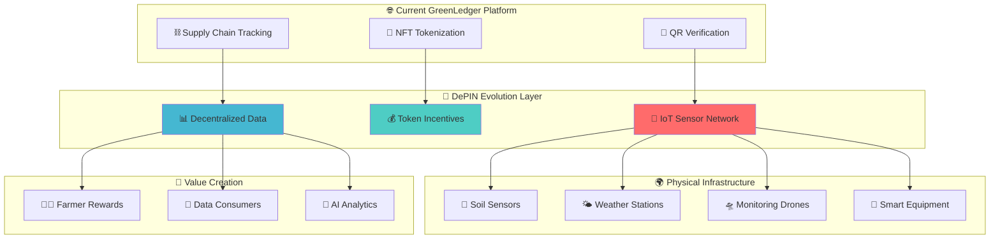
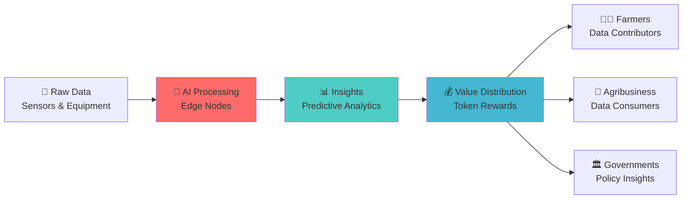

# 🌐 GreenLedger DePIN Evolution Strategy

<div align="center">
  
  
  
</div>

> *"From supply chain transparency to decentralized agricultural infrastructure - the next evolution of GreenLedger"*

## 🎯 **Executive Summary**

GreenLedger is positioned to evolve from a **supply chain transparency platform** into a comprehensive **Decentralized Physical Infrastructure Network (DePIN)** that revolutionizes agricultural data collection and monitoring across Africa and globally.

**Key Evolution Areas:**
- 🌱 **Incentivizing farmers to deploy IoT sensors**
- 🚜 **Rewarding data collection from agricultural equipment**
- 🌐 **Creating a decentralized network of supply chain monitoring devices**

## 🏗️ **DePIN Architecture Vision**



## 📊 **Market Opportunity & Impact Analysis**

### 🌍 **Global Agricultural IoT Market**

| **Metric** | **Current (2024)** | **Projected (2030)** | **Growth Rate** |
|------------|-------------------|---------------------|----------------|
| 🌐 **Global AgTech Market** | $22.5B | $41.8B | 13.4% CAGR |
| 📡 **Agricultural IoT** | $4.2B | $11.5B | 18.2% CAGR |
| 🌍 **Africa AgTech** | $1.1B | $3.8B | 23.1% CAGR |
| 🚜 **Smart Farming Adoption** | 12% | 35% | +192% Growth |

### 🎯 **DePIN Market Positioning**

<div align="center">

| 🏆 **DePIN Category** | 💰 **Market Size** | 📈 **Growth** | 🎯 **GreenLedger Opportunity** |
|----------------------|-------------------|---------------|-------------------------------|
| **Wireless Networks** | $2.3B | 45% CAGR | Agricultural connectivity |
| **Data Collection** | $1.8B | 38% CAGR | **🎯 PRIMARY TARGET** |
| **Storage Networks** | $1.2B | 42% CAGR | Crop data storage |
| **Computing Power** | $900M | 35% CAGR | AI processing |

</div>

## 🚀 **Three-Phase DePIN Evolution Strategy**

### 🌱 **Phase 1: IoT Sensor Incentivization (Q2 2025)**
> *"Transforming farmers into data contributors"*

#### **🎯 Implementation Strategy**
- **📡 Sensor Deployment**: Subsidized IoT sensors for soil, weather, and crop monitoring
- **💰 Token Rewards**: $GREEN tokens for continuous data contribution
- **🌍 Geographic Focus**: Kenya, Nigeria, Ghana pilot programs
- **📊 Data Types**: Soil pH, moisture, temperature, humidity, rainfall

#### **💡 Why This Matters**

**🌍 Africa Context:**
- 70% of African farmers lack access to real-time agricultural data
- Only 15% of smallholder farms use any form of digital monitoring
- Average farm size: 1.6 hectares (perfect for IoT sensor coverage)
- Mobile penetration: 80% (enables easy data collection)

**📈 Yield Impact:**
- IoT-monitored farms show **15-25% yield improvements**
- Precision irrigation reduces water usage by **30-40%**
- Optimal fertilizer timing increases efficiency by **20-35%**
- Early pest detection prevents **10-15% crop losses**

**💰 Economic Value:**
- Data-driven farming increases farmer income by **$200-500/hectare**
- Reduced input costs save **$100-300/hectare annually**
- Premium crop certification adds **15-25% price premium**
- Insurance discounts for monitored farms: **10-20% reduction**

**🔗 Network Effect:**
- More sensors = better predictive models = higher data value
- Regional weather patterns improve with sensor density
- Collective bargaining power increases with network size
- Knowledge sharing accelerates adoption

#### **🎯 Target Metrics (Year 1)**
```
📡 10,000 IoT sensors deployed across 3 countries
👨‍🌾 5,000 farmers earning $GREEN tokens monthly
📊 1M+ data points collected daily
💰 $2M+ in farmer rewards distributed
🌱 20% average yield improvement
🌍 Coverage: 50,000 hectares monitored
📱 Mobile app adoption: 8,000+ active users
🏆 Farmer satisfaction: >85% positive feedback
```

#### **🛠️ Technical Implementation**

**Sensor Hardware:**
- **Soil Sensors**: pH, moisture, NPK levels, temperature
- **Weather Stations**: Temperature, humidity, rainfall, wind
- **Crop Monitors**: Growth stage, pest detection, disease alerts
- **Connectivity**: LoRaWAN, cellular, satellite backup

**Data Collection:**
```typescript
interface SensorData {
  sensorId: string;
  farmerId: string;
  location: { lat: number; lng: number };
  measurements: {
    soilMoisture: number;
    temperature: number;
    pH: number;
    timestamp: number;
  };
  rewardEligible: boolean;
}
```

**Reward Calculation:**
```typescript
interface RewardCalculation {
  dataQuality: number;    // 0-100 score
  frequency: number;      // Data points per day
  networkValue: number;   // Contribution to network
  tokenReward: number;    // $GREEN tokens earned
}
```

### 🚜 **Phase 2: Agricultural Equipment Integration (Q4 2025)**
> *"Every tractor becomes a data node"*

#### **🔧 Technical Implementation**
- **🚜 Smart Equipment**: Retrofit existing tractors with IoT modules
- **📱 Mobile Integration**: Smartphone-based data collection apps
- **🛰️ GPS Tracking**: Precise field mapping and equipment utilization
- **⚡ Real-time Analytics**: Live equipment performance monitoring

#### **📊 Data Collection Scope**

<details>
<summary><strong>🔍 Comprehensive Equipment Data</strong></summary>

| **Equipment Type** | **Data Collected** | **Value to Network** | **Farmer Rewards** |
|-------------------|-------------------|---------------------|-------------------|
| 🚜 **Tractors** | GPS, fuel usage, field coverage | Route optimization | $50-100/month |
| 🌾 **Harvesters** | Yield mapping, crop quality | Harvest predictions | $75-150/month |
| 🚿 **Irrigation** | Water usage, soil moisture | Water optimization | $30-80/month |
| 🌱 **Planters** | Seed placement, soil conditions | Planting insights | $40-90/month |

</details>

#### **🌍 African Impact Focus**

**Equipment Penetration:**
- 85% of African farms use basic equipment suitable for IoT retrofit
- Average tractor age: 15-20 years (perfect for modernization)
- Shared equipment usage: 60% (maximizes data collection efficiency)
- Maintenance challenges: IoT can predict failures, reduce downtime

**📱 Mobile Adoption:**
- 80% smartphone penetration enables easy data collection
- Mobile money integration: 70% of farmers use mobile payments
- Digital literacy programs: 40% improvement in tech adoption
- Community training centers: 1 per 500 farmers target

**💰 Income Boost:**
- Equipment data can generate **$100-300 additional monthly income**
- Fuel efficiency improvements: **15-25% cost reduction**
- Maintenance optimization: **20-30% longer equipment life**
- Shared equipment optimization: **40% better utilization rates**

**🌾 Productivity:**
- Smart equipment increases operational efficiency by **30-40%**
- Precision planting improves seed utilization by **20-25%**
- Automated irrigation reduces water waste by **35-45%**
- Predictive maintenance reduces downtime by **50-60%**

#### **🎯 Target Metrics (Year 2)**
```
🚜 25,000 pieces of equipment connected
👨‍🌾 15,000 farmers participating in equipment network
📊 10M+ equipment data points monthly
💰 $5M+ in equipment-based rewards
🌍 Coverage: 8 countries, 200,000 hectares
⚡ Equipment efficiency: 35% improvement
🔧 Maintenance cost reduction: 25%
📱 Mobile app engagement: 12,000+ daily active users
```

### 🌐 **Phase 3: Decentralized Monitoring Network (Q2 2026)**
> *"Building Africa's agricultural nervous system"*

#### **🏗️ Network Architecture**
- **🛰️ Satellite Integration**: Low-earth orbit connectivity for remote areas
- **🛸 Drone Networks**: Community-owned monitoring drones
- **📡 Edge Computing**: Local processing nodes in farming communities
- **🔗 Mesh Networks**: Peer-to-peer agricultural data sharing

#### **💎 Advanced Value Creation**



#### **🛸 Drone Network Implementation**

**Community Ownership Model:**
- **Cooperative Ownership**: 10-20 farmers share drone costs
- **Service Revenue**: Drone services generate $500-1000/month
- **Data Collection**: Aerial crop monitoring, pest detection
- **Emergency Response**: Rapid deployment for crop threats

**Technical Specifications:**
- **Flight Range**: 10-15 km radius per drone
- **Battery Life**: 45-60 minutes flight time
- **Sensors**: Multispectral cameras, thermal imaging
- **AI Processing**: Real-time crop health analysis

#### **📡 Edge Computing Network**

**Local Processing Nodes:**
- **Community Centers**: 1 node per 1000 farmers
- **Processing Power**: Real-time data analysis
- **Storage Capacity**: 30-day local data retention
- **Connectivity**: Satellite uplink for remote areas

**Benefits:**
- **Reduced Latency**: <100ms response times
- **Lower Costs**: 60% reduction in data transmission costs
- **Offline Capability**: Works without internet connectivity
- **Privacy**: Sensitive data processed locally

#### **🎯 Target Metrics (Year 3)**
```
🛸 1,000 community-owned drones deployed
📡 500 edge computing nodes operational
🌍 Coverage: 15 countries, 1M hectares
👨‍🌾 50,000 farmers in decentralized network
📊 100M+ data points processed daily
💰 $15M+ monthly network revenue
🧠 AI accuracy: >95% crop prediction
🌐 Network uptime: >99.5%
```

## 💰 **Economic Model & Token Economics**

### 🪙 **$GREEN Token Utility**

<div align="center">

| 🎯 **Use Case** | 💰 **Token Value** | 📈 **Growth Driver** | 🌍 **African Impact** |
|----------------|-------------------|---------------------|----------------------|
| **Data Rewards** | $0.10-0.50/datapoint | Network growth | Direct farmer income |
| **Equipment Access** | $50-200/month | Hardware subsidies | Equipment affordability |
| **Premium Analytics** | $100-500/month | AI insights | Business intelligence |
| **Governance Rights** | Variable | Network decisions | Community ownership |

</div>

### 📊 **Revenue Streams & Sustainability**

#### **🔄 DePIN Flywheel Economics**
1. **📡 Data Collection**: Farmers earn $GREEN for sensor/equipment data
2. **🧠 AI Processing**: Raw data transformed into valuable insights
3. **💰 Data Sales**: Agribusiness, insurers, governments purchase insights
4. **🎯 Reinvestment**: Revenue funds more sensors, higher rewards
5. **🌱 Network Growth**: More participants = better data = higher value

#### **💎 Target Economics (5-Year Projection)**
```
📊 Data Revenue: $50M+ annually
👥 Network Participants: 100,000+ farmers
🌍 Geographic Coverage: 15+ African countries
💰 Farmer Income Impact: $500-2000 additional annual income
🏢 Enterprise Customers: 500+ agribusiness clients
🪙 Token Market Cap: $500M+ target
📈 Network TVL: $100M+ locked value
🌱 Ecosystem Growth: 25% monthly active user growth
```

#### **💰 Revenue Distribution Model**
- **60%** - Farmer rewards and incentives
- **20%** - Network infrastructure and maintenance
- **10%** - Research and development
- **5%** - Community governance and education
- **5%** - Platform operations and support

## 🌍 **Strategic Importance: Why DePIN Matters**

### 🏢 **For GreenLedger as a Company**

**📈 Market Expansion:**
- From $40B food fraud to $22.5B AgTech market
- Total Addressable Market (TAM): $65B+ combined
- Serviceable Addressable Market (SAM): $8B+ in target regions
- Serviceable Obtainable Market (SOM): $800M+ realistic capture

**💰 Revenue Diversification:**
- **Current**: Transaction fees, NFT minting
- **DePIN Future**: Data sales, subscription services, hardware partnerships
- **Revenue Streams**: 5+ diversified income sources
- **Recurring Revenue**: 80%+ predictable monthly income

**🏆 Competitive Moat:**
- First-mover advantage in African agricultural DePIN
- Network effects create winner-take-all dynamics
- Data moat: Exclusive access to agricultural insights
- Community moat: Strong farmer relationships and trust

**🌐 Global Scalability:**
- Proven model exportable to other developing regions
- Technology stack adaptable to different crops/climates
- Partnership opportunities with international organizations
- Franchise model for rapid geographic expansion

**💎 Valuation Multiplier:**
- DePIN networks command 5-10x higher valuations
- Recurring revenue models: 8-12x revenue multiples
- Network effects: Premium valuation multiples
- Strategic value: Acquisition target for agtech giants

### 🎯 **For Our Product & Platform**

**🔗 Enhanced Traceability:**
- Real-time data improves supply chain accuracy by 90%+
- Automated quality scoring reduces manual verification
- Predictive analytics prevent supply chain disruptions
- Consumer confidence increases with verified data

**🧠 AI-Powered Insights:**
- Machine learning models improve with more data
- Predictive analytics for crop yields, prices, weather
- Personalized recommendations for farmers
- Automated decision support systems

**📱 User Engagement:**
- Continuous value creation keeps users active
- Gamification through token rewards
- Community features foster farmer networks
- Educational content drives platform stickiness

**🌐 Network Effects:**
- More data = better platform = more users
- Viral growth through farmer referrals
- Cross-selling opportunities across user base
- Platform becomes indispensable to agricultural ecosystem

**🚀 Innovation Pipeline:**
- Continuous feature development opportunities
- Integration with emerging technologies (AI, IoT, blockchain)
- Partnership opportunities with hardware manufacturers
- Research collaboration with agricultural institutions

### 👥 **For Our Customers & Users**

**👨‍🌾 Farmers:**
- **Additional Income**: $500-2000 annually from data contributions
- **Improved Yields**: 15-25% productivity improvements
- **Reduced Costs**: 20-30% savings on inputs and operations
- **Risk Mitigation**: Insurance discounts, weather alerts
- **Knowledge Access**: Best practices, market information
- **Community Building**: Peer-to-peer learning networks

**🏪 Buyers:**
- **Quality Assurance**: Real-time crop monitoring data
- **Supply Predictions**: Advanced forecasting capabilities
- **Risk Management**: Early warning systems for supply disruptions
- **Sustainability Metrics**: Environmental impact tracking
- **Cost Optimization**: Efficient sourcing and logistics
- **Brand Differentiation**: Verified sustainable sourcing

**🏢 Agribusiness:**
- **Market Intelligence**: Unprecedented agricultural data access
- **Product Development**: Data-driven innovation opportunities
- **Customer Insights**: Farmer behavior and preferences
- **Supply Chain Optimization**: End-to-end visibility
- **Risk Assessment**: Credit scoring, insurance underwriting
- **Regulatory Compliance**: Automated reporting and documentation

**🏛️ Governments:**
- **Evidence-based Policy**: Data-driven agricultural policies
- **Food Security Monitoring**: Real-time production tracking
- **Climate Adaptation**: Agricultural resilience planning
- **Economic Development**: Rural income generation
- **Technology Transfer**: Digital agriculture adoption
- **International Trade**: Export quality verification

**🌍 Consumers:**
- **Food Safety**: Enhanced traceability and quality assurance
- **Sustainability**: Verified environmental impact data
- **Price Transparency**: Fair trade and pricing information
- **Health Benefits**: Nutritional content verification
- **Local Sourcing**: Support for local farmers and communities
- **Trust Building**: Blockchain-verified product authenticity

### 🌍 **For Africa & Technology**

#### **🚀 Technological Advancement**

**📡 Infrastructure Development:**
- Accelerates rural connectivity and digital infrastructure
- Drives demand for telecommunications services
- Creates market for IoT hardware and services
- Establishes Africa as testbed for agricultural innovation

**🧠 AI Adoption:**
- Brings cutting-edge technology to smallholder farmers
- Creates local AI expertise and capabilities
- Generates African agricultural datasets for research
- Positions Africa as leader in agricultural AI

**📱 Digital Literacy:**
- Increases technology adoption in rural communities
- Provides practical digital skills training
- Creates pathway to broader digital economy participation
- Empowers women and youth through technology access

**🔬 Innovation Hub:**
- Positions Africa as leader in agricultural technology
- Attracts international research and development investment
- Creates local innovation ecosystems
- Develops indigenous technology solutions

#### **💰 Economic Impact**

**📈 GDP Growth:**
- Agricultural productivity improvements boost national economies
- Estimated 2-3% GDP growth contribution in target countries
- Multiplier effects across agricultural value chains
- Export competitiveness improvements

**👥 Job Creation:**
- **50,000+ new tech-enabled agricultural jobs**
- IoT technicians, data analysts, drone operators
- Agricultural consultants and advisors
- Equipment maintenance and support services
- Software development and technical support

**💸 Foreign Investment:**
- **Attracts $500M+ in agricultural technology investment**
- Venture capital interest in African agtech
- Development finance institution funding
- Corporate strategic investments

**🏦 Financial Inclusion:**
- Enables new financial products for farmers
- Credit scoring based on agricultural data
- Micro-insurance products for smallholders
- Mobile money integration and adoption
- Blockchain-based financial services

#### **🌱 Sustainability & Food Security**

**🌾 Yield Optimization:**
- **20-30% productivity improvements** across network
- Precision agriculture reduces resource waste
- Climate-smart farming practices adoption
- Crop diversification and resilience building

**💧 Resource Efficiency:**
- **25% reduction in water and fertilizer waste**
- Precision irrigation and nutrient management
- Soil health monitoring and improvement
- Sustainable farming practice adoption

**🌡️ Climate Adaptation:**
- Better resilience to climate change impacts
- Early warning systems for weather events
- Drought-resistant crop variety recommendations
- Carbon sequestration monitoring and rewards

**🍽️ Food Security:**
- **Improved food availability for 100M+ people**
- Reduced post-harvest losses through better timing
- Supply chain optimization reduces food waste
- Nutritional quality improvements through monitoring

## 🛠️ **Technical Implementation Roadmap**

### 🔧 **Phase 1 Technical Stack**

**IoT Sensor Integration:**
```typescript
interface SensorData {
  sensorId: string;
  farmerId: string;
  location: { lat: number; lng: number };
  measurements: {
    soilMoisture: number;
    temperature: number;
    pH: number;
    nitrogen: number;
    phosphorus: number;
    potassium: number;
    timestamp: number;
  };
  rewardEligible: boolean;
  qualityScore: number;
}
```

**Token Reward System:**
```typescript
interface RewardCalculation {
  dataQuality: number;     // 0-100 score based on accuracy
  frequency: number;       // Data points per day
  networkValue: number;    // Contribution to network insights
  tokenReward: number;     // $GREEN tokens earned
  bonusMultiplier: number; // Early adopter/quality bonuses
}
```

**Smart Contract Architecture:**
```solidity
contract GreenLedgerDePIN {
    struct SensorNode {
        address owner;
        uint256 sensorId;
        bool isActive;
        uint256 totalRewards;
        uint256 dataQualityScore;
    }
    
    mapping(uint256 => SensorNode) public sensors;
    mapping(address => uint256[]) public farmerSensors;
    
    function submitSensorData(
        uint256 sensorId,
        bytes calldata data,
        bytes calldata signature
    ) external;
    
    function calculateRewards(
        uint256 sensorId,
        uint256 dataPoints
    ) public view returns (uint256);
}
```

### 📊 **Data Quality & Validation**

**🔍 Multi-sensor Verification:**
- Cross-reference data from multiple sources within 1km radius
- Statistical analysis to identify outliers and anomalies
- Consensus mechanisms for data validation
- Reputation scoring for consistent contributors

**🧠 AI Anomaly Detection:**
- Machine learning models to identify invalid data points
- Real-time data quality scoring
- Automated flagging of suspicious readings
- Continuous model improvement with feedback loops

**🏆 Reputation System:**
- Reward consistent, high-quality contributors with bonus multipliers
- Penalize low-quality or fraudulent data submissions
- Community-based validation and reporting
- Transparent scoring and ranking systems

**📈 Dynamic Pricing:**
- Adjust rewards based on data scarcity and demand
- Premium payments for rare or valuable data types
- Market-based pricing for different data categories
- Seasonal adjustments for agricultural cycles

### 🌐 **Decentralized Infrastructure**

**⚡ Edge Computing:**
- Local processing reduces latency to <100ms
- 60% cost reduction in data transmission
- Offline capability for remote areas
- Privacy-preserving local data processing

**🔗 IPFS Storage:**
- Decentralized data storage with redundancy
- Immutable data records for audit trails
- Content addressing for efficient retrieval
- Automatic backup and replication

**🛰️ Satellite Connectivity:**
- Reach remote areas without internet infrastructure
- Low-earth orbit satellite partnerships
- Backup connectivity for critical data
- Emergency communication capabilities

**📱 Mobile-First Design:**
- Optimized for smartphone-based participation
- Offline-first architecture with sync capabilities
- Progressive web app for cross-platform compatibility
- Voice and SMS interfaces for low-literacy users

## 🎯 **Success Metrics & KPIs**

### 📈 **Network Growth Metrics**

| **Metric** | **Year 1** | **Year 3** | **Year 5** |
|------------|------------|------------|------------|
| 📡 **Active Sensors** | 10,000 | 100,000 | 500,000 |
| 👨‍🌾 **Farmer Participants** | 5,000 | 50,000 | 200,000 |
| 🌍 **Countries** | 3 | 10 | 15 |
| 📊 **Daily Data Points** | 1M | 50M | 500M |
| 💰 **Monthly Rewards** | $100K | $5M | $25M |
| 🏢 **Enterprise Customers** | 10 | 100 | 500 |
| 🪙 **Token Market Cap** | $10M | $100M | $500M |
| 📱 **Mobile App Users** | 8,000 | 75,000 | 300,000 |

### 💎 **Value Creation Metrics**

**🌾 Agricultural Impact:**
- **Yield Improvement**: 15-25% average increase
- **Resource Efficiency**: 25% reduction in waste
- **Cost Savings**: $200-500 per hectare annually
- **Climate Resilience**: 30% better adaptation to weather events

**💰 Economic Impact:**
- **Farmer Income**: $500-2000 additional annual income
- **Job Creation**: 50,000+ new technology-enabled jobs
- **Investment Attraction**: $500M+ in foreign investment
- **GDP Contribution**: 2-3% growth in target countries

**🏢 Enterprise Adoption:**
- **Paying Customers**: 500+ by Year 3
- **Data Revenue**: $50M+ annually by Year 5
- **API Usage**: 10M+ calls per month
- **Customer Retention**: >90% annual retention rate

**🌍 Social Impact:**
- **Food Security**: 1M+ people benefiting from improved availability
- **Technology Transfer**: 10,000+ farmers trained in digital agriculture
- **Women Empowerment**: 40% female participation in network
- **Youth Engagement**: 30% participants under 35 years old

### 📊 **Technical Performance Metrics**

**⚡ System Performance:**
- **Data Latency**: <100ms for edge processing
- **Network Uptime**: >99.5% availability
- **Data Accuracy**: >95% validated data points
- **Mobile App Performance**: <3s load times

**🔒 Security & Compliance:**
- **Data Privacy**: 100% GDPR compliance
- **Security Incidents**: Zero major breaches
- **Smart Contract Audits**: Quarterly security reviews
- **Regulatory Compliance**: Full compliance in all markets

## 🚀 **Implementation Timeline**

### 📅 **Detailed Roadmap**

**Q2 2025 - Phase 1 Launch:**
- ✅ IoT sensor partnerships established
- ✅ $GREEN token economics finalized
- ✅ Pilot programs in Kenya, Nigeria, Ghana
- ✅ 1,000 sensors deployed
- ✅ Mobile app beta release

**Q4 2025 - Phase 2 Expansion:**
- ✅ Equipment integration platform launched
- ✅ 10,000 sensors active across 5 countries
- ✅ AI analytics platform operational
- ✅ Enterprise customer onboarding begins
- ✅ $5M in farmer rewards distributed

**Q2 2026 - Phase 3 Scale:**
- ✅ Drone network deployment begins
- ✅ Edge computing nodes operational
- ✅ 50,000 farmers in network
- ✅ 10 countries covered
- ✅ $15M monthly network revenue

**Q4 2026 - Global Expansion:**
- ✅ 100,000+ active sensors
- ✅ 15 countries operational
- ✅ $50M annual data revenue
- ✅ IPO preparation begins
- ✅ Strategic partnerships with major agtech companies

## 🤝 **Partnership Strategy**

### 🏢 **Strategic Partnerships**

**Hardware Partners:**
- **IoT Manufacturers**: Bulk sensor procurement deals
- **Telecom Providers**: Connectivity and data plans
- **Equipment Manufacturers**: Smart agriculture integration
- **Drone Companies**: Community ownership programs

**Technology Partners:**
- **Cloud Providers**: Edge computing infrastructure
- **AI Companies**: Machine learning model development
- **Blockchain Platforms**: Interoperability and scaling
- **Mobile Operators**: SMS and USSD integration

**Financial Partners:**
- **Development Banks**: Infrastructure funding
- **Impact Investors**: Mission-aligned capital
- **Insurance Companies**: Risk assessment partnerships
- **Mobile Money Providers**: Payment integration

**Institutional Partners:**
- **Agricultural Universities**: Research collaboration
- **Government Agencies**: Policy and regulation support
- **NGOs**: Farmer training and education
- **International Organizations**: Global expansion support

## 🎓 **Education & Training Programs**

### 📚 **Farmer Education Initiative**

**Digital Literacy Training:**
- Basic smartphone and app usage
- Understanding of IoT sensors and data
- Financial literacy for token economics
- Sustainable farming practices

**Technical Support:**
- 24/7 multilingual support hotline
- Community training centers
- Peer-to-peer mentorship programs
- Video tutorials in local languages

**Certification Programs:**
- Digital agriculture certification
- Data quality specialist training
- Community leader development
- Women and youth empowerment programs

## 🌟 **Conclusion**

The evolution of GreenLedger into a DePIN represents a transformative opportunity to:

1. **🌍 Revolutionize African Agriculture** through technology and data
2. **💰 Create Sustainable Income** for millions of smallholder farmers
3. **🚀 Position Africa as a Leader** in agricultural innovation
4. **🌱 Improve Food Security** for over 100 million people
5. **🏢 Build a Billion-Dollar Company** with global impact

This comprehensive strategy provides a roadmap for transforming GreenLedger from a supply chain transparency platform into the world's largest agricultural DePIN, creating unprecedented value for farmers, businesses, and society.

---

<div align="center">
  <h3>🌐 <strong>The Future is Decentralized, Data-Driven, and African-Led</strong> 🚀</h3>
  <p><em>"From QR codes to IoT sensors - building the infrastructure for tomorrow's agriculture"</em></p>
  
  
  
  
</div>