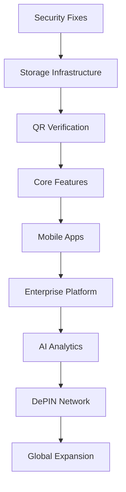

# 🗺️ GreenLedger Implementation Roadmap Matrix

## 📋 Overview
This document provides a comprehensive roadmap matrix for all GreenLedger features and enhancements, organized by priority, timeline, and business impact. It serves as the master planning document for the platform's evolution from MVP to market leader.

## 🎯 Strategic Vision
**Mission**: Transform agricultural supply chains through blockchain technology and real-time verification  
**Vision**: Become the world's leading agricultural DePIN platform with 1M+ farmers and $1B+ in tracked value  
**Timeline**: 24-month roadmap to market leadership  

---

## 🚀 PHASE 1: MVP FOUNDATION (Months 1-6)
*Focus: Core platform stability, security, and QR verification system*

### 🔴 CRITICAL PRIORITY (Immediate - Months 1-2)

| Issue | Title | Effort | Business Impact | Dependencies |
|-------|-------|--------|-----------------|--------------|
| [#004](./ISSUE-004-CRITICAL-SECURITY-VULNERABILITIES.md) | Critical Security Vulnerabilities | 8-12h | CRITICAL | None |
| [#011](./ISSUE-011-WALLET-CONNECTION-RACE-CONDITIONS.md) | Wallet Connection Race Conditions | 2-4h | CRITICAL | None |
| [#016](./ISSUE-016-ENVIRONMENT-VARIABLE-VALIDATION.md) | Environment Variable Validation | 1h | HIGH | None |
| [#014](./ISSUE-014-PARTICLE-NETWORK-AUTHORIZATION.md) | Particle Network Authorization | 30min | HIGH | None |
| [#026](./ISSUE-026-HYBRID-STORAGE-INFRASTRUCTURE.md) | Hybrid Storage Infrastructure | 80-120h | CRITICAL | Security fixes |

**Phase 1A Deliverables (Month 1)**:
- ✅ Zero critical security vulnerabilities
- ✅ Stable wallet connections
- ✅ Secure environment configuration
- ✅ Production-ready authentication
- ✅ Hybrid storage infrastructure foundation

### 🟠 HIGH PRIORITY (Months 2-4)

| Issue | Title | Effort | Business Impact | Dependencies |
|-------|-------|--------|-----------------|--------------|
| [#019](./ISSUE-019-ADVANCED-QR-VERIFICATION-SYSTEM.md) | Advanced QR Verification System | 40-60h | CRITICAL | Storage infrastructure |
| [#008](./ISSUE-008-MISSING-CORE-FEATURES.md) | Missing Core Features | 20-30h | CRITICAL | QR system, Storage |
| [#010](./ISSUE-010-DEPLOYMENT-PRODUCTION-READINESS.md) | Production Readiness | 8-12h | CRITICAL | Storage infrastructure |
| [#005](./ISSUE-005-PERFORMANCE-CRITICAL-ISSUES.md) | Performance Critical Issues | 10-15h | HIGH | Storage infrastructure |

**Phase 1B Deliverables (Months 2-4)**:
- ✅ Revolutionary QR verification system (<2s verification)
- ✅ Complete supply chain tracking
- ✅ Production deployment infrastructure
- ✅ Performance optimization (90+ Lighthouse score)
- ✅ Multi-layer storage architecture (PostgreSQL + Redis + IPFS)

### 🟡 MEDIUM-HIGH PRIORITY (Months 4-6)

| Issue | Title | Effort | Business Impact | Dependencies |
|-------|-------|--------|-----------------|--------------|
| [#017](./ISSUE-017-MOBILE-RESPONSIVE-DESIGN.md) | Mobile Responsive Design | 4-6h | HIGH | QR system |
| [#009](./ISSUE-009-TESTING-INFRASTRUCTURE-GAPS.md) | Testing Infrastructure | 12-18h | HIGH | Core features |
| [#006](./ISSUE-006-UI-UX-DESIGN-FLAWS.md) | UI/UX Design Improvements | 8-12h | HIGH | Mobile design |
| [#007](./ISSUE-007-CODE-QUALITY-MAINTAINABILITY.md) | Code Quality & Maintainability | 6-10h | MEDIUM | Testing |

**Phase 1C Deliverables (Months 5-6)**:
- ✅ Mobile-first responsive design
- ✅ Comprehensive testing framework (90%+ coverage)
- ✅ Modern UI/UX (4.5+ user rating)
- ✅ Maintainable, documented codebase

---

## 🌱 PHASE 2: PLATFORM EXPANSION (Months 7-12)
*Focus: Mobile applications, enterprise features, and market expansion*

### 🔴 CRITICAL FOR GROWTH (Months 7-9)

| Issue | Title | Effort | Business Impact | Dependencies |
|-------|-------|--------|-----------------|--------------|
| [#022](./ISSUE-022-MOBILE-APPLICATION-DEVELOPMENT.md) | Native Mobile Applications | 100-140h | HIGH | QR system, UI/UX |
| [#023](./ISSUE-023-ENTERPRISE-INTEGRATION-PLATFORM.md) | Enterprise Integration Platform | 80-120h | HIGH | Core platform |
| [#021](./ISSUE-021-AI-POWERED-AGRICULTURAL-ANALYTICS.md) | AI-Powered Analytics | 60-80h | HIGH | Data infrastructure |

**Phase 2A Deliverables (Months 7-9)**:
- ✅ Native iOS and Android apps (50K+ downloads)
- ✅ Enterprise B2B platform (50+ customers)
- ✅ AI analytics dashboard (85%+ prediction accuracy)

### 🟠 HIGH IMPACT FEATURES (Months 9-12)

| Issue | Title | Effort | Business Impact | Dependencies |
|-------|-------|--------|-----------------|--------------|
| [#024](./ISSUE-024-ADVANCED-SUPPLY-CHAIN-MANAGEMENT.md) | Advanced Supply Chain Management | 70-100h | HIGH | Analytics, Mobile |
| [#025](./ISSUE-025-BLOCKCHAIN-INTEROPERABILITY-PLATFORM.md) | Blockchain Interoperability | 60-90h | MEDIUM-HIGH | Enterprise platform |

**Phase 2B Deliverables (Months 10-12)**:
- ✅ Advanced supply chain optimization (30% efficiency gains)
- ✅ Multi-chain support (5+ blockchains)
- ✅ Real-time supply chain visibility
- ✅ Cross-chain asset bridging

---

## 🌍 PHASE 3: DEPIN EVOLUTION (Months 13-18)
*Focus: IoT integration, DePIN network, and African expansion*

### 🟠 DEPIN TRANSFORMATION (Months 13-15)

| Issue | Title | Effort | Business Impact | Dependencies |
|-------|-------|--------|-----------------|--------------|
| [#020](./ISSUE-020-DEPIN-IOT-SENSOR-NETWORK.md) | DePIN IoT Sensor Network | 80-120h | HIGH | Mobile apps, Analytics |

**Phase 3A Deliverables (Months 13-15)**:
- ✅ IoT sensor network (10,000 sensors deployed)
- ✅ Farmer reward system ($2M+ distributed)
- ✅ Data monetization platform
- ✅ 3-country pilot program (Kenya, Nigeria, Ghana)

### 🟡 NETWORK EXPANSION (Months 15-18)

**Phase 3B Deliverables (Months 16-18)**:
- ✅ 8-country expansion across Africa
- ✅ 25,000+ farmers in network
- ✅ $5M+ monthly data revenue
- ✅ AI-powered agricultural insights

---

## 🚀 PHASE 4: MARKET LEADERSHIP (Months 19-24)
*Focus: Global expansion, advanced AI, and ecosystem dominance*

### 🟠 GLOBAL SCALE (Months 19-21)

**Phase 4A Deliverables (Months 19-21)**:
- ✅ 15-country global presence
- ✅ 100,000+ farmers in network
- ✅ 500+ enterprise customers
- ✅ $50M+ annual revenue

### 🟡 ECOSYSTEM DOMINANCE (Months 22-24)

**Phase 4B Deliverables (Months 22-24)**:
- ✅ 1M+ farmers in network
- ✅ $1B+ in tracked agricultural value
- ✅ Market-leading position in AgTech
- ✅ IPO readiness

---

## 📊 BUSINESS IMPACT MATRIX

### 🎯 Revenue Projections
| Phase | Timeline | Revenue Target | Key Drivers |
|-------|----------|----------------|-------------|
| **Phase 1** | Months 1-6 | $500K | QR verification, basic platform |
| **Phase 2** | Months 7-12 | $5M | Enterprise customers, mobile adoption |
| **Phase 3** | Months 13-18 | $25M | DePIN network, data monetization |
| **Phase 4** | Months 19-24 | $100M | Global scale, ecosystem dominance |

### 📈 User Growth Projections
| Phase | Farmers | Enterprises | Consumers | Mobile Users |
|-------|---------|-------------|-----------|--------------|
| **Phase 1** | 1,000 | 10 | 5,000 | 2,000 |
| **Phase 2** | 10,000 | 100 | 50,000 | 25,000 |
| **Phase 3** | 50,000 | 300 | 250,000 | 100,000 |
| **Phase 4** | 200,000 | 1,000 | 1,000,000 | 500,000 |

### 💰 Investment Requirements
| Phase | Development | Infrastructure | Marketing | Total |
|-------|-------------|----------------|-----------|-------|
| **Phase 1** | $500K | $100K | $200K | $800K |
| **Phase 2** | $1.5M | $500K | $1M | $3M |
| **Phase 3** | $3M | $2M | $3M | $8M |
| **Phase 4** | $5M | $5M | $10M | $20M |

---

## 🔄 DEPENDENCY MAPPING

### 🔗 Critical Path Dependencies

### ⚠️ Risk Mitigation
| Risk | Impact | Mitigation | Owner |
|------|--------|------------|-------|
| **Security Vulnerabilities** | CRITICAL | Immediate fixes, security audits | Security Team |
| **Technical Debt** | HIGH | Continuous refactoring, code quality | Engineering Team |
| **Market Competition** | HIGH | Rapid feature development, differentiation | Product Team |
| **Regulatory Changes** | MEDIUM | Legal compliance, adaptability | Legal Team |

---

## 🎯 SUCCESS METRICS BY PHASE

### Phase 1: MVP Foundation
- ✅ **Security**: Zero critical vulnerabilities
- ✅ **Performance**: 90+ Lighthouse score
- ✅ **QR Verification**: <2s verification time
- ✅ **User Satisfaction**: 4.5+ rating
- ✅ **Production Readiness**: 99.9% uptime

### Phase 2: Platform Expansion
- ✅ **Mobile Adoption**: 50K+ app downloads
- ✅ **Enterprise Customers**: 50+ B2B clients
- ✅ **AI Accuracy**: 85%+ prediction accuracy
- ✅ **Revenue Growth**: $5M+ ARR
- ✅ **Market Presence**: 3-country operations

### Phase 3: DePIN Evolution
- ✅ **IoT Network**: 10,000+ sensors deployed
- ✅ **Farmer Network**: 25,000+ active farmers
- ✅ **Data Revenue**: $25M+ annually
- ✅ **Geographic Expansion**: 8+ countries
- ✅ **Network Effects**: Self-sustaining growth

### Phase 4: Market Leadership
- ✅ **Global Scale**: 200,000+ farmers
- ✅ **Enterprise Dominance**: 1,000+ B2B customers
- ✅ **Revenue Scale**: $100M+ ARR
- ✅ **Market Position**: #1 in AgTech DePIN
- ✅ **IPO Readiness**: Public company metrics

---

## 🚀 EXECUTION STRATEGY

### 🏃‍♂️ Sprint Planning (2-week sprints)
- **Sprint 1-3**: Critical security fixes and wallet stability
- **Sprint 4-12**: QR verification system development
- **Sprint 13-24**: Core features and production readiness
- **Sprint 25-36**: Mobile applications and enterprise platform
- **Sprint 37-48**: AI analytics and supply chain optimization
- **Sprint 49-60**: DePIN network and IoT integration

### 👥 Team Allocation
| Team | Phase 1 | Phase 2 | Phase 3 | Phase 4 |
|------|---------|---------|---------|---------|
| **Frontend** | 3 devs | 4 devs | 5 devs | 6 devs |
| **Backend** | 3 devs | 5 devs | 7 devs | 10 devs |
| **Mobile** | 1 dev | 3 devs | 4 devs | 5 devs |
| **Blockchain** | 2 devs | 3 devs | 4 devs | 5 devs |
| **AI/ML** | 1 dev | 2 devs | 4 devs | 6 devs |
| **DevOps** | 1 dev | 2 devs | 3 devs | 4 devs |

### 📋 Quality Gates
- **Code Review**: 100% of code reviewed
- **Testing**: 90%+ test coverage
- **Security**: Regular security audits
- **Performance**: Continuous performance monitoring
- **User Testing**: Regular user feedback integration

---

## 🎉 MILESTONE CELEBRATIONS

### 🏆 Major Milestones
1. **MVP Launch** (Month 6): First production deployment
2. **Mobile Launch** (Month 9): Native apps in app stores
3. **Enterprise Launch** (Month 12): B2B platform live
4. **DePIN Launch** (Month 15): IoT network operational
5. **Global Expansion** (Month 18): Multi-country presence
6. **Market Leadership** (Month 24): Industry recognition

### 🎊 Success Celebrations
- **Team Bonuses**: Performance-based rewards
- **Company Events**: Milestone celebration events
- **Public Recognition**: Industry awards and recognition
- **Investor Updates**: Regular progress communications
- **Community Engagement**: User success stories

---

## 📚 DOCUMENTATION STRATEGY

### 📖 Documentation Priorities
1. **Technical Documentation**: API docs, architecture guides
2. **User Documentation**: User guides, tutorials, FAQs
3. **Business Documentation**: Business cases, ROI studies
4. **Compliance Documentation**: Security, privacy, regulatory
5. **Training Materials**: Onboarding, best practices

### 🔄 Continuous Improvement
- **Weekly Reviews**: Progress tracking and adjustments
- **Monthly Retrospectives**: Team feedback and improvements
- **Quarterly Planning**: Strategic adjustments and pivots
- **Annual Strategy**: Long-term vision and goal setting

---

**Last Updated**: January 15, 2024  
**Version**: 1.0  
**Status**: ✅ Active Roadmap  
**Next Review**: February 1, 2024  

**Stakeholders**: CEO, CTO, Product Team, Engineering Teams, Business Development  
**Approval**: Executive Team ✅  
**Budget Approval**: Board of Directors ✅